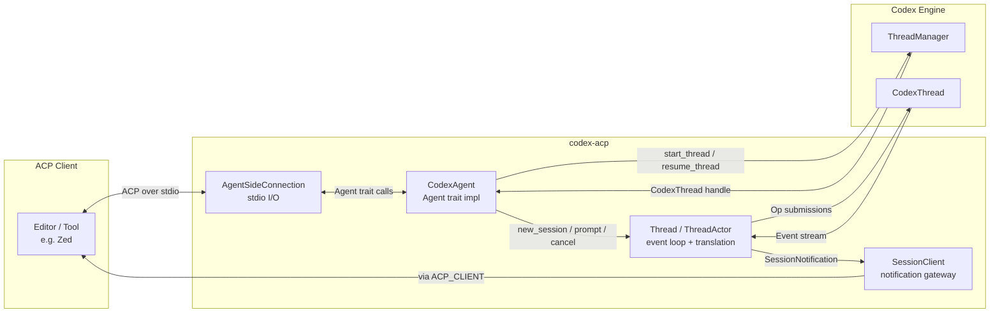

**codex-acp** is a Rust-based adapter that bridges OpenAI's Codex coding agent with the **Agent Client Protocol (ACP)** — an open standard that lets any ACP-compatible client (such as the [Zed](https://zed.dev) editor) interact with AI agents through a unified protocol. Instead of building a proprietary integration for every editor and tool, codex-acp exposes Codex's full capabilities — tool calls, permission requests, slash commands, session management, and more — through the well-defined ACP interface, making Codex accessible to the entire ACP ecosystem.

Sources: [README.md](README.md#L1-L27), [Cargo.toml](Cargo.toml#L1-L9)

## What codex-acp Does

At its core, codex-acp is a **protocol translator**. The Codex engine emits domain-specific events (exec approvals, patch requests, MCP tool calls, guardian assessments) that have no meaning outside of Codex itself. Meanwhile, ACP clients speak a different language — they send `PromptRequest`, expect `SessionNotification`, and render `ToolCallUpdate` objects. Codex-acp sits between these two worlds: it receives ACP requests from the client, delegates them to the Codex engine, then translates every Codex event into the corresponding ACP notification that the client knows how to render. The communication channel is **stdio** — the adapter reads ACP JSON-RPC from stdin and writes responses and notifications to stdout — making it compatible with any process-based agent launcher.

Sources: [lib.rs](src/lib.rs#L1-L87), [codex_agent.rs](src/codex_agent.rs#L1-L62)

## High-Level Architecture

The following diagram shows how codex-acp mediates between an ACP client and the Codex engine. The client never talks to Codex directly; every request and every event passes through the adapter's translation layer.



**Key data flow**: When the client sends a `PromptRequest`, `CodexAgent` routes it to the appropriate `Thread`, which submits an `Op` to the `CodexThread`. As Codex processes the prompt, it emits a stream of `Event` variants. The `ThreadActor` event loop consumes these events, translates each one into the appropriate ACP `SessionNotification`, and dispatches it through the `SessionClient` using the globally shared `ACP_CLIENT` connection.

Sources: [lib.rs](src/lib.rs#L62-L87), [codex_agent.rs](src/codex_agent.rs#L46-L62), [thread.rs](src/thread.rs#L130-L200)

## Core Components at a Glance

| Component | Responsibility | Key Source |
|-----------|---------------|------------|
| **CodexAgent** | Implements the ACP `Agent` trait — handles initialize, authenticate, session lifecycle (new/load/close/list), prompt, cancel, and config changes | [codex_agent.rs](src/codex_agent.rs#L49-L62) |
| **Thread** | Wraps a `CodexThread` with an async message-passing interface; provides `prompt()`, `cancel()`, `set_mode()`, `set_model()`, `set_config_option()` | [thread.rs](src/thread.rs#L171-L178) |
| **ThreadActor** | Runs the event loop that consumes Codex `Event` variants and translates them into ACP `SessionNotification` objects | [thread.rs](src/thread.rs#L180-L200) |
| **SessionClient** | Holds the `SessionId` and `ClientCapabilities`; sends ACP notifications to the client through the shared `ACP_CLIENT` connection | [thread.rs](src/thread.rs#L74-L77) |
| **prompt_args** | Parses and expands custom prompt templates — handles `$VARIABLE` placeholders, positional `$1`-`$9` args, and `/prompts:name key=value` syntax | [prompt_args.rs](src/prompt_args.rs#L1-L10) |
| **AgentSideConnection** | Provided by the `agent-client-protocol` crate; manages stdio-based JSON-RPC framing between the adapter and the client | [lib.rs](src/lib.rs#L72-L74) |

## Feature Summary

Codex-acp exposes Codex's capabilities through the ACP protocol. The table below maps each user-facing feature to its ACP mechanism and the internal component responsible.

| Feature | ACP Mechanism | Internal Translation |
|---------|--------------|---------------------|
| **Context @-mentions** | `PromptRequest` with `EmbeddedResource` content blocks | Parsed from prompt content and forwarded to Codex as part of the `Op::UserMessage` |
| **Images** | `PromptRequest` with image content blocks | Forwarded as base64-encoded image data in the user message |
| **Tool call permissions** | `RequestPermissionRequest` / `RequestPermissionResponse` | `ExecApprovalRequestEvent`, `ApplyPatchApprovalRequestEvent`, and `ElicitationRequestEvent` from Codex are translated to ACP permission requests |
| **Edit review (patches)** | `ToolCallUpdate` with `Diff` content | `PatchApplyBeginEvent`/`PatchApplyEndEvent` translated to ACP tool call notifications with diff representation |
| **Terminal output** | `Terminal` content blocks in notifications | `ExecCommandOutputDeltaEvent` and `ExecCommandEndEvent` translated to ACP terminal blocks |
| **Slash commands** | `AvailableCommandsUpdate` notification + `PromptRequest` | Built-in commands (`/review`, `/init`, `/compact`, `/undo`, `/logout`) and custom prompts discovered from Codex config |
| **MCP tool calls** | `ToolCallUpdate` notifications | `McpToolCallBeginEvent`/`McpToolCallEndEvent` translated with status and output content |
| **Session management** | `NewSession` / `LoadSession` / `CloseSession` / `ListSessions` | Mapped to `ThreadManager.start_thread()`, `resume_thread_from_rollout()`, and rollout listing |
| **Mode switching** | `SetSessionModeRequest` | Changes Codex collaboration mode (e.g., suggest, auto-edit, full-auto) |
| **Model selection** | `SetSessionModelRequest` | Changes the underlying OpenAI model via `ModelsManager` |
| **Client MCP servers** | `McpServer` in `NewSessionRequest` | Propagated from ACP client into Codex config as `McpServerConfig` entries |
| **Authentication** | `AuthenticateRequest` with method selection | Supports ChatGPT browser login, `CODEX_API_KEY`, and `OPENAI_API_KEY` |

Sources: [codex_agent.rs](src/codex_agent.rs#L216-L591), [thread.rs](src/thread.rs#L1-L77), [README.md](README.md#L5-L21)

## Project Structure

The repository is a Rust workspace with a single crate and an npm distribution wrapper:

```
codex-acp/
├── src/
│   ├── main.rs              # Entry point — parses CLI args, delegates to run_main()
│   ├── lib.rs               # Core startup: config loading, AgentSideConnection wiring
│   ├── codex_agent.rs       # CodexAgent: ACP Agent trait implementation
│   ├── thread.rs            # Thread, ThreadActor, SessionClient: event loop & translation
│   ├── prompt_args.rs       # Custom prompt template parsing & variable expansion
│   └── prompt_for_init_command.md  # Prompt template for /init slash command
├── npm/
│   ├── bin/codex-acp.js     # Platform-detecting launcher (locates native binary)
│   ├── package.json         # @zed-industries/codex-acp with platform-specific optionalDeps
│   ├── template/            # Template package.json for per-platform npm packages
│   ├── publish/             # Scripts for creating and publishing platform packages
│   └── testing/             # Platform detection and validation test scripts
├── .github/workflows/
│   ├── ci.yml               # Multi-platform test matrix (8 targets)
│   └── release.yml          # Cross-compilation, code signing, and npm publish
├── script/                  # Code signing scripts for macOS and Windows
├── Cargo.toml               # Package metadata and codex-rs dependency declarations
└── rust-toolchain.toml      # Pinned Rust toolchain version
```

Sources: [main.rs](src/main.rs#L1-L12), [lib.rs](src/lib.rs#L1-L18), [npm/package.json](npm/package.json#L1-L38), [npm/bin/codex-acp.js](npm/bin/codex-acp.js#L1-L40)

## Authentication Methods

Codex-acp supports three authentication paths, exposed to the ACP client as distinct `AuthMethod` entries during initialization:

| Method | ACP Auth Type | How It Works |
|--------|--------------|--------------|
| **ChatGPT subscription** | `AuthMethodAgent` (browser login) | Launches a local OAuth server via `codex_login`; user authenticates in browser. Not available when `NO_BROWSER` is set (e.g., remote SSH). |
| **CODEX_API_KEY** | `AuthMethodEnvVar` | Reads `CODEX_API_KEY` from environment; calls `codex_login::login_with_api_key()` |
| **OPENAI_API_KEY** | `AuthMethodEnvVar` | Reads `OPENAI_API_KEY` from environment; calls `codex_login::login_with_api_key()` |

The adapter checks authentication status before allowing session creation or prompt submission, returning an `auth_required` error if no valid credentials are found.

Sources: [codex_agent.rs](src/codex_agent.rs#L111-L116), [codex_agent.rs](src/codex_agent.rs#L256-L323), [codex_agent.rs](src/codex_agent.rs#L593-L653)

## Distribution and Platform Support

Codex-acp ships as a native binary for **six platform targets**, distributed through two channels:

| Platform | Architecture | Target Triple |
|----------|-------------|---------------|
| macOS | Apple Silicon | `aarch64-apple-darwin` |
| macOS | Intel | `x86_64-apple-darwin` |
| Linux | ARM64 | `aarch64-unknown-linux-gnu` |
| Linux | x86_64 (musl) | `x86_64-unknown-linux-musl` |
| Windows | ARM64 | `aarch64-pc-windows-msvc` |
| Windows | x86_64 | `x86_64-pc-windows-msvc` |

The **npm package** (`@zed-industries/codex-acp`) uses `optionalDependencies` to install only the platform-specific binary that matches the host OS and architecture. The JavaScript launcher in `bin/codex-acp.js` resolves the correct binary path at runtime and spawns it with `stdio: 'inherit'`.

Sources: [npm/package.json](npm/package.json#L30-L37), [npm/bin/codex-acp.js](npm/bin/codex-acp.js#L8-L40), [.github/workflows/ci.yml](.github/workflows/ci.yml#L15-L35)

## Where to Go Next

The documentation is organized into two sections. **Get Started** covers everything you need to begin using codex-acp, while **Deep Dive** explores the internals for contributors and advanced integrators.

1. **[Quick Start](2-quick-start)** — Install and run codex-acp in under five minutes
2. **[Authentication Methods](3-authentication-methods)** — Detailed setup for each auth path
3. **[Using with Zed and Other ACP Clients](4-using-with-zed-and-other-acp-clients)** — Editor-specific configuration guides
4. **[Architecture: Bridging ACP and Codex](5-architecture-bridging-acp-and-codex)** — In-depth look at the protocol translation layer
5. **[CodexAgent: The ACP Agent Trait Implementation](6-codexagent-the-acp-agent-trait-implementation)** — How the Agent trait maps to Codex operations
6. **[Thread and ThreadActor: Event Loop and Codex-to-ACP Translation](7-thread-and-threadactor-event-loop-and-codex-to-acp-translation)** — The heart of the translation engine