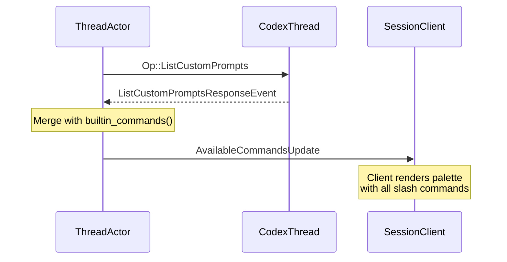
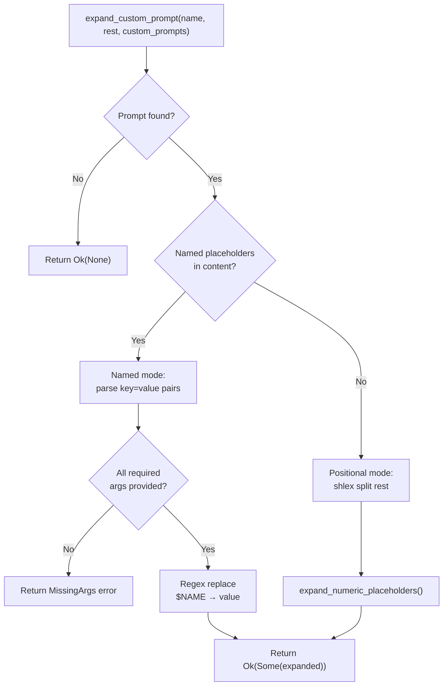

Beyond the built-in slash commands documented in [Built-in Slash Commands](9-built-in-slash-commands-review-init-compact-undo-logout), codex-acp supports **custom prompt templates** — user-authored Markdown files stored in the project workspace that behave as parameterizable slash commands. This page covers how those templates are discovered, registered with the ACP client, and expanded at invocation time through a dual-mode argument system supporting both named (`$USER`) and positional (`$1`–`$9`) placeholder syntax.

Sources: [prompt_args.rs](src/prompt_args.rs#L1-L10), [thread.rs](src/thread.rs#L36)

## Template Discovery and Registration

Custom prompts are not hardcoded — they are **discovered at session load time** by querying the Codex runtime. When a new session is created or loaded, the `ThreadActor` issues an `Op::ListCustomPrompts` operation to the underlying `CodexThread`. The Codex runtime scans the project workspace for prompt definition files and returns a `ListCustomPromptsResponseEvent` containing a vector of `CustomPrompt` structs. Each `CustomPrompt` carries five fields:

| Field | Type | Purpose |
|-------|------|---------|
| `name` | `String` | The slash command identifier (e.g., `my-review` → `/my-review`) |
| `path` | `PathBuf` | Filesystem path to the template source file |
| `content` | `String` | The raw template body containing placeholders |
| `description` | `Option<String>` | Human-readable description shown in the command palette |
| `argument_hint` | `Option<String>` | Placeholder text displayed in the client's input field |

Sources: [thread.rs](src/thread.rs#L692-L723), [thread.rs](src/thread.rs#L2790-L2806)

Once the prompt list arrives, it is merged with the built-in commands and broadcast to the client as an `AvailableCommandsUpdate` notification. Each custom prompt becomes an `AvailableCommand` entry whose `name` and `description` map directly from the `CustomPrompt` fields. If an `argument_hint` is present, it is wrapped in `AvailableCommandInput::Unstructured` so the ACP client can render an appropriate input field. This means custom prompts appear in the client's command palette **alongside** built-in commands like `/review` and `/init`, with identical UX affordances.



Sources: [thread.rs](src/thread.rs#L2642-L2687), [thread.rs](src/thread.rs#L2756-L2788)

## Slash Command Parsing

When a user submits a prompt that begins with `/`, the `handle_prompt` method in `ThreadActor` delegates to `extract_slash_command`, which extracts the first text input from the prompt items and passes it to `parse_slash_name`. This function strips the leading `/`, scans for the first whitespace boundary to isolate the command name, and returns the remaining text as the `rest` string. The name is then matched against the built-in command set (`compact`, `undo`, `init`, `review`, `review-branch`, `review-commit`, `logout`). If no built-in matches, the fallback path invokes custom prompt expansion.

| Input | Parsed `name` | Parsed `rest` |
|-------|--------------|---------------|
| `/my-review USER=alice BRANCH=main` | `my-review` | `USER=alice BRANCH=main` |
| `/deploy staging` | `deploy` | `staging` |
| `/greet` | `greet` | (empty string) |

Sources: [prompt_args.rs](src/prompt_args.rs#L57-L75), [thread.rs](src/thread.rs#L3147-L3231), [thread.rs](src/thread.rs#L4037-L4045)

## Dual-Mode Argument Expansion

The `expand_custom_prompt` function is the central engine that resolves a template's content against user-supplied arguments. It operates in two mutually exclusive modes determined by the template's content:



### Named Placeholder Mode

If the template content contains tokens matching the pattern `$[A-Z][A-Z0-9_]*` (excluding the special `$ARGUMENTS` aggregate), the system enters **named mode**. The `prompt_argument_names` function extracts unique placeholder names in order of first appearance, then `parse_prompt_inputs` parses the `rest` string as a sequence of `key=value` pairs using **shlex** shell-style tokenization — meaning values containing spaces can be wrapped in double quotes.

Every required placeholder must be supplied; if any are missing, a `PromptExpansionError::MissingArgs` is returned with the list of absent keys. The actual substitution uses the compiled `PROMPT_ARG_REGEX` (`\$[A-Z][A-Z0-9_]*`) with `replace_all`, which performs a single-pass replacement of each `$NAME` token with its corresponding value from the input map. Any `$NAME` token not present in the map is left unchanged — this handles edge cases gracefully.

Sources: [prompt_args.rs](src/prompt_args.rs#L77-L100), [prompt_args.rs](src/prompt_args.rs#L102-L123), [prompt_args.rs](src/prompt_args.rs#L130-L171)

**Template example** — `review-branch.md`:
```markdown
Review all changes on branch $BRANCH made by $USER. Focus on $FOCUS areas.
```

**Invocation**: `/review-branch BRANCH=feature/auth USER="Alice Smith" FOCUS=security`

**Expanded output**: `Review all changes on branch feature/auth made by Alice Smith. Focus on security areas.`

### Positional Placeholder Mode

When the template contains **no** named placeholders, the system falls back to **positional mode**. The `rest` string is split using shlex into an ordered vector of arguments, then `expand_numeric_placeholders` performs a character-level scan of the template content:

| Placeholder | Expansion |
|-------------|-----------|
| `$1` through `$9` | Replaced by the 1st through 9th positional argument (0-indexed from the `args` vector) |
| `$ARGUMENTS` | Replaced by all positional arguments joined with a single space |
| `$$` | Escaped literal — produces `$$` in output (prevents interpretation of the following `$` as a placeholder) |

The scan processes left-to-right: when a `$` is encountered, the next byte determines behavior. A digit (`1`–`9`) triggers positional lookup; a second `$` emits the escaped `$$` pair; the literal `ARGUMENTS` after `$` triggers aggregate expansion. Any other `$` sequence is emitted verbatim.

Sources: [prompt_args.rs](src/prompt_args.rs#L173-L220)

**Template example** — `deploy.md`:
```markdown
Deploy $1 to the $2 environment. Full command: deploy $ARGUMENTS
```

**Invocation**: `/deploy myapp staging`

**Expanded output**: `Deploy myapp to the staging environment. Full command: deploy myapp staging`

## Escape Mechanism: Literal Dollar Signs

Both expansion modes share a common escape convention: a doubled `$$` prefix signals that the subsequent token should be treated as a literal string, not a placeholder. In `prompt_argument_names`, a match at position `i` is skipped if `content[i-1]` is `$`, which prevents `$$USER` from being registered as a required argument. During named-mode expansion in `expand_custom_prompt`, the same byte-check logic causes `$$USER` to emit `$USER` rather than attempting substitution. In positional mode, `$$` explicitly emits the two-character literal `$$`.

Sources: [prompt_args.rs](src/prompt_args.rs#L86-L88), [prompt_args.rs](src/prompt_args.rs#L156-L162), [prompt_args.rs](src/prompt_args.rs#L191-L196)

| Template Content | Arguments | Expanded Output |
|-----------------|-----------|-----------------|
| `Price is $$AMOUNT` | (none needed — `$$AMOUNT` is not a named placeholder) | `Price is $$AMOUNT` |
| `literal $$USER and $REAL` | `REAL=value` | `literal $$USER and value` |

## Error Taxonomy

The expansion pipeline produces two categories of structured errors, both implementing user-facing messages via `PromptExpansionError::user_message`:

| Error Variant | Trigger | Message Pattern |
|---------------|---------|-----------------|
| `PromptExpansionError::Args` | A token in `rest` lacks `=` (e.g., `USER=Alice stray`), or has an empty key before `=` | `"Could not parse /{command}: expected key=value but found '{token}'..."` |
| `PromptExpansionError::MissingArgs` | Named placeholders exist but one or more required keys are absent from the input | `"Missing required args for /{command}: KEY1, KEY2..."` |

These errors are mapped to ACP `Error::invalid_params()` responses in `handle_prompt`, ensuring the client receives a structured, actionable error rather than a generic failure.

Sources: [prompt_args.rs](src/prompt_args.rs#L12-L55), [thread.rs](src/thread.rs#L3213-L3216)

## End-to-End Flow: From Slash Command to Op Submission

The complete lifecycle of a custom prompt invocation proceeds through four stages:

1. **Dispatch** — `handle_prompt` receives the `PromptRequest`, extracts the slash command name and argument string.
2. **Resolution** — `expand_custom_prompt` looks up the matching `CustomPrompt` by name and applies the appropriate expansion mode.
3. **Construction** — The expanded string is wrapped in `Op::UserInput { items: vec![UserInput::Text { text: expanded, ... }] }`.
4. **Submission** — The `Op` is submitted to the `CodexThread`, and a `PromptState` is registered in the `submissions` map to track the resulting event stream.

If expansion fails, the error is propagated immediately without submitting an `Op`. If no matching custom prompt is found (i.e., `expand_custom_prompt` returns `Ok(None)`), the original user input is submitted as-is — this allows unrecognized slash commands to be passed through to the model as plain text.

Sources: [thread.rs](src/thread.rs#L3212-L3231)

## Relationship to ACP Command Advertisements

Custom prompts are not merely internal implementation details — they surface in the ACP protocol through the `AvailableCommandsUpdate` notification. When a session loads, the `ThreadActor` assembles a combined list of built-in and custom commands and broadcasts it via `SessionClient::send_notification`. The client uses this list to populate its command palette, autocomplete suggestions, and input hint displays. The `argument_hint` field on each `CustomPrompt` maps directly to `UnstructuredCommandInput`, giving the client enough metadata to render an input prompt with placeholder text (e.g., "branch name" or "key=value pairs").

This design ensures that **custom prompts are first-class citizens** in the ACP protocol — they are discoverable, documented, and type-hinted to the same degree as built-in commands.

Sources: [thread.rs](src/thread.rs#L2662-L2686)

## Next Steps

- For the built-in commands that precede custom prompt resolution in the dispatch chain, see [Built-in Slash Commands](9-built-in-slash-commands-review-init-compact-undo-logout).
- For how the expanded `Op::UserInput` flows through the Codex event system and is translated back to ACP notifications, see [Thread and ThreadActor](7-thread-and-threadactor-event-loop-and-codex-to-acp-translation).
- For how `SessionClient` delivers the `AvailableCommandsUpdate` to the connected ACP client, see [SessionClient: The ACP Notification Gateway](18-sessionclient-the-acp-notification-gateway).