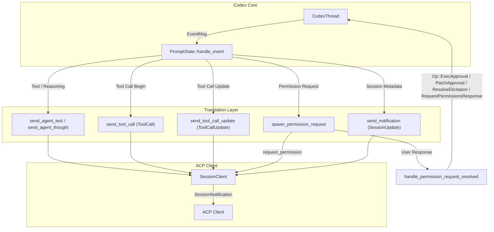
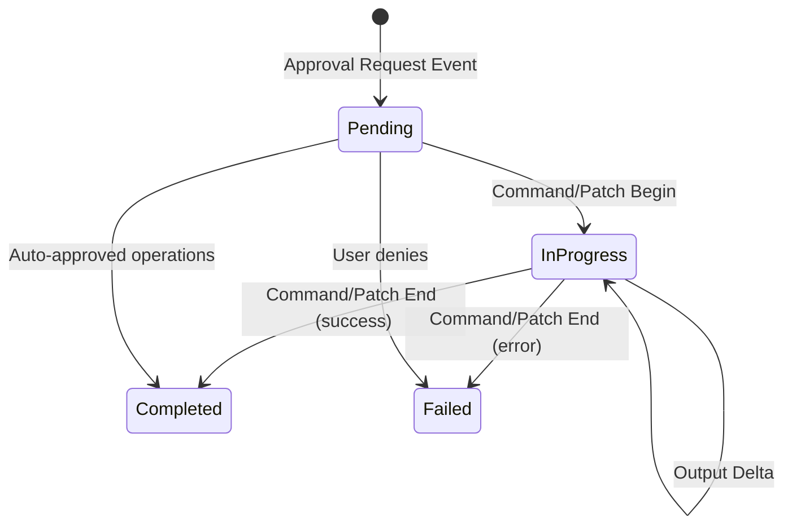
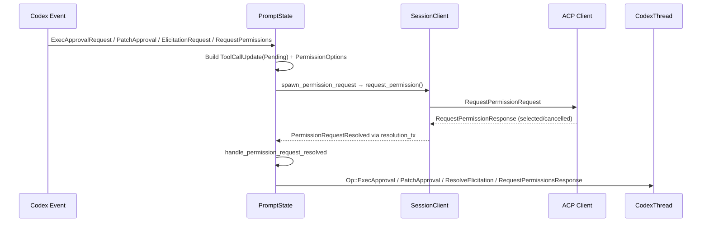

Codex operates on an internal event protocol — a stream of `EventMsg` variants emitted by `CodexThread` — while ACP clients expect structured `SessionUpdate` notifications. The translation layer in `PromptState::handle_event` is the bridge between these two worlds: it consumes each Codex event, enriches it with contextual metadata (parsed commands, file diffs, permission options), and dispatches the corresponding ACP notification through `SessionClient`. Understanding this mapping is essential for extending the agent, debugging client-side rendering, or adding new tool call types.

Sources: [thread.rs](src/thread.rs#L947-L1374)

## The Translation Architecture at a Glance

Every Codex event flows through a single dispatch point: `PromptState::handle_event`. This method pattern-matches on `EventMsg` variants and invokes dedicated handler methods that construct ACP `ToolCall`, `ToolCallUpdate`, or `SessionUpdate` objects before sending them via `SessionClient`. Permission-gated operations (exec, patch, MCP elicitation, general permissions) follow a more complex async lifecycle — they spawn an ACP `request_permission` interaction, await the user's response, and then submit a resolution `Op` back to Codex.

The diagram above illustrates the three key pathways: **streaming content** (agent text and thought chunks), **tool call lifecycle** (begin/update/complete), and **permission-gated interactions** (the round-trip through ACP's permission protocol back to Codex).

Sources: [thread.rs](src/thread.rs#L947-L975), [thread.rs](src/thread.rs#L2411-L2558)

## Complete Event-to-Notification Mapping

The following table catalogs every `EventMsg` variant that produces a visible ACP notification or triggers a client interaction. Variants not listed are either logged internally with no client-visible effect or explicitly silenced (see [Ignored and Unexpected Events](#ignored-and-unexpected-events)).

| Codex Event (`EventMsg`) | ACP Notification(s) | Key Translation Logic |
|---|---|---|
| `AgentMessageContentDelta` | `SessionUpdate::AgentMessageChunk` | Streaming text delta forwarded verbatim |
| `AgentMessage` | `SessionUpdate::AgentMessageChunk` | Non-delta fallback; only emitted if no prior deltas were seen for the turn |
| `ReasoningContentDelta` / `ReasoningRawContentDelta` | `SessionUpdate::AgentThoughtChunk` | Both reasoning delta types map to thought chunks |
| `AgentReasoning` | `SessionUpdate::AgentThoughtChunk` | Non-delta fallback; same guard as `AgentMessage` |
| `AgentReasoningSectionBreak` | `SessionUpdate::AgentThoughtChunk` | Emits `"\n\n"` to create visual spacing |
| `TokenCount` | `SessionUpdate::UsageUpdate` | Maps `tokens_in_context_window` → `used`, `model_context_window` → `total` |
| `ThreadNameUpdated` | `SessionUpdate::SessionInfoUpdate` | Only forwards if `thread_name` is `Some` |
| `PlanUpdate` | `SessionUpdate::Plan` | Maps `StepStatus` → `PlanEntryStatus`, sets priority to `Medium` |
| `ExecApprovalRequest` | `request_permission` + `ToolCallUpdate(Pending)` | Parses command, builds permission options from `available_decisions` |
| `ExecCommandBegin` | `SessionUpdate::ToolCall(InProgress)` | Parses command for title/kind/locations; optionally includes `Terminal` content |
| `ExecCommandOutputDelta` | `SessionUpdate::ToolCallUpdate` | Either streams to terminal (via meta) or accumulates into fenced code block |
| `ExecCommandEnd` | `SessionUpdate::ToolCallUpdate(Completed/Failed)` | Maps exit code + `ExecCommandStatus` → `ToolCallStatus` |
| `TerminalInteraction` | `SessionUpdate::ToolCallUpdate` | Mirrors `ExecCommandOutputDelta` formatting for stdin lines |
| `ApplyPatchApprovalRequest` | `request_permission` + `ToolCallUpdate(Pending)` | Extracts diff content from `changes` map; kind = `Edit` |
| `PatchApplyBegin` | `SessionUpdate::ToolCall(Edit, InProgress)` | Extracts title, locations, and diff content from `changes` |
| `PatchApplyEnd` | `SessionUpdate::ToolCallUpdate(Completed/Failed)` | Maps `PatchApplyStatus`; may include updated changes if present |
| `DynamicToolCallRequest` | `SessionUpdate::ToolCall(InProgress)` | Generic tool call with `raw_input` from arguments |
| `DynamicToolCallResponse` | `SessionUpdate::ToolCallUpdate(Completed/Failed)` | Maps `content_items` (text/image) + error to `ToolCallContent` |
| `McpToolCallBegin` | `SessionUpdate::ToolCall(InProgress)` | Title formatted as `"Tool: {server}/{tool}"` |
| `McpToolCallEnd` | `SessionUpdate::ToolCallUpdate(Completed/Failed)` | Maps MCP `CallToolResult.is_error`; deserializes content blocks |
| `WebSearchBegin` | `SessionUpdate::ToolCall(Fetch, InProgress)` | Title = "Searching the Web" |
| `WebSearchEnd` | `SessionUpdate::ToolCallUpdate(InProgress)` | Updates title with query; `raw_input` contains query and action |
| *(next event triggers completion)* | `SessionUpdate::ToolCallUpdate(Completed)` | Web search completed implicitly when any non-search event arrives |
| `ElicitationRequest` | `request_permission` (if supported form) or auto-decline | Checks `meta.codex_approval_kind == "mcp_tool_call"` |
| `RequestPermissions` | `request_permission` + `ToolCallUpdate(Pending)` | Builds content from file system and network access descriptions |
| `GuardianAssessment` | `SessionUpdate::ToolCall(Think)` or `ToolCallUpdate` | Status maps: `InProgress`→`InProgress`, `Approved`→`Completed`, `Denied/Aborted`→`Failed` |
| `ViewImageToolCall` | `SessionUpdate::ToolCall(Read, Completed)` | Includes `ResourceLink` content and file `location` |
| `Warning` | `SessionUpdate::AgentMessageChunk` | Forwarded as agent text so users see informational notices |
| `ContextCompacted` | `SessionUpdate::AgentMessageChunk` | Emits "Context compacted\n" as agent text |
| `UndoStarted` / `UndoCompleted` | `SessionUpdate::AgentMessageChunk` | Emits undo status messages as agent text |
| `ExitedReviewMode` | `SessionUpdate::AgentMessageChunk` | Formats review findings via `format_review_findings_block` |

Sources: [thread.rs](src/thread.rs#L977-L1374), [thread.rs](src/thread.rs#L1469-L2227)

## The ToolCall Lifecycle Pattern

Most Codex events that represent agent actions follow a **begin → update → complete** lifecycle through ACP's `ToolCall` and `ToolCallUpdate` types. Understanding this pattern is critical because the same `tool_call_id` must be consistent across all three phases, and the `ToolKind` determines how the client renders the activity.

**ToolCall** (the initial creation) carries `tool_call_id`, `title`, `kind`, `status`, `locations`, `content`, and `raw_input`. **ToolCallUpdate** (subsequent mutations) references the same `tool_call_id` and carries only the fields that changed in `ToolCallUpdateFields`. The `kind` field (`ToolKind`) is set once during creation and determines the client's visual treatment:

| `ToolKind` | Assigned When | Client Rendering Hint |
|---|---|---|
| `Execute` | Unknown shell commands | Terminal/command execution |
| `Read` | `cat`-like commands, `ViewImageToolCall` | File read operation |
| `Search` | `ls`, `grep`, `find` commands; web search replay | Search/query operation |
| `Edit` | Patch approval and application | File modification |
| `Fetch` | Live web search (begin phase) | Network fetch |
| `Think` | Guardian assessments | Agent reasoning/review |
| `Other` | Generic/dynamic tool calls, replay fallback | Unclassified tool call |

The `parse_command_tool_call` function is responsible for classifying shell commands into the appropriate `ToolKind` by pattern-matching on `ParsedCommand` variants: `Read` maps to `ToolKind::Read`, `ListFiles` and `Search` map to `ToolKind::Search`, and `Unknown` maps to `ToolKind::Execute`.

Sources: [thread.rs](src/thread.rs#L2343-L2409), [thread.rs](src/thread.rs#L2485-L2524)

## Permission-Gated Event Translation

Four Codex event types require user approval before proceeding. These follow a shared asynchronous pattern implemented through `spawn_permission_request`, but each has distinct resolution semantics when the user's response arrives.

### The Shared Permission Request Flow

When a permission-gated event arrives, the handler constructs a `ToolCallUpdate` with `ToolCallStatus::Pending` and a list of `PermissionOption` choices, then calls `spawn_permission_request`. This spawns a local tokio task that calls `SessionClient::request_permission` — an ACP RPC that blocks until the user selects an option or cancels. The response is routed back as a `ThreadMessage::PermissionRequestResolved` message through the actor's `resolution_rx` channel.

Sources: [thread.rs](src/thread.rs#L782-L814), [thread.rs](src/thread.rs#L816-L944)

### Permission Request Types and Resolution

Each permission type carries a `PendingPermissionRequest` variant that determines how the user's option selection maps back to a Codex operation:

| PendingPermissionRequest Variant | Codex Event Source | Resolution Op | Option Mapping |
|---|---|---|---|
| `Exec` | `ExecApprovalRequestEvent` | `Op::ExecApproval` | `option_map: HashMap<String, ReviewDecision>` — maps ACP option IDs to Codex decisions |
| `Patch` | `ApplyPatchApprovalRequestEvent` | `Op::PatchApproval` | `option_map: HashMap<String, ReviewDecision>` — "approved" → `Approved`, "abort" → `Abort` |
| `McpElicitation` | `ElicitationRequestEvent` | `Op::ResolveElicitation` | `option_map: HashMap<String, ResolvedMcpElicitation>` — includes persist metadata |
| `RequestPermissions` | `RequestPermissionsEvent` | `Op::RequestPermissionsResponse` | Hard-coded: "approved-for-session" → `Session` scope, "approved" → `Turn` scope |

When the ACP client cancels (or returns an unrecognized outcome), the default resolution is always conservative: `ReviewDecision::Abort` for exec/patch, `ElicitationAction::Decline` for MCP elicitation, and default (empty) permissions for `RequestPermissions`.

Sources: [thread.rs](src/thread.rs#L335-L354), [thread.rs](src/thread.rs#L829-L944)

## Command Parsing and ToolCall Enrichment

Raw shell commands from Codex carry limited structure — typically just a `Vec<String>` of arguments and a working directory. The translation layer enriches these with **parsed metadata** that makes tool calls informative and interactive in the ACP client.

The `parse_command_tool_call` function processes `ParsedCommand` variants produced by `codex_shell_command::parse_command`:

| `ParsedCommand` | Title Pattern | `ToolKind` | `terminal_output` | Location |
|---|---|---|---|---|
| `Read { name, path }` | `"Read {name}"` | `Read` | `false` | `path` (absolute) |
| `ListFiles { path }` | `"List {dir}"` | `Search` | `false` | `path` if present |
| `Search { query, path }` | `"Search {query} in {path}"` | `Search` | `false` | — |
| `Unknown { cmd }` | `"Run {cmd}"` | `Execute` | `true` | — |

The `terminal_output` flag is particularly significant: when set to `true` **and** the client advertises `meta.terminal_output` capability, the handler switches from accumulating output into fenced code blocks to streaming raw bytes through `ToolCallUpdate.meta` with `terminal_output` and `terminal_exit` keys. This enables rich terminal emulation in capable clients like Zed.

Sources: [thread.rs](src/thread.rs#L2343-L2409), [thread.rs](src/thread.rs#L1852-L1864)

## Patch and Diff Content Extraction

File changes from Codex arrive as `HashMap<PathBuf, FileChange>` — a map of affected files to their change type. The `extract_tool_call_content_from_changes` function transforms these into ACP `Diff` objects that clients can render as inline diffs:

- **`FileChange::Add`**: Creates a `Diff` with `new_text` set to the file content and no `old_text`
- **`FileChange::Delete`**: Creates a `Diff` with empty `new_text` and `old_text` set to the deleted content
- **`FileChange::Update`**: Parses the unified diff using `diffy::Patch`, then decomposes each hunk into `old_text`/`new_text` pairs. If the unified diff cannot be parsed, the raw diff text is embedded as a `TextContent` fallback

The title is constructed as `"Edit {file1}, {file2}, ..."`, listing all affected file paths. For `FileChange::Update` with a `move_path`, the destination path is used for both the `ToolCallLocation` and the `Diff` path.

Sources: [thread.rs](src/thread.rs#L3767-L3866)

## Web Search: Implicit Completion Semantics

Web search events follow an unusual lifecycle: `WebSearchBegin` creates the tool call, `WebSearchEnd` provides the query and updates the title, but there is **no explicit `WebSearchComplete` event** from Codex. Instead, completion is triggered implicitly when the next "significant" event arrives.

Before dispatching any event in `handle_event`, the method checks whether the event is one of ~18 types that signal the web search is done (including `Error`, `ExecApprovalRequest`, `McpToolCallBegin`, `TurnComplete`, `ShutdownComplete`, etc.). If a web search is active, it is completed first. This design means web searches are always "closed out" by the next activity, which simplifies the Codex core but requires the translation layer to manage the pending state.

Sources: [thread.rs](src/thread.rs#L950-L975), [thread.rs](src/thread.rs#L2032-L2088)

## Ignored and Unexpected Events

The translation layer explicitly ignores a substantial set of `EventMsg` variants that either have no ACP equivalent, represent deprecated protocols, or are handled through alternative pathways:

**Silently ignored** (no-op match arm): `ImageGenerationBegin/End`, `AgentReasoningRawContent`, `ThreadRolledBack`, `HookStarted/Completed`, `TurnDiff`, `BackgroundEvent`, `SkillsUpdateAvailable`, `AgentMessageDelta`, `AgentReasoningDelta`, `AgentReasoningRawContentDelta`, `RawResponseItem`, `SessionConfigured`, all `Collab*` events, all `RealtimeConversation*` events, `PlanDelta`.

**Logged as unexpected** (warn-level): `McpListToolsResponse`, `ListCustomPromptsResponse`, `ListSkillsResponse`, `GetHistoryEntryResponse`, `DeprecationNotice`, `RequestUserInput` — these are events that should have been consumed by a specific submission context but arrived when no matching submission was active.

**Logged but no ACP output**: `TurnStarted`, `ItemStarted`, `ItemCompleted`, `StreamError`, `McpStartupUpdate`, `McpStartupComplete`, `ModelReroute`, `EnteredReviewMode` — these carry diagnostic information useful for server-side logging but do not produce client-visible notifications.

Sources: [thread.rs](src/thread.rs#L1332-L1374)

## SessionClient: The Notification Gateway

`SessionClient` is the thin abstraction over the ACP `Client` trait that all translation handlers use. It wraps three categories of methods:

**Content streaming**: `send_agent_text`, `send_agent_thought`, `send_user_message` — each wraps a `ContentChunk` in the appropriate `SessionUpdate` variant (`AgentMessageChunk`, `AgentThoughtChunk`, `UserMessageChunk`).

**Tool call lifecycle**: `send_tool_call`, `send_tool_call_update`, `send_completed_tool_call`, `send_tool_call_completed` — convenience wrappers that construct `ToolCall` or `ToolCallUpdate` objects with sensible defaults.

**Permission and metadata**: `request_permission` (direct ACP RPC), `update_plan`, `send_notification` (raw `SessionUpdate`).

The client also performs **capability detection** via `supports_terminal_output`, which checks `client_capabilities.meta.terminal_output` to decide whether to stream raw terminal data or accumulate output into fenced code blocks.

Sources: [thread.rs](src/thread.rs#L2411-L2558)

## Replay: Historical Event Translation

When loading a session, historical events are replayed through a separate path in `ThreadActor`. The `replay_event_msg` method handles `UserMessage`, `AgentMessage`, `AgentReasoning`, and `AgentReasoningRawContent` as simple content chunks. The `replay_response_item` method reconstructs tool calls from `ResponseItem` variants — `LocalShellCall`, `FunctionCall`, `CustomToolCall` (including `apply_patch`), `WebSearchCall`, and their corresponding output items — producing completed `ToolCall` notifications that mirror the original live session's tool call structure.

Replay differs from live handling in two key ways: all tool calls are emitted as already-completed (no `Pending` or `InProgress` states), and no permission requests are spawned (the outcomes are already determined).

Sources: [thread.rs](src/thread.rs#L3386-L3703)

## Next Steps

The translation layer touches several specialized domains, each documented in dedicated pages:

- For the exec command approval flow and terminal output handling in detail, see [Exec Command Approval and Terminal Output](12-exec-command-approval-and-terminal-output)
- For patch approval mechanics and diff representation, see [Patch Approval and File Diff Representation](13-patch-approval-and-file-diff-representation)
- For MCP tool calls and elicitation permission requests, see [MCP Tool Calls and Elicitation Permission Requests](14-mcp-tool-calls-and-elicitation-permission-requests)
- For web search, guardian assessments, and dynamic tool calls, see [Web Search, Guardian Assessment, and Dynamic Tool Calls](15-web-search-guardian-assessment-and-dynamic-tool-calls)
- For the `SessionClient` implementation and notification delivery, see [SessionClient: The ACP Notification Gateway](18-sessionclient-the-acp-notification-gateway)