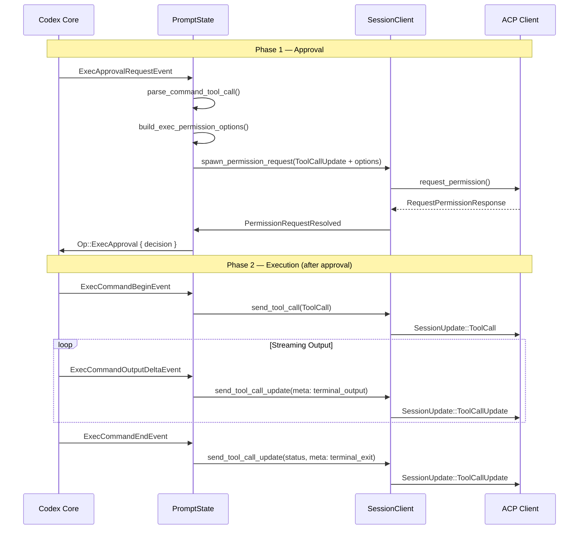
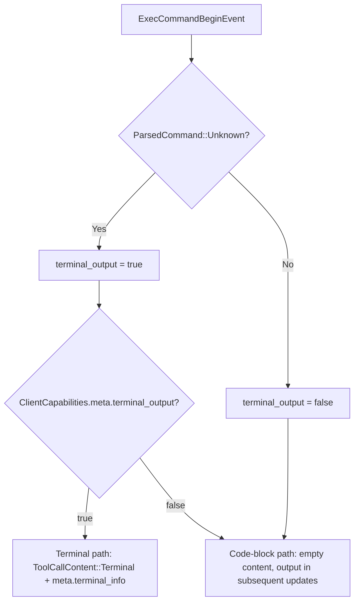

When Codex decides to execute a shell command, the codex-acp bridge must accomplish two things in the ACP domain: **request the user's permission** before execution proceeds, and **stream the command's terminal output** back to the client in real time. These two responsibilities are handled by distinct but interleaved event paths within `PromptState`, the per-prompt event processor that lives inside [Thread and ThreadActor](7-thread-and-threadactor-event-loop-and-codex-to-acp-translation). This page examines both paths in detail — from the moment a `ExecApprovalRequestEvent` arrives from Codex, through the async permission round-trip with the ACP client, to the streaming of `ExecCommandBegin`, `ExecCommandOutputDelta`, `ExecCommandEnd`, and `TerminalInteraction` events that follow approval.

Sources: [thread.rs](src/thread.rs#L1092-L1126)

## The Two-Phase Lifecycle: Approval Then Execution

Exec command processing in codex-acp follows a strict two-phase lifecycle. In the first phase, Codex emits an `ExecApprovalRequestEvent` asking whether the command is permitted. The bridge translates this into an ACP `request_permission` call, suspending the command until the user responds. In the second phase — only after approval — Codex emits a sequence of `ExecCommandBegin → ExecCommandOutputDelta* → ExecCommandEnd` events that the bridge translates into ACP `ToolCall` and `ToolCallUpdate` notifications. A fifth event, `TerminalInteraction`, can arrive between begin and end when the executing process reads from stdin (i.e., the user typed into a terminal).



Sources: [thread.rs](src/thread.rs#L1092-L1126), [thread.rs](src/thread.rs#L1702-L1822), [thread.rs](src/thread.rs#L1824-L1981)

## Phase 1: Exec Approval Request

When Codex emits an `ExecApprovalRequestEvent`, the `PromptState::exec_approval` method takes over. Its responsibilities are: parse the command into a rich display representation, construct the permission options from the available decisions, register a pending permission interaction, and spawn an async task that sends the `request_permission` call to the ACP client.

### Command Parsing and ToolCall Metadata

The `parse_command_tool_call` function transforms the `ParsedCommand` vector from Codex into an ACP-friendly representation. Each `ParsedCommand` variant maps to a specific `ToolKind` and title:

| Codex `ParsedCommand` Variant | ACP `ToolKind` | Title Pattern | `terminal_output` |
|---|---|---|---|
| `Read { name, path }` | `ToolKind::Read` | `"Read {name}"` | `false` |
| `ListFiles { path }` | `ToolKind::Search` | `"List {dir}"` | `false` |
| `Search { query, path }` | `ToolKind::Search` | `"Search {query} in {path}"` | `false` |
| `Unknown { cmd }` | `ToolKind::Execute` | `"Run {cmd}"` | `true` |

The `terminal_output` flag is the critical differentiator: only `ParsedCommand::Unknown` commands set it to `true`. This flag determines whether the bridge will later use the ACP `Terminal` content type for streaming output, or fall back to accumulating text in code blocks. When multiple parsed commands are present in a single exec event, the title joins them with `", "` and `terminal_output` becomes `true` if *any* sub-command is unknown.

Sources: [thread.rs](src/thread.rs#L2343-L2409), [thread.rs](src/thread.rs#L726-L731)

### Building Permission Options

The `build_exec_permission_options` function maps each `ReviewDecision` that Codex declares as available into an `ExecPermissionOption` containing an ACP `PermissionOption`. The mapping is context-sensitive — for instance, `ReviewDecision::Approved` produces `"Yes, proceed"` in normal contexts but `"Yes, just this once"` when a network approval context is present. Similarly, `ReviewDecision::ApprovedForSession` adapts its label to reflect whether it applies to a network host, additional permissions, or the command itself:

| `ReviewDecision` | Option ID | Label (default) | `PermissionOptionKind` |
|---|---|---|---|
| `Approved` | `"approved"` | `"Yes, proceed"` | `AllowOnce` |
| `ApprovedExecpolicyAmendment` | `"approved-execpolicy-amendment"` | `"Yes, and don't ask again for commands that start with \`{prefix}\`"` | `AllowAlways` |
| `ApprovedForSession` | `"approved-for-session"` | `"Yes, and don't ask again for this command in this session"` | `AllowAlways` |
| `NetworkPolicyAmendment(Allow)` | `"network-policy-amendment-allow"` | `"Yes, and allow this host in the future"` | `AllowAlways` |
| `NetworkPolicyAmendment(Deny)` | `"network-policy-amendment-deny"` | `"No, and block this host in the future"` | `RejectAlways` |
| `Denied` | `"denied"` | `"No, continue without running it"` | `RejectOnce` |
| `Abort` | `"abort"` | `"No, and tell Codex what to do differently"` | `RejectOnce` |

The `available_decisions` field is sourced from `event.effective_available_decisions()`, which Codex populates based on the session's sandbox policy and trust level. The bridge does not second-guess this list — it faithfully translates every decision the upstream provides.

Sources: [thread.rs](src/thread.rs#L2229-L2341), [thread.rs](src/thread.rs#L1707)

### Spawning the Permission Request

Rather than blocking the event loop, `exec_approval` calls `spawn_permission_request`, which launches a `tokio::task::spawn_local` task that sends `client.request_permission(tool_call, options)` asynchronously. The pending interaction is stored in `PromptState::pending_permission_interactions` under a key derived by `exec_request_key` (which produces the format `"exec:{call_id}"`). This design ensures that **subsequent events from Codex continue flowing** even while the user deliberates on a permission prompt — a critical property tested explicitly in `test_blocked_approval_does_not_block_followup_events`.

When the user responds, the spawned task sends a `ThreadMessage::PermissionRequestResolved` back through the `resolution_tx` channel. The `ThreadActor`'s main loop receives this on `resolution_rx` and routes it to `PromptState::handle_permission_request_resolved`. For exec approvals, this method looks up the user's selected `option_id` in the `option_map` (a `HashMap<String, ReviewDecision>`), resolves it to a `ReviewDecision`, and submits `Op::ExecApproval { id, turn_id, decision }` back to Codex. If the user cancels or selects an unrecognized option, the decision defaults to `ReviewDecision::Abort`.

Sources: [thread.rs](src/thread.rs#L782-L814), [thread.rs](src/thread.rs#L830-L854), [thread.rs](src/thread.rs#L1790-L1822), [thread.rs](src/thread.rs#L394-L396)

### Approval Content Enrichment

Beyond the parsed command, the `exec_approval` method enriches the `ToolCallUpdate` content with contextual information from the event:

- **`reason`** — Codex's explanation for why the command is being proposed
- **`proposed_execpolicy_amendment`** — a suggested persistent policy rule (e.g., "allow all commands starting with `cargo test`")
- **`network_approval_context`** — the `{host, protocol}` pair when the command involves network access
- **`additional_permissions`** — any extra capability grants the command requires
- **`available_decisions`** — the full list of decisions Codex is offering
- **`proposed_network_policy_amendments`** — persistent network allow/deny rules

These are joined with newlines into a single content block attached to the `ToolCallUpdate`, giving the ACP client rich context to display alongside the approval prompt.

Sources: [thread.rs](src/thread.rs#L1744-L1783)

## Phase 2: Command Execution and Output Streaming

After approval, Codex begins executing the command. The event stream transitions from the approval phase to the execution phase, and `PromptState` tracks each running command via the `active_commands: HashMap<String, ActiveCommand>` map.

### The `ActiveCommand` Tracker

Each `ActiveCommand` entry stores:

| Field | Purpose |
|---|---|
| `tool_call_id: ToolCallId` | The ACP identifier for this tool call |
| `terminal_output: bool` | Whether to use Terminal content or code-block content |
| `output: String` | Accumulated output text (used only when `terminal_output` is `false`) |
| `file_extension: Option<String>` | Language hint for code-block fencing (e.g., `"md"`, `"sh"`) |

The `terminal_output` and `file_extension` fields are populated by `parse_command_tool_call` during both the approval and begin phases, ensuring consistent rendering regardless of which path created the entry.

Sources: [thread.rs](src/thread.rs#L726-L731)

### ExecCommandBegin: Announcing Execution

On `ExecCommandBeginEvent`, the bridge creates a fresh `ActiveCommand` entry and sends a `ToolCall` notification with `status: InProgress`. The key branching point is `client.supports_terminal_output(&active_command)`, which checks two conditions:

1. **`active_command.terminal_output`** is `true` (i.e., the command was classified as `ParsedCommand::Unknown`)
2. **`client_capabilities.meta["terminal_output"]`** is `true` (i.e., the ACP client has declared support for terminal output)

When both are true, the `ToolCall` content includes a `ToolCallContent::Terminal(Terminal::new(call_id))` entry and the meta contains `terminal_info: { terminal_id, cwd }`. This tells ACP clients like Zed to render a live terminal widget. When the capability is absent, the content is left empty — output will be delivered as text in subsequent updates.

Sources: [thread.rs](src/thread.rs#L1824-L1879), [thread.rs](src/thread.rs#L2440-L2452)

### ExecCommandOutputDelta: Streaming Output

For each `ExecCommandOutputDeltaEvent`, the bridge decodes the raw byte chunk via `String::from_utf8_lossy` and then follows one of two paths:

**Terminal path** (`supports_terminal_output` is `true`): The update carries a `meta` field with key `"terminal_output"` containing `{ terminal_id, data }`. This streams raw text into the client's terminal widget without modifying the tool call's primary `content`.

**Code-block path** (`supports_terminal_output` is `false`): The output text is appended to `active_command.output`, and the full accumulated output is reformatted as a fenced code block on every delta. The fence language is determined by `file_extension`: `"md"` renders as raw Markdown, other extensions use ` ```{ext} `, and `None` defaults to ` ```sh `. This means every output delta replaces the entire content — a design that trades efficiency for simplicity, ensuring the client always has a self-contained renderable block.

Sources: [thread.rs](src/thread.rs#L1881-L1928)

### TerminalInteraction: Stdin Echo

When the executing process reads from stdin (e.g., an interactive prompt), Codex emits a `TerminalInteractionEvent` carrying `{ call_id, process_id, stdin }`. The bridge wraps the `stdin` string with leading and trailing newlines (`"\n{stdin}\n"`) and streams it using the same dual-path logic as `ExecCommandOutputDelta` — either via the `terminal_output` meta key or by appending to the accumulated code-block content.

Sources: [thread.rs](src/thread.rs#L1983-L2030)

### ExecCommandEnd: Completion and Exit Code

On `ExecCommandEndEvent`, the `ActiveCommand` is removed from the tracker and a final `ToolCallUpdate` is sent with the resolved status and `raw_output`. The status mapping is:

| Codex `ExecCommandStatus` | Exit Code | ACP `ToolCallStatus` |
|---|---|---|
| `Completed` | any | `Completed` |
| (not `Completed`) | `0` | `Completed` |
| `Failed` | non-zero | `Failed` |
| `Declined` | non-zero | `Failed` |

When the client supports terminal output, the update also carries a `terminal_exit` meta key containing `{ terminal_id, exit_code, signal: null }`, signaling the terminal widget to finalize with the exit code.

Sources: [thread.rs](src/thread.rs#L1930-L1981)

## The Terminal Output Capability Contract

The `supports_terminal_output` method on `SessionClient` encapsulates a two-party capability negotiation: the *command* must be classified as terminal-worthy (`active_command.terminal_output == true`), and the *client* must declare the `terminal_output` capability in its `ClientCapabilities.meta`. This negotiation prevents sending terminal-specific content to clients that cannot render it, while also avoiding the overhead of terminal framing for simple read/list/search commands that are better represented as file operations.



Sources: [thread.rs](src/thread.rs#L2440-L2452)

## Parallel Command Support

The `active_commands` HashMap allows multiple commands to execute concurrently. Codex may interleave `ExecCommandBegin` events for different `call_id`s before any of them end, and the bridge correctly tracks each independently. The test `test_parallel_exec_commands` verifies this by emitting `Begin A → Begin B → End A → End B` and asserting that two distinct `ToolCall` begins and two completed `ToolCallUpdate`s are sent, with matching `tool_call_id` sets.

Sources: [thread.rs](src/thread.rs#L4993-L5070)

## Error Handling and Non-Blocking Guarantees

A design goal of the permission system is that **approval requests never block the event loop**. When `exec_approval` encounters an error (e.g., the permission request itself fails), it captures the error and sends it through the `response_tx` channel, which terminates the prompt with an error. However, while a permission request is pending — even indefinitely — the `PromptState::handle_event` method continues processing other events like `AgentMessage` and `AgentReasoning`. The `spawn_permission_request` approach, combined with the `ThreadActor`'s `tokio::select!` loop that listens to both `message_rx` and `resolution_rx` alongside `thread.next_event()`, ensures that a blocked approval never stalls the session.

Sources: [thread.rs](src/thread.rs#L1092-L1101), [thread.rs](src/thread.rs#L5347-L5419), [thread.rs](src/thread.rs#L2612-L2640)

## Session Shutdown and Pending Approvals

When a session is shut down while a permission request is pending, the `Thread::shutdown` method submits `Op::Shutdown` to the underlying Codex thread and the `abort_pending_interactions` method cancels all spawned permission tasks. The test `test_thread_shutdown_bypasses_blocked_permission_request` verifies that shutdown completes even when the ACP client's `request_permission` call is blocked indefinitely, and that the final `Op` submitted to the thread is `Op::Shutdown`.

Sources: [thread.rs](src/thread.rs#L776-L780), [thread.rs](src/thread.rs#L5421-L5492)

## Summary: Event-to-ACP Mapping Table

| Codex Event | ACP Notification | Key Fields |
|---|---|---|
| `ExecApprovalRequestEvent` | `ToolCallUpdate` (status: `Pending`) + `request_permission` | `kind`, `title`, `raw_input`, `content` (context), `locations`, `PermissionOption[]` |
| `ExecCommandBeginEvent` | `ToolCall` (status: `InProgress`) | `Terminal` content if supported, `meta.terminal_info` |
| `ExecCommandOutputDeltaEvent` | `ToolCallUpdate` | `meta.terminal_output` OR `content` (code-block) |
| `TerminalInteractionEvent` | `ToolCallUpdate` | `meta.terminal_output` OR `content` (code-block) |
| `ExecCommandEndEvent` | `ToolCallUpdate` (status: `Completed`/`Failed`) | `raw_output`, `meta.terminal_exit` if supported |

Sources: [thread.rs](src/thread.rs#L1092-L1126)

## Related Pages

- [Translating Codex Events to ACP Notifications](11-translating-codex-events-to-acp-notifications) — the broader event translation framework
- [Patch Approval and File Diff Representation](13-patch-approval-and-file-diff-representation) — the parallel approval flow for file edits
- [MCP Tool Calls and Elicitation Permission Requests](14-mcp-tool-calls-and-elicitation-permission-requests) — permission handling for MCP server interactions
- [SessionClient: The ACP Notification Gateway](18-sessionclient-the-acp-notification-gateway) — the `SessionClient` type and its notification delivery mechanics