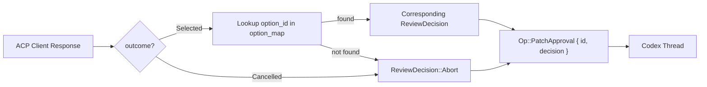
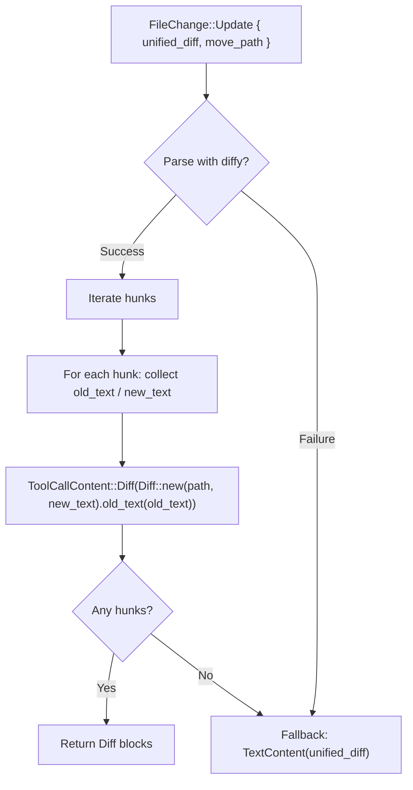

When Codex proposes modifications to the filesystem—creating, updating, or deleting files—the codex-acp bridge must translate those intent signals into ACP's structured permission model and diff representation format. This page covers the complete lifecycle: from the moment Codex emits a patch approval request, through the ACP permission dialog, to the final diff content rendered in the client. Understanding this pipeline is essential for anyone extending the agent, building custom ACP clients, or debugging why a particular edit appears (or doesn't) in the UI.

Sources: [thread.rs](src/thread.rs#L46-L53)

## The Patch Event Lifecycle

Patch operations in Codex flow through three distinct event types that codex-acp intercepts and translates into ACP tool call notifications. The sequence is deterministic: Codex always emits an approval request first, then a begin event when the patch starts applying, and finally an end event with the outcome. In auto-approved modes (e.g., the `full-auto` session mode), the approval step is skipped and Codex proceeds directly to the begin/end pair.

```mermaid
sequenceDiagram
    participant Codex as Codex Core
    participant Actor as ThreadActor
    participant Client as ACP Client

    Note over Codex,Client: Requires Approval Flow
    Codex->>Actor: ApplyPatchApprovalRequestEvent
    Actor->>Client: ToolCallUpdate (Pending, ToolKind::Edit)
    Client-->>Actor: RequestPermissionResponse (Allow/Reject)
    Actor->>Codex: Op::PatchApproval { decision }
    Codex->>Actor: PatchApplyBeginEvent
    Actor->>Client: ToolCall (InProgress, ToolKind::Edit)
    Codex->>Actor: PatchApplyEndEvent
    Actor->>Client: ToolCallUpdate (Completed/Failed)

    Note over Codex,Client: Auto-Approved Flow
    Codex->>Actor: PatchApplyBeginEvent (auto_approved=true)
    Actor->>Client: ToolCall (InProgress, ToolKind::Edit)
    Codex->>Actor: PatchApplyEndEvent
    Actor->>Client: ToolCallUpdate (Completed/Failed)
```

The `ThreadActor::handle_event` method dispatches on `EventMsg::ApplyPatchApprovalRequest`, `EventMsg::PatchApplyBegin`, and `EventMsg::PatchApplyEnd` to route each event to its dedicated handler. All three handlers share a common diff extraction pipeline—`extract_tool_call_content_from_changes`—but differ in how they construct the ACP tool call envelope and status.

Sources: [thread.rs](src/thread.rs#L1160-L1184)

## Approval Request: The Permission Gate

The `patch_approval` method handles the `ApplyPatchApprovalRequestEvent`. It destructures the event into its constituent `call_id`, `changes` (a `HashMap<PathBuf, FileChange>`), and optional `reason`. The changes are immediately transformed into ACP's visual representation using `extract_tool_call_content_from_changes`, which produces a title, a set of file locations, and structured diff content.

The method then constructs exactly two permission options for the user:

| Option ID | Label | ACP Kind | Codex Decision |
|-----------|-------|----------|----------------|
| `approved` | "Yes" | `AllowOnce` | `ReviewDecision::Approved` |
| `abort` | "No, provide feedback" | `RejectOnce` | `ReviewDecision::Abort` |

This is notably simpler than the exec command approval flow (documented in [Exec Command Approval and Terminal Output](12-exec-command-approval-and-terminal-output)), which offers session-scoped and policy-amendment options. Patches are inherently atomic—each one targets specific file regions—so the binary allow/reject model is sufficient.

The approval request is spawned as an asynchronous permission interaction via `spawn_permission_request`, which sends a `ToolCallUpdate` with `ToolKind::Edit` and `ToolCallStatus::Pending` to the ACP client, then awaits the user's decision. The mapping between option IDs and `ReviewDecision` variants is stored in a `PendingPermissionRequest::Patch` variant, keyed by a `patch:{call_id}` request identifier.

Sources: [thread.rs](src/thread.rs#L1469-L1516)

## Resolution: Feeding the Decision Back to Codex

When the ACP client responds—either by selecting an option or cancelling—the `handle_permission_request_resolved` method retrieves the `PendingPermissionRequest::Patch` from the pending interactions map. It resolves the selected `option_id` against the stored `option_map`, defaulting to `ReviewDecision::Abort` on cancellation or unknown option. The resolved decision is then submitted to the Codex thread via `Op::PatchApproval { id: call_id, decision }`, which tells Codex whether to proceed with or abandon the patch.



If an error occurs during resolution (e.g., the thread has already been shut down), the error propagates up and terminates the current prompt's response channel, causing the prompt to fail cleanly.

Sources: [thread.rs](src/thread.rs#L855-L876)

## Patch Apply Begin and End: Status Transitions

Once approved (or auto-approved), Codex emits `PatchApplyBeginEvent` and `PatchApplyEndEvent` to bracket the actual filesystem operation. These are mapped to ACP tool call states:

**Begin event** → `ToolCall::new(call_id, title).kind(ToolKind::Edit).status(ToolCallStatus::InProgress)` with the full diff content and file locations attached. The `auto_approved` flag from the begin event is logged but not forwarded to ACP—the client sees no distinction between auto-approved and user-approved patches.

**End event** → `ToolCallUpdate` with status determined by the `PatchApplyStatus`:

| `PatchApplyStatus` | ACP `ToolCallStatus` |
|--------------------|---------------------|
| `Completed` | `Completed` |
| `Failed` | `Failed` |
| `Declined` | `Failed` |

If the end event carries non-empty `changes`, the diff content is re-extracted and attached to the update—this ensures the client sees the final state of the filesystem after application, not just the proposed changes. When `changes` is empty, only the status and raw output are sent.

Sources: [thread.rs](src/thread.rs#L1518-L1577)

## File Diff Representation: From FileChange to ACP Diff

The core translation from Codex's `FileChange` model to ACP's `Diff` content blocks happens in `extract_tool_call_content_from_changes` and its delegates. This is where the bridge converts Codex's filesystem mutation vocabulary into ACP's structured diff format that clients render as inline code changes.

### The FileChange Variants

`FileChange` is an enum from `codex-protocol` with three variants, each mapped to a distinct `Diff` pattern:

| Codex `FileChange` | ACP `Diff::new(path, new_text).old_text(old_text)` | Semantic |
|--------------------|------------------------------------------------------|----------|
| `Add { content }` | `Diff::new(path, content)` | New file: `old_text` is absent, `new_text` contains full content |
| `Delete { content }` | `Diff::new(path, "").old_text(content)` | Deleted file: `old_text` holds original content, `new_text` is empty |
| `Update { unified_diff, move_path }` | Parsed via `extract_tool_call_content_from_unified_diff` | Modified file: hunk-by-hunk diff extraction |

For `Add` operations, the `Diff` carries only the `new_text` field—no `old_text` is set, signaling to the client that this is a creation. For `Delete` operations, the `old_text` carries the deleted content and `new_text` is empty. For `Update` operations, the unified diff is parsed into per-hunk `Diff` blocks.

Sources: [thread.rs](src/thread.rs#L3809-L3825)

### Unified Diff Parsing: Hunk-by-Hunk Decomposition

The `extract_tool_call_content_from_unified_diff` function parses a unified diff string (from the `diffy` crate's `Patch::from_str`) and decomposes it into individual `Diff` objects, one per hunk. Each hunk's lines are classified into three categories:

- **Context lines** (`diffy::Line::Context`): appended to both `old_text` and `new_text`
- **Deleted lines** (`diffy::Line::Delete`): appended to `old_text` only
- **Inserted lines** (`diffy::Line::Insert`): appended to `new_text` only

This produces a semantically clean representation where each `Diff` block captures a contiguous region of change with its before/after state. The path for each hunk is the `move_path` if the file was renamed, otherwise the original `path`.

If the unified diff fails to parse (malformed input), or produces zero hunks after parsing, the function falls back to embedding the raw diff text as a `TextContent` block rather than a structured `Diff`. This graceful degradation ensures the user always sees the patch information, even if it can't be rendered as a rich diff.



Sources: [thread.rs](src/thread.rs#L3827-L3866)

### Title and Location Generation

The `extract_tool_call_content_from_changes` function also produces the tool call's title and locations. The title follows the pattern `"Edit {file_list}"` where file_list joins the display paths of all changed files. For a single-file patch, this becomes `"Edit src/main.rs"`; for multi-file patches, `"Edit src/main.rs, lib/utils.rs"`. If no changes are present, the title defaults to `"Edit"`.

Locations use `ToolCallLocation::new(path)` for each file. For `FileChange::Update` with a `move_path`, the location points to the destination path (the file after rename), not the source. This ensures the client navigates to the correct file when the user clicks on the location.

Sources: [thread.rs](src/thread.rs#L3767-L3807)

## Replay Path: CustomToolCall with apply_patch

During session history replay, patches are represented differently—they arrive as `ResponseItem::CustomToolCall { name: "apply_patch", input, call_id }` rather than as live events. The `parse_apply_patch_call` method handles this by parsing the raw patch string using `codex_apply_patch::parse_patch`, which produces a structured representation with three hunk types:

| `codex_apply_patch::Hunk` | Diff Construction | Path Resolution |
|---------------------------|-------------------|-----------------|
| `AddFile { path, contents }` | `Diff::new(full_path, contents)` | `cwd.join(path)` |
| `DeleteFile { path }` | `Diff::new(full_path, "").old_text("[file deleted]")` | `cwd.join(path)` |
| `UpdateFile { path, move_path, chunks }` | `Diff::new(dest_path, new_lines).old_text(old_lines)` | `move_path` or `cwd.join(path)` |

For `UpdateFile`, the old and new text are reconstructed by concatenating the `old_lines` and `new_lines` from all chunks with `"\n"` separators. The location for a renamed file points to the destination path, consistent with the live event handling.

The replay path produces a completed tool call (`ToolCallStatus::Completed`) rather than a pending one, since the patch has already been applied. If parsing fails, the system falls through to generic custom tool call handling, which renders the tool name and raw input without structured diff content.

Sources: [thread.rs](src/thread.rs#L3430-L3501)

## ACP Protocol Mapping Summary

The following table summarizes the complete mapping from Codex patch events to ACP protocol constructs:

| Codex Event | ACP Construct | `ToolKind` | Status | Content |
|-------------|---------------|------------|--------|---------|
| `ApplyPatchApprovalRequestEvent` | `ToolCallUpdate` (via `request_permission`) | `Edit` | `Pending` | Diff blocks + reason |
| `PatchApplyBeginEvent` | `ToolCall` | `Edit` | `InProgress` | Diff blocks from changes |
| `PatchApplyEndEvent` (success) | `ToolCallUpdate` | — | `Completed` | Diff blocks from final changes |
| `PatchApplyEndEvent` (failure) | `ToolCallUpdate` | — | `Failed` | Diff blocks from final changes |
| `ResponseItem::CustomToolCall("apply_patch")` | `ToolCall` | `Edit` | `Completed` | Parsed patch hunks |

All patch-related tool calls are uniformly classified as `ToolKind::Edit`, which signals to ACP clients that the operation modifies files rather than executing commands or searching. The `request_key` for pending patch approvals follows the format `"patch:{call_id}"`, namespacing them separately from exec approvals (`"exec:{call_id}"`) and other permission request types.

Sources: [thread.rs](src/thread.rs#L394-L399), [thread.rs](src/thread.rs#L1503-L1514)

## Abort and Cancellation Semantics

Pending patch approval interactions are tracked in the `PromptState::pending_permission_interactions` map, keyed by their `patch:{call_id}` identifier. When a turn completes, is aborted, or encounters an error, `abort_pending_interactions` drains the map and aborts all spawned tokio tasks. This ensures that stale permission dialogs don't linger after the model has moved on—if the user hasn't responded by the time the turn ends, the request is silently cancelled and the patch is never applied.

If a new patch approval arrives for the same `call_id` while a previous one is pending, the `spawn_permission_request` method aborts the old task before inserting the new one. This prevents duplicate dialogs and ensures the most recent request always takes precedence.

Sources: [thread.rs](src/thread.rs#L776-L813)

## Related Pages

- [Translating Codex Events to ACP Notifications](11-translating-codex-events-to-acp-notifications) — the overall event translation framework
- [Exec Command Approval and Terminal Output](12-exec-command-approval-and-terminal-output) — the parallel approval flow for shell commands, which offers richer permission options
- [MCP Tool Calls and Elicitation Permission Requests](14-mcp-tool-calls-and-elicitation-permission-requests) — another permission variant using ACP elicitation
- [Session History Replay](17-session-history-replay) — how patches appear during session replay
- [SessionClient: The ACP Notification Gateway](18-sessionclient-the-acp-notification-gateway) — the underlying transport for all tool call and permission messages