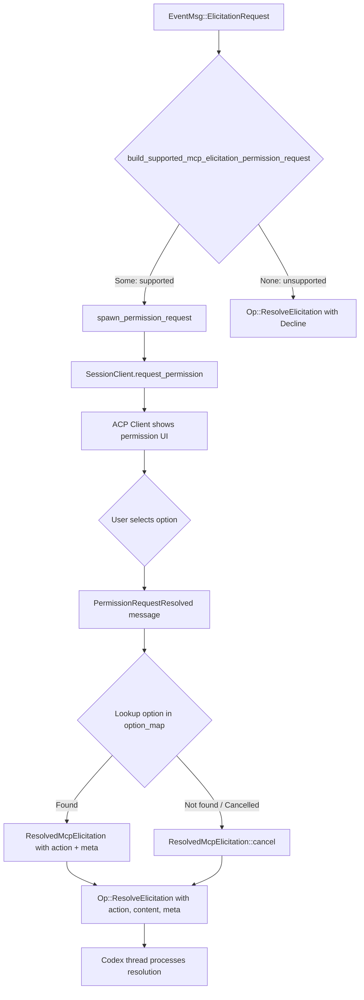

When Codex invokes an MCP (Model Context Protocol) server tool, two distinct translation concerns arise: **reporting the tool call's execution lifecycle** to the ACP client, and **routing permission requests** (elicited by MCP servers) back through the ACP permission system. This page dissects both pathways — the `McpToolCallBegin`/`McpToolCallEnd` event-to-notification pipeline and the `ElicitationRequest`-to-ACP-permission-request bridge — showing exactly how codex-acp transforms Codex-internal MCP events into the ACP protocol's `ToolCall`, `ToolCallUpdate`, and `RequestPermission` primitives.

Sources: [thread.rs](src/thread.rs#L1138-L1159)

## The MCP Tool Call Lifecycle

An MCP tool call in Codex follows a begin/end event pattern. When the Codex runtime dispatches a tool invocation to an MCP server, it emits `EventMsg::McpToolCallBegin`; when the server responds, it emits `EventMsg::McpToolCallEnd`. The `ThreadActor` maps these directly into ACP tool call notifications.

```mermaid
sequenceDiagram
    participant Codex as Codex Runtime
    participant Actor as ThreadActor
    participant Client as SessionClient
    participant ACP as ACP Client

    Codex->>Actor: EventMsg::McpToolCallBegin(call_id, invocation)
    Actor->>Client: send_tool_call(ToolCall { status: InProgress, title: "Tool: {server}/{tool}", raw_input })
    Client->>ACP: SessionUpdate::ToolCall

    Note over Codex,ACP: MCP server processes the invocation...

    Codex->>Actor: EventMsg::McpToolCallEnd(call_id, result)
    Actor->>Client: send_tool_call_update(ToolCallUpdate { status: Completed|Failed, raw_output, content })
    Client->>ACP: SessionUpdate::ToolCallUpdate
```

Sources: [thread.rs](src/thread.rs#L1595-L1700)

### Begin: Reporting an In-Progress MCP Tool Call

The `start_mcp_tool_call` method constructs a `ToolCall` with `ToolCallStatus::InProgress` and a human-readable title formatted as `Tool: {server}/{tool}`. The entire `McpInvocation` struct (which carries the server name, tool name, and arguments) is serialized as `raw_input`, giving the ACP client full visibility into what the MCP server was asked to do.

Sources: [thread.rs](src/thread.rs#L1595-L1609)

### End: Reporting Tool Call Completion or Failure

The `end_mcp_tool_call` method receives a `Result<CallToolResult, String>` — success carries structured content from the MCP server, while an error string indicates invocation failure. The mapping is straightforward:

| Codex Result | `is_error` Flag | ACP `ToolCallStatus` | Content Handling |
|---|---|---|---|
| `Ok(CallToolResult)` with `is_error: false` | `false` | `Completed` | Each content item deserialized into `ContentBlock` |
| `Ok(CallToolResult)` with `is_error: true` | `true` | `Failed` | Same deserialization as above |
| `Err(String)` | `true` (implicit) | `Failed` | No content items |

For successful results, the `CallToolResult.content` array is iterated and each item is deserialized from its raw JSON value into an ACP `ContentBlock`, then wrapped in `ToolCallContent::Content`. This ensures that text, images, and embedded resources returned by the MCP server are faithfully propagated to the ACP client.

Sources: [thread.rs](src/thread.rs#L1661-L1700)

## Elicitation Requests: The MCP Permission Gateway

MCP servers can issue **elicitation requests** to ask the user for input or approval before proceeding with a tool call. Codex models these as `ElicitationRequest` variants — `Form` (structured input with a JSON schema) and `Url` (redirect to an external URL). The `ThreadActor`'s `mcp_elicitation` method is the central routing point that decides how each elicitation is handled.

Sources: [thread.rs](src/thread.rs#L1377-L1435)

### The Routing Decision: Supported vs. Unsupported Elicitations

The critical distinction is whether the elicitation qualifies as a **supported MCP tool approval request**. The `build_supported_mcp_elicitation_permission_request` function applies a strict filter — only `ElicitationRequest::Form` variants whose `meta` object contains `"codex_approval_kind": "mcp_tool_call"` pass through. Everything else is auto-declined.

| Elicitation Type | Meta Check | Routing | Outcome |
|---|---|---|---|
| `Form` with `codex_approval_kind: "mcp_tool_call"` | Passes | ACP `request_permission` | User decides via ACP permission UI |
| `Form` without `codex_approval_kind` | Fails | Auto-declined | `ElicitationAction::Decline` sent to Codex |
| `Form` with `meta: None` | Fails | Auto-declined | `ElicitationAction::Decline` sent to Codex |
| `Url` | N/A | Auto-declined | `ElicitationAction::Decline` sent to Codex |

This design ensures that only MCP tool approval solicitations — the ones the ACP permission system is designed to handle — reach the user. All other elicitation forms (arbitrary structured input, URL redirects) are rejected at the boundary, preventing unsupported interaction patterns from leaking into the ACP client.

Sources: [thread.rs](src/thread.rs#L437-L459), [thread.rs](src/thread.rs#L1413-L1434)

### The Permission Request Construction Pipeline

When an elicitation passes the filter, `build_supported_mcp_elicitation_permission_request` constructs a full ACP permission request from the elicitation's metadata. The function extracts five categories of information from the `meta` object:

| Meta Key | Purpose | Example |
|---|---|---|
| `codex_approval_kind` | Filter gate (must be `"mcp_tool_call"`) | `"mcp_tool_call"` |
| `persist` | Controls which persistence options appear | `["session", "always"]` |
| `tool_title` | Short tool name for the permission title | `"search_docs"` |
| `tool_description` | Longer description shown in content | `"Search project documentation"` |
| `connector_name` | Human-readable source name | `"Docs"` |
| `connector_description` | Source description | `"Project documentation connector"` |
| `tool_params_display` | Structured parameter list for display | `[{"display_name": "Query", "value": "approval flow"}]` |
| `tool_params` | Raw JSON parameters (fallback) | `{"query": "approval flow"}` |

Sources: [thread.rs](src/thread.rs#L413-L428), [thread.rs](src/thread.rs#L437-L530)

### Permission Option Generation and Persistence Modes

The `persist` field in the elicitation metadata controls which approval options the ACP client presents. The `mcp_tool_approval_persist_modes` function parses `persist` as either a single string or an array of strings, returning two boolean flags: `allow_session_remember` and `allow_persistent_approval`.

This drives a tiered option construction:

```mermaid
flowchart TD
    A[Elicitation with codex_approval_kind=mcp_tool_call] --> B{persist includes "session"?}
    B -->|Yes| C[Add "Allow for this session" option]
    B -->|No| D[Skip session option]
    C --> E{persist includes "always"?}
    D --> E
    E -->|Yes| F[Add "Allow and don't ask again" option]
    E -->|No| G[Skip always option]
    F --> H[Always present: "Allow" + "Cancel"]
    G --> H
```

The resulting option set maps directly to `ResolvedMcpElicitation` values that carry the `ElicitationAction` and optional `meta` (containing the persist scope) back to Codex:

| Option ID | Label | `PermissionOptionKind` | `ResolvedMcpElicitation` |
|---|---|---|---|
| `approved` | Allow | `AllowOnce` | `accept()` — no persist meta |
| `approved-for-session` | Allow for this session | `AllowAlways` | `accept_with_persist("session")` |
| `approved-always` | Allow and don't ask again | `AllowAlways` | `accept_with_persist("always")` |
| `cancel` | Cancel | `RejectOnce` | `cancel()` |

Sources: [thread.rs](src/thread.rs#L460-L503), [thread.rs](src/thread.rs#L532-L550)

### Content Formatting for the Permission Request

The `format_mcp_tool_approval_content` function assembles the human-readable content shown to the user in the ACP permission dialog. It builds a multi-section document from the elicitation's `message` and metadata:

1. **Primary message** — the `message` field from the elicitation (e.g., `Allow Docs to run tool "search_docs"?`)
2. **Source attribution** — uses `connector_name` if available (as `Source: Docs`), otherwise falls back to `Server: {server_name}`
3. **Connector description** — from `connector_description`, if non-empty
4. **Tool description** — from `tool_description`, if non-empty
5. **Arguments** — formatted from `tool_params_display` (structured, with `display_name`/`value` pairs) or `tool_params` (raw JSON fallback)

Parameter display prioritizes the structured `tool_params_display` array, where each entry can specify a `display_name` (falling back to `name`) and a `value`. String values are rendered as-is; all other JSON types are serialized. If no structured display is available, the raw `tool_params` JSON is pretty-printed as a fallback.

Sources: [thread.rs](src/thread.rs#L561-L636)

## The Full Elicitation-to-Resolution Flow

When an `ElicitationRequest` event arrives, the `mcp_elicitation` method orchestrates the following sequence:



The `spawn_permission_request` method creates a `PendingPermissionRequest::McpElicitation` entry and spawns a local task that calls `SessionClient::request_permission`. This async call blocks until the ACP client responds. Upon response, a `ThreadMessage::PermissionRequestResolved` is sent through the resolution channel, which the actor loop processes by looking up the selected option ID in the `option_map` to produce the final `ResolvedMcpElicitation`, then submitting `Op::ResolveElicitation` back to the Codex thread.

Sources: [thread.rs](src/thread.rs#L1377-L1435), [thread.rs](src/thread.rs#L782-L814), [thread.rs](src/thread.rs#L914-L940)

### Request Key Namespacing

Each pending permission interaction is indexed by a **request key** that namespaces MCP elicitation separately from exec and patch approvals. The key format is `mcp-elicitation:{server_name}:{request_id}`, ensuring uniqueness across servers and preventing collisions with exec (`exec:{call_id}`) and patch (`patch:{call_id}`) keys. If a duplicate key arrives (e.g., from a re-prompt), the previous interaction's task is aborted before the new one is installed.

Sources: [thread.rs](src/thread.rs#L394-L411), [thread.rs](src/thread.rs#L805-L813)

### Call ID Derivation from Request IDs

The `mcp_tool_approval_call_id` function extracts the ACP tool call ID from the elicitation's request ID. When the request ID is a string prefixed with `"mcp_tool_call_approval_"`, the prefix is stripped and the remainder becomes the tool call ID. This allows the ACP client to correlate the permission request with a previously emitted tool call notification. Integer request IDs and non-prefixed strings fall back to `mcp-elicitation:{request_id}` as the tool call ID.

Sources: [thread.rs](src/thread.rs#L552-L559)

## MCP Tool Call Labeling in the ACP Protocol

Beyond the permission flow, MCP tool calls also appear in session history replay. The `mcp_tool_call` action kind is one of several action types handled by the `action_label` function, which generates human-readable descriptions for tool calls in replay contexts. For MCP tool calls, the label format is `MCP {tool_name} on {connector_name_or_server}`, extracted from the action's `tool_name` and either `connector_name` or `server` fields.

Sources: [thread.rs](src/thread.rs#L3978-L3988)

## Architectural Summary

The MCP tool call and elicitation system in codex-acp operates on a **dual-track model**: one track for observation (tool call lifecycle reporting) and one for interaction (permission request routing). The observation track is unconditional — every MCP tool invocation produces ACP `ToolCall`/`ToolCallUpdate` notifications regardless of whether approval is needed. The interaction track is conditional — only elicitation requests that conform to the `codex_approval_kind: "mcp_tool_call"` contract are elevated to the ACP permission system; all others are silently declined. This separation ensures that the ACP client always has visibility into MCP activity while maintaining strict control over which user interactions cross the protocol boundary.

| Concern | Codex Event | ACP Translation | Page Reference |
|---|---|---|---|
| Tool call lifecycle | `McpToolCallBegin` / `McpToolCallEnd` | `ToolCall` + `ToolCallUpdate` | This page |
| Tool approval elicitation | `ElicitationRequest` (Form with `mcp_tool_call` kind) | `RequestPermissionRequest` | This page |
| Exec command approval | `ExecApprovalRequest` | `RequestPermissionRequest` | [Exec Command Approval and Terminal Output](12-exec-command-approval-and-terminal-output) |
| Patch approval | `ApplyPatchApprovalRequest` | `RequestPermissionRequest` | [Patch Approval and File Diff Representation](13-patch-approval-and-file-diff-representation) |

For the next layer of the permission mapping system, see [Web Search, Guardian Assessment, and Dynamic Tool Calls](15-web-search-guardian-assessment-and-dynamic-tool-calls). For how the `SessionClient` delivers these notifications to the ACP client, see [SessionClient: The ACP Notification Gateway](18-sessionclient-the-acp-notification-gateway). For how MCP servers are initially propagated from the ACP client into the Codex session, see [Client MCP Server Propagation](19-client-mcp-server-propagation).