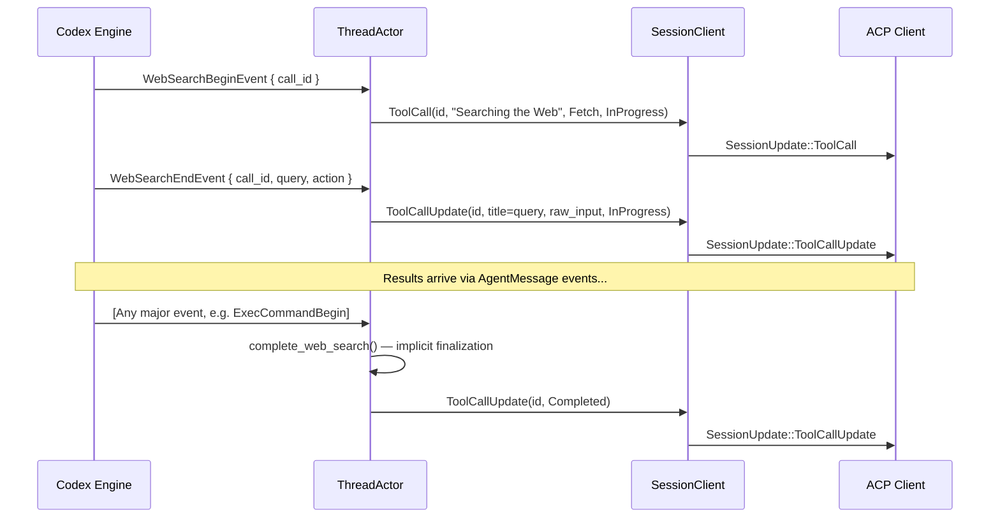
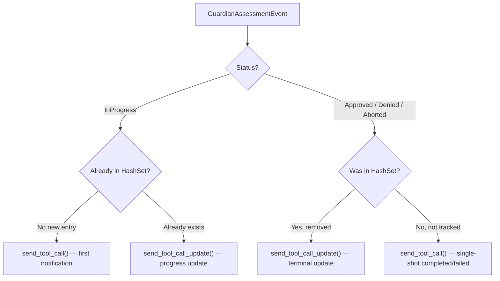
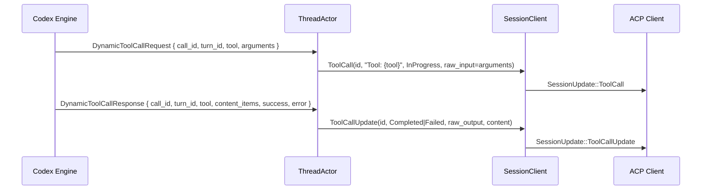

Codex-rs emits several categories of tool-call-like events that do not map directly to traditional shell execution or file patching. **Web Search** events model the model's ability to query the internet, **Guardian Assessment** events represent the internal safety-review layer that approves or denies proposed actions, and **Dynamic Tool Call** events provide a generic envelope for any tool the model invokes at runtime that is not covered by the built-in exec/patch/MCP paths. The `ThreadActor` inside `thread.rs` translates each of these Codex-protocol events into ACP `ToolCall` / `ToolCallUpdate` notifications, choosing the appropriate `ToolKind`, status, and content payload so that ACP clients can render them with semantic fidelity.

Sources: [thread.rs](src/thread.rs#L37-L57)

## Event Taxonomy and ACP ToolKind Mapping

Each of the three event families is mapped to a distinct `ToolKind` so that ACP clients can differentiate them visually and functionally. The table below summarizes the mapping from Codex-protocol event to ACP notification type and kind:

| Codex-Protocol Event | ACP Notification | `ToolKind` | Status Semantics |
|---|---|---|---|
| `WebSearchBeginEvent` | `ToolCall` | `Fetch` | InProgress (generic "Searching the Web") |
| `WebSearchEndEvent` | `ToolCallUpdate` | (inherited) | InProgress (query details appended) |
| Auto-completion (any major event) | `ToolCallUpdate` | (inherited) | Completed |
| `GuardianAssessmentEvent` (InProgress) | `ToolCall` | `Think` | InProgress |
| `GuardianAssessmentEvent` (Approved) | `ToolCallUpdate` or `ToolCall` | `Think` | Completed |
| `GuardianAssessmentEvent` (Denied/Aborted) | `ToolCallUpdate` or `ToolCall` | `Think` | Failed |
| `DynamicToolCallRequest` | `ToolCall` | (default) | InProgress |
| `DynamicToolCallResponse` | `ToolCallUpdate` | (inherited) | Completed or Failed |

The **Fetch** kind for web search signals a network-retrieval operation; the **Think** kind for guardian assessments signals a deliberative, non-mutating internal review; dynamic tool calls use the default `ToolKind` (no explicit kind set) because their nature is determined at runtime by the tool name.

Sources: [thread.rs](src/thread.rs#L2032-L2036), [thread.rs](src/thread.rs#L2178-L2225), [thread.rs](src/thread.rs#L1579-L1592)

## Web Search: Lifecycle and Implicit Completion

Web search operates as a **two-phase, implicitly-completed** tool call. The Codex model emits `WebSearchBeginEvent` when it starts a search, followed by `WebSearchEndEvent` when the query details are available. Critically, `WebSearchEndEvent` does **not** mean the search is complete — it merely means the query string has been resolved. The search result content arrives later through `AgentMessage` events. This asymmetry requires a completion strategy that is not driven by an explicit "search done" event.

The implicit completion is implemented as a **pre-event hook** in `handle_event`. Before dispatching any incoming event, the actor checks whether the event belongs to a set of "major" event types (turn lifecycle, command execution, patch application, MCP tool calls, errors, etc.). If it does, the actor calls `complete_web_search` to finalize any pending web search. The `PromptState` struct tracks the active web search via `active_web_search: Option<String>`, which stores the `call_id` of the in-flight search. Only one web search can be active at a time — a new `WebSearchBeginEvent` first triggers `complete_web_search` on the prior one.

Sources: [thread.rs](src/thread.rs#L736-L737), [thread.rs](src/thread.rs#L950-L974), [thread.rs](src/thread.rs#L1074-L1091), [thread.rs](src/thread.rs#L2032-L2088)

### WebSearchAction Variants and Title Derivation

The `WebSearchAction` enum captures the specific search intent. The `update_web_search_query` method derives a human-readable title from it:

| `WebSearchAction` Variant | Title Pattern | Example |
|---|---|---|
| `Search { query, queries }` | `"Searching for: {queries}"` or `"Searching for: {query}"` | `"Searching for: Rust async patterns"` |
| `OpenPage { url }` | `"Opening: {url}"` | `"Opening: https://docs.rs/tokio"` |
| `FindInPage { pattern, url }` | `"Finding: {pattern} in {url}"` | `"Finding: spawn in https://docs.rs/tokio"` |
| `Other` | `"Web search"` | — |

Both the query string and the action struct are serialized into the `raw_input` field of the `ToolCallUpdate`, preserving full fidelity for programmatic consumers.

Sources: [thread.rs](src/thread.rs#L2039-L2077)

## Guardian Assessment: Safety Review as a ToolCall

The **Guardian** is Codex's internal safety and policy assessment layer. Before the model executes certain actions, the Guardian evaluates the proposed action for risk, producing an assessment with a status (InProgress → Approved/Denied/Aborted), optional risk level and score, and a textual rationale. The `ThreadActor` maps this to an ACP `ToolCall` with `ToolKind::Think`, signaling that this is a deliberative review rather than a side-effecting operation.

### State Tracking with HashSet

Unlike web search (which allows at most one active search), guardian assessments can be **parallel** — multiple assessments may be in flight simultaneously. The `PromptState` tracks them with `active_guardian_assessments: HashSet<String>`, keyed by the assessment's `id` field. The ACP `call_id` is derived as `"guardian_assessment:{id}"` to namespace it away from other tool calls.

Sources: [thread.rs](src/thread.rs#L737-L738), [thread.rs](src/thread.rs#L2166-L2226), [thread.rs](src/thread.rs#L3868-L3870)

### Dual-Path Notification Logic

Guardian assessments can arrive in any order — an `InProgress` event may be the first seen, or a terminal event (Approved/Denied/Aborted) may arrive without a prior `InProgress`. The handler therefore uses a **dual-path** notification strategy:

This ensures that regardless of event ordering, the ACP client always receives a well-formed tool call sequence: either a `ToolCall` followed by `ToolCallUpdate`(s), or a single `ToolCall` with a terminal status.

Sources: [thread.rs](src/thread.rs#L2176-L2225)

### Status and Content Derivation

The helper functions `guardian_assessment_tool_call_status` and `guardian_assessment_content` perform the translation from Codex-protocol types to ACP types:

| `GuardianAssessmentStatus` | `ToolCallStatus` | Content Label |
|---|---|---|
| `InProgress` | `InProgress` | "In progress" |
| `Approved` | `Completed` | "Approved" |
| `Denied` | `Failed` | "Denied" |
| `Aborted` | `Failed` | "Aborted" |

The content payload is multi-line text assembled from the assessment's fields: status label, action summary (if extractable), risk level/score, and rationale. When the `action` field is present but cannot be summarized (i.e., `guardian_action_summary` returns `None`), the raw JSON action payload is appended as a separate content block for transparency.

Sources: [thread.rs](src/thread.rs#L3872-L3931)

### Guardian Action Summaries

The `guardian_action_summary` function extracts a concise, human-readable summary from the action's JSON payload. It dispatches on the `"tool"` field:

| Action `"tool"` Value | Summary Pattern | Example |
|---|---|---|
| `"shell"` / `"exec_command"` | The command string or joined args | `"cargo test -- --nocapture"` |
| `"apply_patch"` | File list + change count | `"apply_patch touching 3 changes across 2 files"` |
| `"network_access"` | Target host from `"target"` or `"host"` | `"network access to api.example.com"` |
| `"mcp_tool_call"` | `"MCP {tool_name} on {connector_name}"` | `"MCP read_file on filesystem"` |
| Anything else | `None` (falls through to raw JSON) | — |

This summary is placed in the content line `"Action: {summary}"`, giving ACP clients a quick scan of what the Guardian is evaluating without needing to parse the full action JSON.

Sources: [thread.rs](src/thread.rs#L3933-L3991)

## Dynamic Tool Calls: Generic Runtime Tool Invocation

**Dynamic tool calls** are the catch-all mechanism for tool invocations that are not covered by the built-in exec, patch, MCP, or web-search paths. The Codex model may invoke arbitrary tools at runtime (e.g., image generation, code analysis, custom integrations) using the `DynamicToolCallRequest` / `DynamicToolCallResponse` event pair. Unlike MCP tool calls which are routed through a specific server, dynamic tool calls are handled directly by the Codex engine.

### Request-Response Lifecycle

The lifecycle is a straightforward two-event sequence:

The `start_dynamic_tool_call` method creates the initial `ToolCall` with a title of `"Tool: {tool}"`, status `InProgress`, and the `arguments` serialized as `raw_input`. The `end_dynamic_tool_call` method processes the response, setting status to `Completed` or `Failed` based on the `success` flag, and converting the `content_items` into ACP `ToolCallContent` entries.

Sources: [thread.rs](src/thread.rs#L1127-L1136), [thread.rs](src/thread.rs#L1579-L1658)

### Content Item Mapping

The `DynamicToolCallOutputContentItem` enum maps to ACP content types:

| `DynamicToolCallOutputContentItem` Variant | ACP Mapping | Description |
|---|---|---|
| `InputText { text }` | `Content::new(text)` (TextContent) | Plain text output |
| `InputImage { image_url }` | `Content::new(ResourceLink)` | Image reference via URL |

If the response includes an `error` field, it is appended as an additional text content block after the regular content items, ensuring error visibility even when partial content was produced.

Sources: [thread.rs](src/thread.rs#L1638-L1656)

## PromptState Tracking: Shared Infrastructure

All three event families share the `PromptState` struct as their mutable state container within the event loop. The struct maintains:

- **`active_web_search: Option<String>`** — at most one in-flight web search, identified by `call_id`. Implicitly completed by the pre-event hook or by a new `WebSearchBeginEvent`.
- **`active_guardian_assessments: HashSet<String>`** — multiple concurrent assessments, keyed by their Guardian-assigned `id` (not the ACP `call_id`).
- **`active_commands: HashMap<String, ActiveCommand>`** — for exec command tracking (covered in [Exec Command Approval and Terminal Output](12-exec-command-approval-and-terminal-output)).
- **`pending_permission_interactions: HashMap<String, PendingPermissionInteraction>`** — for MCP elicitation (covered in [MCP Tool Calls and Elicitation Permission Requests](14-mcp-tool-calls-and-elicitation-permission-requests)).

This design keeps the event loop's state centralized while allowing each event family to have its own concurrency semantics: web search is single-threaded, guardian assessments are parallel, and dynamic tool calls are stateless (they do not need tracking between request and response because the `call_id` correlation is sufficient).

Sources: [thread.rs](src/thread.rs#L733-L745), [thread.rs](src/thread.rs#L747-L767)

## Session Replay: Reconstructing Historical Tool Calls

When a session is loaded, the `HistoryReplayActor` replays prior turns to the ACP client. For web search, the replay path uses `ResponseItem::WebSearchCall { id, action }`, which is converted via `web_search_action_to_title_and_id` into a single completed `ToolCall` with `ToolKind::Search` and status `Completed`. This differs from the live path, which uses `ToolKind::Fetch` — the replay uses `Search` to reflect that the search is already complete and its results are known.

For guardian assessments and dynamic tool calls, the replay path does not process `EventMsg::GuardianAssessment` or `DynamicToolCallRequest`/`DynamicToolCallResponse` events directly. These are handled through the `ResponseItem` path if they are persisted as function call items, or they are skipped as transient events in `replay_event_msg`. The replay focuses on user messages, agent messages, and reasoning for `EventMsg`, and tool calls for `ResponseItem`.

The `generate_fallback_id` function creates UUID-based IDs when the original `call_id` is missing from the persisted `ResponseItem`, ensuring the ACP client always receives a valid tool call identifier.

Sources: [thread.rs](src/thread.rs#L3386-L3428), [thread.rs](src/thread.rs#L3687-L3700), [thread.rs](src/thread.rs#L3993-L4035)

## Comparative Summary

| Dimension | Web Search | Guardian Assessment | Dynamic Tool Call |
|---|---|---|---|
| **Protocol Events** | `WebSearchBegin` → `WebSearchEnd` | `GuardianAssessment` (multi-emit) | `DynamicToolCallRequest` → `DynamicToolCallResponse` |
| **ACP ToolKind** | `Fetch` (live), `Search` (replay) | `Think` | Default (no explicit kind) |
| **Concurrency** | Single (at most one active) | Parallel (HashSet tracking) | Stateless (no tracking needed) |
| **Completion Trigger** | Implicit (next major event) | Explicit (Approved/Denied/Aborted) | Explicit (Response event) |
| **ID Namespacing** | Direct `call_id` | `guardian_assessment:{id}` | Direct `call_id` |
| **Content Type** | Query + action JSON | Status + action summary + risk + rationale | Text + image items + optional error |
| **Failure Semantics** | N/A (always completes) | Denied/Aborted → `Failed` | `success: false` → `Failed` |
| **Replay Representation** | `ResponseItem::WebSearchCall` | Via `ResponseItem` function calls | Via `ResponseItem` function calls |

Sources: [thread.rs](src/thread.rs#L1074-L1136), [thread.rs](src/thread.rs#L2032-L2088), [thread.rs](src/thread.rs#L2166-L2226), [thread.rs](src/thread.rs#L1579-L1658)

## Related Pages

- [Translating Codex Events to ACP Notifications](11-translating-codex-events-to-acp-notifications) — the overarching event translation framework
- [Exec Command Approval and Terminal Output](12-exec-command-approval-and-terminal-output) — the exec command tool call path
- [Patch Approval and File Diff Representation](13-patch-approval-and-file-diff-representation) — the patch tool call path
- [MCP Tool Calls and Elicitation Permission Requests](14-mcp-tool-calls-and-elicitation-permission-requests) — the MCP tool call path
- [SessionClient: The ACP Notification Gateway](18-sessionclient-the-acp-notification-gateway) — the `SessionClient` notification dispatch layer