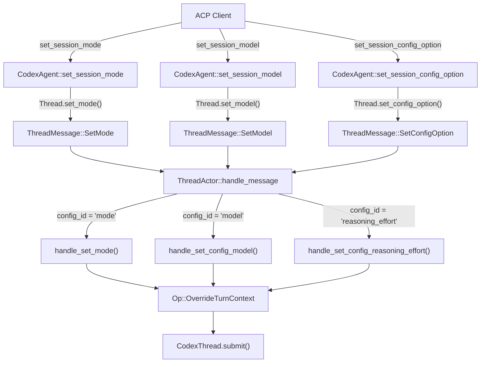

Once a session is alive and streaming events, an ACP client can reshape its behavior in real time through three configuration axes — **approval mode**, **model selection**, and **reasoning effort**. These three controls are surfaced both as dedicated ACP protocol methods (`set_session_mode`, `set_session_model`) and as a unified `set_session_config_option` dispatch, and any change takes effect on the *next* Codex turn without interrupting the current one. This page traces the full lifecycle of each configuration knob: how its options are assembled, how a client request flows from the ACP layer through the `ThreadActor`, and how the resulting `Op::OverrideTurnContext` mutation reaches the underlying Codex conversation.

Sources: [codex_agent.rs](src/codex_agent.rs#L550-L590), [thread.rs](src/thread.rs#L130-L169)

## The Three Configuration Axes

Every session carries three independent but interrelated configuration dimensions. **Mode** controls what Codex is allowed to do without asking (approval policy + sandbox policy). **Model** selects the underlying language model preset that powers the conversation. **Reasoning effort** adjusts how much compute the model devotes to internal chain-of-thought, and is only visible when the active model preset supports more than one effort level. The following table summarizes their ACP-level identifiers and categories:

| Axis | Config ID | ACP Category | Codex Config Field | Affects |
|------|-----------|-------------|-------------------|---------|
| **Mode** | `"mode"` | `Mode` | `config.permissions.approval_policy`, `config.permissions.sandbox_policy` | Approval requirements, filesystem sandboxing, project trust level |
| **Model** | `"model"` | `Model` | `config.model` | Underlying LLM, default reasoning effort |
| **Reasoning Effort** | `"reasoning_effort"` | `ThoughtLevel` | `config.model_reasoning_effort` | Depth of model reasoning, token budget for thinking |

Sources: [thread.rs](src/thread.rs#L2886-L2965), [thread.rs](src/thread.rs#L3267-L3279)

## Dual Entry Points: Dedicated Methods vs. Unified Config Options

ACP provides two pathways for changing session configuration. **Dedicated methods** — `set_session_mode`, `set_session_model` — map directly to `ThreadMessage::SetMode` and `ThreadMessage::SetModel`, offering type-safe, single-concern entry points. The **unified config option** method — `set_session_config_option` — accepts a `config_id` string and a `SessionConfigOptionValue`, then dispatches internally to the same handlers. This dual design serves two audiences: protocol-level integrations that prefer strongly-typed method calls, and UI-driven clients that want a single generic "settings panel" that renders `SessionConfigOption` objects as dropdowns.

The dispatch logic in `handle_set_config_option` is a simple string match on `config_id`:

| `config_id` value | Handler | Effect |
|--------------------|---------|--------|
| `"mode"` | `handle_set_mode(SessionModeId::new(value))` | Changes approval + sandbox policies, may upgrade project trust |
| `"model"` | `handle_set_config_model(value)` | Swaps model preset, adjusts reasoning effort if current effort unsupported |
| `"reasoning_effort"` | `handle_set_config_reasoning_effort(value)` | Adjusts reasoning depth, validates against model's supported efforts |
| any other | `Error::invalid_params` | Rejected |

Sources: [codex_agent.rs](src/codex_agent.rs#L550-L590), [thread.rs](src/thread.rs#L2991-L3004)



Sources: [codex_agent.rs](src/codex_agent.rs#L550-L590), [thread.rs](src/thread.rs#L2700-L2717)

## Modes: Approval Presets and Project Trust

**Modes** are Codex's way of encoding a security posture for the session. Each mode is an `ApprovalPreset` — a bundled pair of an `approval` policy (when Codex must ask the user before acting) and a `sandbox` policy (what filesystem access is permitted). The presets are loaded from `codex_utils_approval_presets::builtin_approval_presets` and cached in a static `LazyLock`:

| Preset ID | Label | Controls |
|-----------|-------|----------|
| `"read-only"` | Read Only | Sandboxed filesystem read access, no writes without approval |
| `"auto-edit"` | Auto Edit | Workspace-scoped writes allowed, external changes require approval |
| `"full-access"` | Full Access | All writes allowed, no sandbox restrictions |

Sources: [thread.rs](src/thread.rs#L79-L80), [thread.rs](src/thread.rs#L2808-L2843)

### Current Mode Detection

The `modes()` method determines the current mode by comparing the discriminants of the session's active `approval_policy` and `sandbox_policy` against each preset. It uses `std::mem::discriminant` rather than equality because the policies may carry configuration data (e.g., sandbox directories) that vary per session — only the *variant* matters for mode matching.

There is one important edge case: when a project is **untrusted**, the active approval policy is `AskForApproval::UnlessTrusted`, which does not match any built-in preset. In this case, the mode selector still appears by defaulting to the `"read-only"` preset, giving the user a path to select a mode that will implicitly trust the project.

Sources: [thread.rs](src/thread.rs#L2808-L2843)

### Mode Changes and Project Trust

When `handle_set_mode` processes a mode change, it performs three actions:

1. **Submits `Op::OverrideTurnContext`** to the CodexThread with the preset's `approval` and `sandbox` policies, which takes effect on the next turn.
2. **Updates `self.config.permissions`** — sets both `approval_policy` and `sandbox_policy` on the in-memory config so subsequent config queries reflect the new state.
3. **Upgrades project trust level** — if the selected mode's sandbox grants write access (`DangerFullAccess`, `WorkspaceWrite`, or `ExternalSandbox`), `set_project_trust_level` is called with `TrustLevel::Trusted`. The `ReadOnly` sandbox does not upgrade trust, preserving the safety boundary.

Sources: [thread.rs](src/thread.rs#L3260-L3309)

```mermaid
sequenceDiagram
    participant Client as ACP Client
    participant Agent as CodexAgent
    participant Thread as Thread wrapper
    participant Actor as ThreadActor
    participant Codex as CodexThread
    participant Config as self.config

    Client->>Agent: set_session_mode(mode_id)
    Agent->>Thread: set_mode(mode_id)
    Thread->>Actor: ThreadMessage::SetMode { mode }
    Actor->>Actor: Find matching ApprovalPreset
    Actor->>Codex: Op::OverrideTurnContext { approval_policy, sandbox_policy }
    Actor->>Config: permissions.approval_policy.set(preset.approval)
    Actor->>Config: permissions.sandbox_policy.set(preset.sandbox)
    alt Sandbox grants write access
        Actor->>Actor: set_project_trust_level(Trusted)
    end
    Actor->>Actor: maybe_emit_config_options_update()
    Actor-->>Thread: Ok(())
    Thread-->>Agent: Ok(())
    Agent-->>Client: SetSessionModeResponse
```

Sources: [thread.rs](src/thread.rs#L2700-L2703), [thread.rs](src/thread.rs#L3260-L3309)

## Models: Presets, Picker Filtering, and Reasoning Effort Coupling

Model selection is built around the concept of **model presets** — curated configurations fetched at runtime from the Codex models manager via `ModelsManager::list_models()`. Each `ModelPreset` carries the following fields:

| Field | Purpose |
|-------|---------|
| `id` | Stable identifier (e.g., `"codex-mini"`) — used as the ACP select option value |
| `display_name` | Human-readable name shown in the client UI |
| `description` | Short description of the model's capabilities |
| `model` | The underlying model string sent to the API (e.g., `"codex-mini"`) |
| `show_in_picker` | Whether this preset should appear in the UI selector; hidden presets are still returned if they match the current model |
| `default_reasoning_effort` | The default `ReasoningEffort` for this preset |
| `supported_reasoning_efforts` | List of supported effort levels, each with an `effort` value and `description` |

Sources: [thread.rs](src/thread.rs#L2898-L2927), [thread.rs](src/thread.rs#L3107-L3138)

### Model ID Format: Preset + Effort

The ACP protocol represents models as `ModelId` strings, but Codex internally separates the model preset from its reasoning effort. The bridge encodes both pieces into a single compound identifier using the format `"{preset_id}/{reasoning_effort}"` — for example, `"codex-mini/high"`. Two helper methods handle this encoding:

- **`model_id(id, effort)`** — constructs the compound `ModelId` by joining preset ID and effort with `/`.
- **`parse_model_id(id)`** — splits on `/` and deserializes the reasoning portion back into a `ReasoningEffort` enum value.

This compound format means that when the ACP client selects a model from the `models()` list, it implicitly selects a reasoning effort as well. The `handle_set_model` method parses the incoming `ModelId` to extract both components and passes them together through `Op::OverrideTurnContext`.

Sources: [thread.rs](src/thread.rs#L2866-L2874), [thread.rs](src/thread.rs#L3315-L3354)

### The models() Method: Building the ACP Model List

The `models()` method assembles the complete set of available models for the ACP client. It first resolves the current model via `get_current_model()`, then iterates over all model presets. For each preset that passes the `show_in_picker` filter (or matches the current model), it generates **one `ModelInfo` entry per supported reasoning effort**, using the compound `ModelId` format. This means a single model preset like `codex-mini` that supports `low`, `medium`, and `high` reasoning efforts appears as three separate entries in the ACP model list: `"codex-mini/low"`, `"codex-mini/medium"`, `"codex-mini/high"`.

Sources: [thread.rs](src/thread.rs#L3107-L3138)

### Model Changes and Effort Fallback

When a model change is requested, the handler must decide what reasoning effort to use with the new model. The logic differs depending on whether the request comes through the dedicated `set_session_model` path or the unified `set_session_config_option` path:

**Via `handle_set_model`** (dedicated ACP method): If the incoming `ModelId` parses as `preset_id/effort`, both are used directly. Otherwise, the raw model string is used with the previously configured reasoning effort preserved from `self.config.model_reasoning_effort`.

**Via `handle_set_config_model`** (unified config): The model ID is always a preset ID (not compound). If the current reasoning effort is supported by the new preset, it is preserved; otherwise, the preset's `default_reasoning_effort` is adopted. If the selected model is not a known preset at all (a raw model string), the previously configured effort is kept unchanged — the bridge does not invent a default for unknown models.

Sources: [thread.rs](src/thread.rs#L3007-L3058), [thread.rs](src/thread.rs#L3315-L3354)

## Reasoning Effort: Conditional Visibility and Validation

The reasoning effort selector is the most conditional of the three configuration axes. It is **only rendered** in `config_options()` when the current model preset exists and has more than one supported reasoning effort. A model with a single effort level (or no preset match at all) silently omits the selector — there is nothing for the user to choose.

When the selector does appear, its options are built from `preset.supported_reasoning_efforts`, with each effort's string representation title-cased via the `heck` crate (e.g., `"high"` → `"High"`). The current value is resolved by checking whether `self.config.model_reasoning_effort` is set and matches one of the supported efforts; if not, the preset's `default_reasoning_effort` is used.

Sources: [thread.rs](src/thread.rs#L2929-L2966)

### Effort Validation

When `handle_set_config_reasoning_effort` receives a new value, it performs strict validation:

1. **Deserialize** the value string into a `ReasoningEffort` via `serde_json`. Invalid strings result in an `invalid_params` error.
2. **Locate the current model's preset** — reasoning effort can only be set for known model presets.
3. **Verify the effort is supported** — if the requested effort is not in the preset's `supported_reasoning_efforts` list, an `invalid_params` error is returned with the message "Unsupported reasoning effort for selected model".

Only after validation passes does the handler submit `Op::OverrideTurnContext` with `effort: Some(Some(effort))` and update `self.config.model_reasoning_effort`.

Sources: [thread.rs](src/thread.rs#L3061-L3105)

## The Unified config_options() Assembly

The `config_options()` method is the single source of truth for what the ACP client renders as the session's settings panel. It assembles a `Vec<SessionConfigOption>` by conditionally including each axis:

| Option | Category | Config ID | Condition for Inclusion |
|--------|----------|-----------|------------------------|
| Approval Preset | `Mode` | `"mode"` | Always (if `modes()` returns `Some`) |
| Model | `Model` | `"model"` | Always |
| Reasoning Effort | `ThoughtLevel` | `"reasoning_effort"` | Only if current preset has >1 supported reasoning effort |

Each option is a `SessionConfigOption::select` — a dropdown-style selector with a current value and a list of `SessionConfigSelectOption` entries. The mode selector's options come from `APPROVAL_PRESETS`, the model selector's from `ModelsManager::list_models()`, and the reasoning effort selector's from the current preset's `supported_reasoning_efforts`.

Sources: [thread.rs](src/thread.rs#L2876-L2969)

## Reactive Config Updates: maybe_emit_config_options_update

After a mode or model change, the `ThreadActor` proactively pushes an updated `ConfigOptionUpdate` notification to the client. This is critical because changing the model can alter which reasoning efforts are available, and changing the mode can shift the current mode ID. The `maybe_emit_config_options_update` method regenerates the full `config_options()` list, compares it against `last_sent_config_options`, and only emits a notification if the state has actually changed. This deduplication prevents unnecessary network traffic when, for example, a model change preserves the same reasoning effort set.

Note that `set_session_config_option` does **not** trigger this proactive push — the `CodexAgent` handler already queries `thread.config_options()` and includes the result in the `SetSessionConfigOptionResponse`, giving the client the updated state synchronously.

Sources: [thread.rs](src/thread.rs#L2971-L2989), [codex_agent.rs](src/codex_agent.rs#L574-L590), [thread.rs](src/thread.rs#L2700-L2717)

## Session Initialization: The Initial Config Snapshot

Both `new_session` and `load_session` return the session's initial configuration as part of their response. The `handle_load` method in `ThreadActor` assembles this by calling three helpers in sequence:

```rust
Ok(LoadSessionResponse::new()
    .models(self.models().await?)
    .modes(self.modes())
    .config_options(self.config_options().await?))
```

This means every new or loaded session immediately provides the client with: the full list of available models (with compound IDs including reasoning effort), the current mode state (with all presets), and the combined config options for rendering a settings UI. The client can then modify any of these through subsequent ACP calls.

Sources: [thread.rs](src/thread.rs#L3140-L3145), [codex_agent.rs](src/codex_agent.rs#L332-L378), [codex_agent.rs](src/codex_agent.rs#L437-L448)

## The OverrideTurnContext Operation: The Unified Mutation Mechanism

All three configuration changes converge on a single Codex operation: `Op::OverrideTurnContext`. This operation carries optional overrides for every dimension of the turn context — `model`, `effort`, `approval_policy`, `sandbox_policy`, and others — with `None` fields meaning "keep the current value." This design allows any combination of changes to be applied in a single atomic submission to the CodexThread:

| Handler | Model | Effort | Approval Policy | Sandbox Policy |
|---------|-------|--------|-----------------|----------------|
| `handle_set_mode` | `None` | `None` | `Some(preset.approval)` | `Some(preset.sandbox)` |
| `handle_set_config_model` | `Some(model)` | `Some(effort_to_use)` | `None` | `None` |
| `handle_set_config_reasoning_effort` | `None` | `Some(Some(effort))` | `None` | `None` |
| `handle_set_model` | `Some(model)` | `Some(effort_to_use)` | `None` | `None` |

After the `Op::OverrideTurnContext` is submitted, the handler also updates the in-memory `self.config` so that subsequent queries (such as `config_options()` or `modes()`) reflect the new state. This dual-write pattern — submitting the operation to the CodexThread *and* updating the local config — ensures consistency between what Codex will do on the next turn and what the ACP layer reports as the current configuration.

Sources: [thread.rs](src/thread.rs#L3038-L3056), [thread.rs](src/thread.rs#L3085-L3102), [thread.rs](src/thread.rs#L3266-L3292), [thread.rs](src/thread.rs#L3333-L3351)

## Error Handling and Validation Summary

Each configuration handler validates its inputs before mutating state. The following table summarizes the validation rules and error conditions:

| Scenario | Handler | Error |
|----------|---------|-------|
| Unknown mode ID | `handle_set_mode` | `invalid_params` — no matching `ApprovalPreset` found |
| Unknown config ID string | `handle_set_config_option` | `invalid_params` — "Unsupported config option" |
| Non-ValueId config value | `handle_set_config_option` | `invalid_params` — "Unsupported config option value" |
| Empty model selection | `handle_set_config_model` / `handle_set_model` | `invalid_params` — "No model selected" / "No model parsed or configured" |
| Invalid reasoning effort string | `handle_set_config_reasoning_effort` | `invalid_params` — deserialization failure |
| Unknown model preset for effort change | `handle_set_config_reasoning_effort` | `invalid_params` — "Reasoning effort can only be set for known model presets" |
| Unsupported effort for current model | `handle_set_config_reasoning_effort` | `invalid_params` — "Unsupported reasoning effort for selected model" |
| Failed `Op::OverrideTurnContext` submission | All handlers | Propagated as internal error |

Sources: [thread.rs](src/thread.rs#L2996-L3004), [thread.rs](src/thread.rs#L3017-L3019), [thread.rs](src/thread.rs#L3061-L3083), [thread.rs](src/thread.rs#L3329-L3331)

## Downstream Connections

Configuration changes ripple through several other subsystems. When a mode change upgrades the project trust level, it affects how [Exec Command Approval and Terminal Output](12-exec-command-approval-and-terminal-output) requests are processed — trusted projects may auto-approve commands that untrusted projects would require explicit consent for. Model and reasoning effort changes influence the token budget reported in usage updates, which are discussed in [SessionClient: The ACP Notification Gateway](18-sessionclient-the-acp-notification-gateway). The `Op::OverrideTurnContext` mechanism itself is part of the broader event loop covered in [Thread and ThreadActor: Event Loop and Codex-to-ACP Translation](7-thread-and-threadactor-event-loop-and-codex-to-acp-translation), and the initial config snapshot is assembled during session creation as described in [Session Lifecycle: New, Load, Close, and List](8-session-lifecycle-new-load-close-and-list).