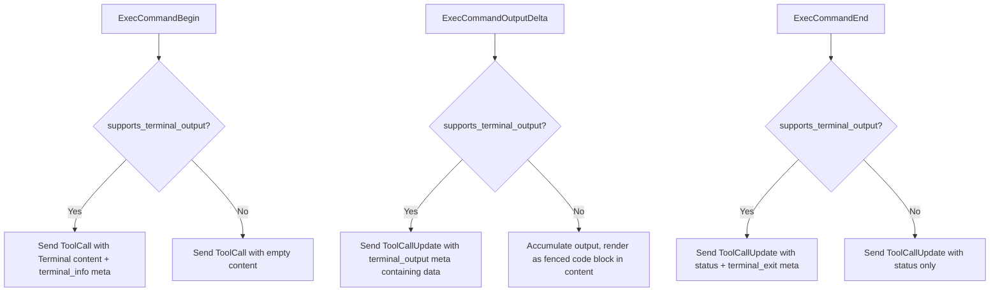
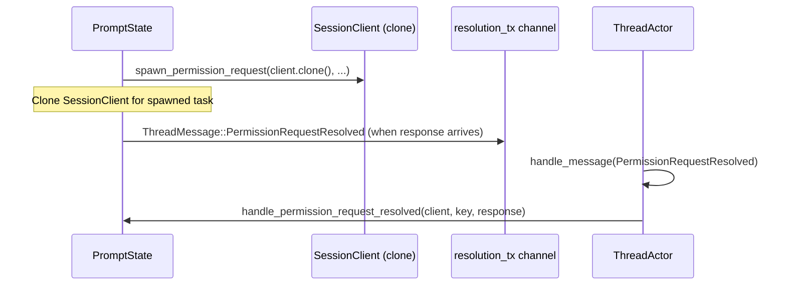

**SessionClient** is the centralized abstraction that bridges codex-acp's internal event processing with the Agent Client Protocol's notification transport. Every piece of information a client sees — agent messages, tool call progress, permission requests, plan updates — flows through a single `SessionClient` instance per session. It encapsulates the session-scoped identity, the shared ACP transport, and client capability awareness into one cohesive interface, transforming raw `SessionUpdate` payloads into well-typed, session-addressed notifications.

Sources: [thread.rs](src/thread.rs#L2411-L2558)

## Structural Anatomy

SessionClient is a `Clone`-derived struct with three fields, each serving a distinct architectural role:

| Field | Type | Purpose |
|-------|------|---------|
| `session_id` | `SessionId` | Scoped identity — every notification is addressed to this specific session |
| `client` | `Arc<dyn Client>` | Shared reference to the ACP transport, obtained from the global `ACP_CLIENT` singleton |
| `client_capabilities` | `Arc<Mutex<ClientCapabilities>>` | Mutable capability metadata — determines feature-gated behavior like terminal output streaming |

Sources: [thread.rs](src/thread.rs#L2411-L2416)

The `Client` trait (defined in the `agent-client-protocol` crate) exposes exactly two operations: `session_notification` for fire-and-forget updates, and `request_permission` for interactive approval flows. SessionClient wraps both with session-scoped context and ergonomic convenience methods, ensuring that no caller ever needs to manually construct a `SessionNotification` or remember to include the session ID.

Sources: [thread.rs](src/thread.rs#L2454-L2557), [lib.rs](src/lib.rs#L72-L78)

## Creation and Lifecycle

SessionClient instances are created at session construction time and remain bound to that session for its entire lifetime. There are two construction paths:

**Production path** — `SessionClient::new(session_id, client_capabilities)`: Retrieves the shared `Arc<dyn Client>` from the global `ACP_CLIENT` singleton, which is initialized once during `run_main` when the `AgentSideConnection` is established over stdio. This panics if the global has not been set, which is intentional — a SessionClient without a transport is a programming error.

**Test path** — `SessionClient::with_client(session_id, client, client_capabilities)`: Accepts an explicit `Arc<dyn Client>` (typically a `StubClient`), bypassing the global singleton entirely. This is gated behind `#[cfg(test)]` and enables deterministic unit testing of notification flows without stdio I/O.

Sources: [thread.rs](src/thread.rs#L2418-L2438), [lib.rs](src/lib.rs#L72-L78)

The lifecycle flows through these stages:

```mermaid
sequenceDiagram
    participant Main as run_main
    participant ACP as ACP_CLIENT (global)
    participant CA as CodexAgent
    participant T as Thread
    participant SC as SessionClient
    participant TA as ThreadActor

    Main->>ACP: AgentSideConnection::new → set OnceLock
    CA->>T: Thread::new(session_id, thread, auth, models, caps, config)
    T->>SC: SessionClient::new(session_id, caps)
    Note over SC: Pulls Arc&lt;dyn Client&gt; from ACP_CLIENT
    T->>TA: ThreadActor::new(auth, client, thread, models, config, ...)
    Note over TA: Holds SessionClient for entire session lifetime
    TA->>SC: send_notification / request_permission (ongoing)
```

Sources: [thread.rs](src/thread.rs#L180-L202), [lib.rs](src/lib.rs#L69-L84)

## Notification API Surface

SessionClient exposes a layered API: one foundational method that all others delegate to, plus specialized convenience methods for each notification category. Understanding this hierarchy is key to extending the notification layer.

### The Foundation: `send_notification`

Every outbound notification ultimately passes through `send_notification(update: SessionUpdate)`. It wraps the update in a `SessionNotification` addressed to the current `session_id` and calls `self.client.session_notification(...)`. Errors are logged but not propagated — notification delivery is best-effort by design, preventing transient transport failures from crashing the event loop.

Sources: [thread.rs](src/thread.rs#L2454-L2462)

### Convenience Methods

The convenience methods each map to a specific `SessionUpdate` variant, reducing boilerplate and ensuring consistent payload construction:

| Method | SessionUpdate Variant | Primary Caller | Description |
|--------|----------------------|----------------|-------------|
| `send_user_message(text)` | `UserMessageChunk` | `replay_event_msg` | Echo user text during history replay |
| `send_agent_text(text)` | `AgentMessageChunk` | `PromptState::handle_event`, `replay_event_msg` | Stream agent response text (live and replay) |
| `send_agent_thought(text)` | `AgentThoughtChunk` | `PromptState::handle_event`, `replay_event_msg` | Stream agent reasoning/thinking content |
| `send_tool_call(tool_call)` | `ToolCall` | Various tool handlers | Announce a new tool call with initial state |
| `send_tool_call_update(update)` | `ToolCallUpdate` | Various tool handlers | Update an existing tool call's status/content |
| `send_completed_tool_call(...)` | `ToolCall` (completed) | `replay_response_item` | Shorthand for emitting a completed tool call |
| `send_tool_call_completed(...)` | `ToolCallUpdate` (completed) | `replay_response_item` | Shorthand for marking a tool call completed with output |
| `update_plan(plan)` | `Plan` | `PromptState::handle_event` | Translate Codex plan items to ACP plan entries |
| `request_permission(...)` | (direct `Client` call) | `spawn_permission_request` | Interactive permission dialog with option selection |

Sources: [thread.rs](src/thread.rs#L2464-L2557)

Beyond these convenience methods, `send_notification` is also called directly for `SessionUpdate` variants that don't warrant a dedicated wrapper — such as `UsageUpdate` (token counts), `SessionInfoUpdate` (title changes), `ConfigOptionUpdate` (configuration changes), and `AvailableCommandsUpdate` (slash command discovery).

Sources: [thread.rs](src/thread.rs#L988-L994), [thread.rs](src/thread.rs#L1062-L1067), [thread.rs](src/thread.rs#L2984-L2988), [thread.rs](src/thread.rs#L2682-L2686)

## Capability-Aware Behavior

SessionClient doesn't just relay data — it adapts its behavior based on what the connected client supports. The `supports_terminal_output` method inspects `client_capabilities.meta` for a `"terminal_output": true` flag, and this boolean gates a fundamentally different rendering strategy for command execution output.

When terminal output **is** supported (e.g., Zed with its built-in terminal), command output is streamed as `ToolCallContent::Terminal` objects with `terminal_id` metadata, enabling live terminal emulation. When it **is not** supported, output accumulates in-memory and is rendered as fenced code blocks with language-appropriate syntax highlighting (e.g., ` ```sh ... ``` ` or ` ```py ... ``` ` based on `file_extension`).

Sources: [thread.rs](src/thread.rs#L2440-L2452), [thread.rs](src/thread.rs#L1852-L1878)

This capability check is performed at three points in the command lifecycle:



Sources: [thread.rs](src/thread.rs#L1824-L1980)

## Permission Request Flow

The `request_permission` method is the sole bidirectional operation in SessionClient. Unlike fire-and-forget notifications, it returns a `Result<RequestPermissionResponse, Error>` — the client must respond before the agent can proceed. This method delegates directly to `self.client.request_permission(...)` with a `RequestPermissionRequest` containing the session ID, a `ToolCallUpdate` describing what needs approval, and a list of `PermissionOption` choices.

Permission requests are never called directly from the event loop. Instead, `PromptState::spawn_permission_request` clones the SessionClient and spawns a local task that awaits the response, then routes it back to the actor via the `resolution_tx` channel as a `ThreadMessage::PermissionRequestResolved`. This design ensures the event loop never blocks on a pending approval — it continues processing other events while the user deliberates.

Sources: [thread.rs](src/thread.rs#L2545-L2557), [thread.rs](src/thread.rs#L782-L814), [thread.rs](src/thread.rs#L2733-L2752)



Sources: [thread.rs](src/thread.rs#L782-L814)

## Usage Across Event Processing Layers

SessionClient is passed by reference through three nested processing layers, each with different ownership semantics:

**ThreadActor** — Owns the `SessionClient` instance. Delegates to `SubmissionState::handle_event(&self.client, msg)`. Also uses it directly for session-level notifications (config updates, command discovery) and for history replay via `replay_event_msg` and `replay_response_item`.

**SubmissionState** — An enum that dispatches to either `CustomPromptsState` (which ignores the client) or `PromptState` (which is the primary consumer).

**PromptState** — Receives `&SessionClient` on every `handle_event` call. This is where the vast majority of notification logic lives: agent message streaming, tool call lifecycle management, permission request spawning, web search tracking, and guardian assessment reporting.

Sources: [thread.rs](src/thread.rs#L654-L659), [thread.rs](src/thread.rs#L947-L975), [thread.rs](src/thread.rs#L3706-L3712)

The deliberate choice to pass `&SessionClient` rather than owning it reflects the actor model's single-threaded execution guarantee — since `ThreadActor::spawn` runs on a single `LocalSet` task, there's no contention on the underlying `Arc<dyn Client>`, and cloning only occurs when spawning permission request tasks that outlive the current `handle_event` call.

Sources: [thread.rs](src/thread.rs#L2612-L2640), [thread.rs](src/thread.rs#L794-L803)

## Notification Pattern Summary

The following table maps each Codex event to its corresponding SessionClient method and the ACP `SessionUpdate` variant produced, providing a complete reference for the notification translation layer:

| Codex Event | SessionClient Method | ACP SessionUpdate |
|-------------|---------------------|-------------------|
| `AgentMessageContentDelta` | `send_agent_text` | `AgentMessageChunk` |
| `AgentMessage` (non-delta) | `send_agent_text` | `AgentMessageChunk` |
| `ReasoningContentDelta` / `ReasoningRawContentDelta` | `send_agent_thought` | `AgentThoughtChunk` |
| `AgentReasoning` (non-delta) | `send_agent_thought` | `AgentThoughtChunk` |
| `AgentReasoningSectionBreak` | `send_agent_thought("\n\n")` | `AgentThoughtChunk` |
| `TokenCount` | `send_notification` | `UsageUpdate` |
| `ThreadNameUpdated` | `send_notification` | `SessionInfoUpdate` |
| `PlanUpdate` | `update_plan` | `Plan` |
| `WebSearchBegin` | `send_tool_call` | `ToolCall` (Fetch, InProgress) |
| `WebSearchEnd` | `send_tool_call_update` | `ToolCallUpdate` (InProgress) |
| (completion trigger) | `send_tool_call_update` | `ToolCallUpdate` (Completed) |
| `ExecApprovalRequest` | `request_permission` via `spawn_permission_request` | `ToolCallUpdate` (Pending) + Permission dialog |
| `ExecCommandBegin` | `send_tool_call` | `ToolCall` (Execute/Read/Search, InProgress) |
| `ExecCommandOutputDelta` | `send_tool_call_update` | `ToolCallUpdate` (content or terminal meta) |
| `ExecCommandEnd` | `send_tool_call_update` | `ToolCallUpdate` (Completed/Failed) |
| `TerminalInteraction` | `send_tool_call_update` | `ToolCallUpdate` (content or terminal meta) |
| `ApplyPatchApprovalRequest` | `request_permission` via `spawn_permission_request` | `ToolCallUpdate` (Pending, Edit) + Permission dialog |
| `PatchApplyBegin` | `send_tool_call` | `ToolCall` (Edit, InProgress) |
| `PatchApplyEnd` | `send_tool_call_update` | `ToolCallUpdate` (Completed/Failed, Edit) |
| `McpToolCallBegin` | `send_tool_call` | `ToolCall` (InProgress) |
| `McpToolCallEnd` | `send_tool_call_update` | `ToolCallUpdate` (Completed/Failed) |
| `DynamicToolCallRequest` | `send_tool_call` | `ToolCall` (InProgress) |
| `DynamicToolCallResponse` | `send_tool_call_update` | `ToolCallUpdate` (Completed/Failed) |
| `ViewImageToolCall` | `send_notification` | `ToolCall` (Read, Completed, with ResourceLink) |
| `GuardianAssessment` (InProgress) | `send_tool_call` or `send_tool_call_update` | `ToolCall` or `ToolCallUpdate` (Think) |
| `GuardianAssessment` (terminal) | `send_tool_call_update` or `send_tool_call` | `ToolCallUpdate` or `ToolCall` (Think) |
| `ElicitationRequest` (MCP) | `request_permission` via `spawn_permission_request` | `ToolCallUpdate` (Pending) + Permission dialog |
| `RequestPermissions` | `request_permission` via `spawn_permission_request` | `ToolCallUpdate` (Pending) + Permission dialog |
| `WarningEvent` | `send_agent_text` | `AgentMessageChunk` |
| `ContextCompacted` | `send_agent_text` | `AgentMessageChunk` |
| `ExitedReviewMode` | `send_agent_text` | `AgentMessageChunk` |
| Config change | `send_notification` | `ConfigOptionUpdate` |
| Slash command discovery | `send_notification` | `AvailableCommandsUpdate` |

Sources: [thread.rs](src/thread.rs#L947-L1374), [thread.rs](src/thread.rs#L1437-L2226), [thread.rs](src/thread.rs#L3386-L3703)

## Error Handling Philosophy

SessionClient adopts a **log-and-continue** error handling strategy. The `send_notification` method catches any transport error and logs it via `tracing::error!`, but never propagates the failure to the caller. This is a deliberate architectural choice: the event loop must remain responsive even if the client connection experiences transient issues. A single failed notification should not cascade into a stalled agent.

The sole exception is `request_permission`, which returns `Result<RequestPermissionResponse, Error>` — because the caller needs to know whether the user approved, denied, or if the request failed entirely. Permission failures are propagated up through `handle_permission_request_resolved`, which can abort pending interactions and fail the active submission.

Sources: [thread.rs](src/thread.rs#L2454-L2462), [thread.rs](src/thread.rs#L816-L827)

## Test Infrastructure

The test module provides a `StubClient` that implements the `Client` trait with in-memory storage: `notifications` captures all `SessionNotification` values in a `Mutex<Vec>`, and `permission_requests` / `permission_responses` enable controlled permission flow testing. The `StubClient::with_blocked_permission_requests` variant uses a `tokio::sync::Notify` to suspend permission resolution until an explicit signal, enabling tests for concurrent event processing during pending approvals.

All tests construct SessionClient via `SessionClient::with_client(session_id, stub_client, Arc::default())`, completely isolating the test from the global `ACP_CLIENT` singleton.

Sources: [thread.rs](src/thread.rs#L4927-L4990), [thread.rs](src/thread.rs#L4560-L4598)

---

**Next**: Learn how MCP servers from the client are propagated into the Codex session configuration in [Client MCP Server Propagation](19-client-mcp-server-propagation). For the event-level translation details that feed into SessionClient's notification methods, see [Translating Codex Events to ACP Notifications](11-translating-codex-events-to-acp-notifications).