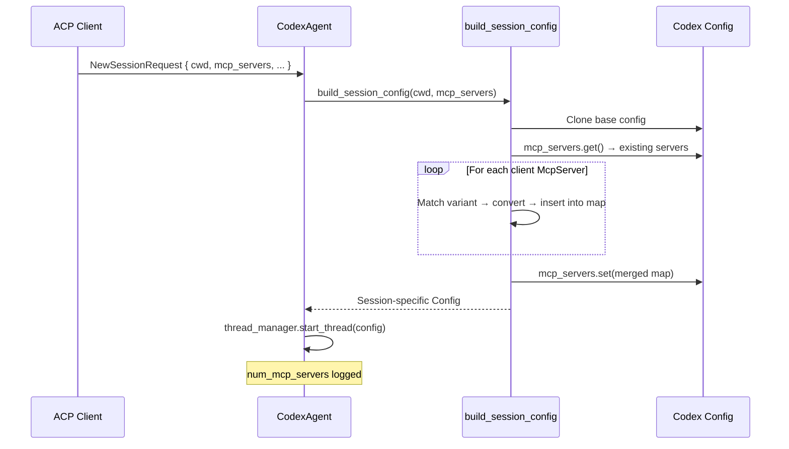
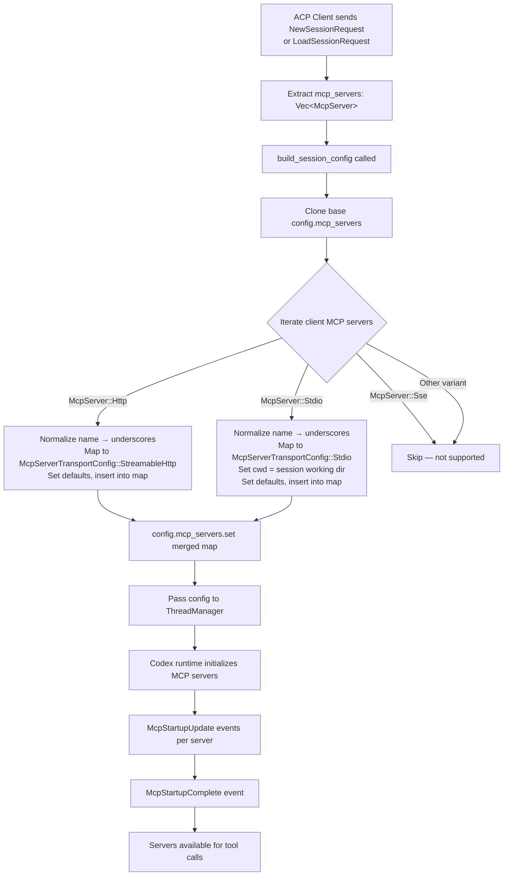

When an ACP client like Zed creates or loads a session, it can declare a set of MCP (Model Context Protocol) servers that it wants the agent to use. **Client MCP server propagation** is the mechanism by which codex-acp translates these ACP-protocol MCP server definitions into the Codex runtime's native configuration format, merging them with any servers already present in the base config. This page examines the full propagation pipeline — from capability advertisement during initialization, through type mapping and name normalization, to the resulting session configuration.

Sources: [codex_agent.rs](src/codex_agent.rs#L118-L213)

## Capability Advertisement: Signaling MCP Support

Before any MCP servers can be propagated, the agent must declare its MCP capabilities to the client. During the `initialize` handshake, `CodexAgent` constructs its `AgentCapabilities` with `McpCapabilities::new().http(true)`, signaling that it supports HTTP-based MCP server transports. This tells ACP clients that they may include `mcp_servers` in their `NewSessionRequest` and `LoadSessionRequest` payloads.

Sources: [codex_agent.rs](src/codex_agent.rs#L230-L233)

## The Propagation Entry Points

Both `new_session` and `load_session` extract an `mcp_servers: Vec<McpServer>` field from their respective ACP requests and pass it to the shared `build_session_config` method. This design ensures that **client-provided MCP servers are propagated identically** regardless of whether the session is freshly created or resumed from a previous rollout. The total count of MCP servers (after merging) is logged at session creation time for observability.

Sources: [codex_agent.rs](src/codex_agent.rs#L332-L342), [codex_agent.rs](src/codex_agent.rs#L380-L411), [codex_agent.rs](src/codex_agent.rs#L372-L372)

Sources: [codex_agent.rs](src/codex_agent.rs#L118-L213)

## Type Mapping: ACP `McpServer` → Codex `McpServerConfig`

The core of propagation is the type conversion from ACP protocol types (`McpServer`, `McpServerHttp`, `McpServerStdio`) to Codex runtime types (`McpServerConfig`, `McpServerTransportConfig`). The `build_session_config` method matches on each ACP `McpServer` variant and performs a targeted field extraction and mapping. Not all ACP variants are supported — **unsupported variants are silently skipped** to maintain forward compatibility with future ACP protocol extensions.

Sources: [codex_agent.rs](src/codex_agent.rs#L130-L205)

### Supported Transports

| ACP Variant | Codex Transport | Key Field Mappings | Status |
|---|---|---|---|
| `McpServer::Http` | `McpServerTransportConfig::StreamableHttp` | `url` → `url`; `headers` → `http_headers`; `bearer_token_env_var` = `None`; `env_http_headers` = `None` | ✅ Supported |
| `McpServer::Stdio` | `McpServerTransportConfig::Stdio` | `command` → `command` (stringified); `args` → `args`; `env` → `env`; `cwd` = session working dir; `env_vars` = empty | ✅ Supported |
| `McpServer::Sse` | *(no mapping)* | — | ❌ Skipped |
| Other (future variants) | *(no mapping)* | — | ❌ Skipped via wildcard match |

Sources: [codex_agent.rs](src/codex_agent.rs#L133-L204)

### HTTP Server Mapping Detail

When an `McpServer::Http` variant is encountered, the `McpServerHttp` fields are mapped as follows: the `name` is normalized (see below), the `url` is passed directly to `StreamableHttp.url`, and the `headers` vector is converted from ACP header objects into a `HashMap<String, String>` of name-value pairs. If the headers vector is empty, `http_headers` is set to `None` rather than an empty map. Two Codex-specific fields — `bearer_token_env_var` and `env_http_headers` — are always set to `None`, as the ACP protocol does not currently provide a mechanism for the client to specify bearer token environment variables or environment-sourced HTTP headers.

Sources: [codex_agent.rs](src/codex_agent.rs#L136-L165)

### Stdio Server Mapping Detail

For `McpServer::Stdio`, the `command` (a `PathBuf`) is converted to its display string representation via `command.display().to_string()`, matching Codex's expectation of a string command path. The `args` vector is passed through unchanged. The `env` vector of ACP environment variable declarations is converted into an optional `HashMap<String, String>` — `None` when empty, `Some(map)` when populated. A critical detail: **the `cwd` for the Stdio transport is set to the session's working directory** (`cwd.to_path_buf()`), ensuring that spawned MCP server processes execute in the same sandboxed directory as the Codex session. The `env_vars` field is initialized as an empty vector.

Sources: [codex_agent.rs](src/codex_agent.rs#L167-L201)

## Name Normalization: Whitespace to Underscores

Codex's internal naming convention prohibits whitespace characters in MCP server names. The propagation code addresses this constraint by applying a whitespace replacement rule to every client-provided server name before insertion: all characters satisfying `char::is_whitespace()` are replaced with underscores (`_`). This normalization is applied uniformly to both `Http` and `Stdio` variants.

This means a client-provided server named `"My MCP Server"` will be registered as `"My_MCP_Server"` in the Codex configuration. The normalization is **not** reversible — if a client needs to reference the server by its original name, it must account for this transformation.

Sources: [codex_agent.rs](src/codex_agent.rs#L139-L140), [codex_agent.rs](src/codex_agent.rs#L174-L175)

## Server Configuration Defaults

When converting from ACP types to `McpServerConfig`, several Codex-specific fields are set to hardcoded defaults because the ACP protocol does not provide equivalent fields:

| `McpServerConfig` Field | Default Value | Rationale |
|---|---|---|
| `required` | `false` | Client-provided servers should not block session startup on failure |
| `enabled` | `true` | Client explicitly provided the server, so it should be active |
| `startup_timeout_sec` | `None` | No timeout override; Codex uses its built-in default |
| `tool_timeout_sec` | `None` | No timeout override; Codex uses its built-in default |
| `disabled_tools` | `None` | No tool-level filtering from the client side |
| `enabled_tools` | `None` | All tools from the server are available |
| `disabled_reason` | `None` | Server is enabled, no reason needed |
| `scopes` | `None` | No scope restrictions |
| `oauth_resource` | `None` | No OAuth resource identifier |
| `tools` | `Default::default()` | Empty tool list; populated at runtime after server startup |

Sources: [codex_agent.rs](src/codex_agent.rs#L143-L164), [codex_agent.rs](src/codex_agent.rs#L178-L200)

## Merge Semantics: Client Servers Override Base Config

The propagation uses a **merge-and-override** strategy. It starts by cloning the existing `mcp_servers` map from the base `Config` (`config.mcp_servers.get().clone()`), then inserts each client-provided server into this map. Because the underlying data structure is a `HashMap` keyed by server name (after normalization), **a client-provided server with the same name as an existing base-config server will replace it**. This gives the ACP client authoritative control over server definitions — if the client explicitly provides a server, its definition takes precedence.

After all insertions, the merged map is written back to the config via `config.mcp_servers.set(new_mcp_servers)`, which returns an error if the set operation fails (propagated as an internal error to the ACP client).

Sources: [codex_agent.rs](src/codex_agent.rs#L131-L210)

## Post-Propagation: MCP Server Startup Lifecycle

Once the session config with its merged MCP servers is passed to `thread_manager.start_thread` (for new sessions) or `thread_manager.resume_thread_from_rollout` (for loaded sessions), the Codex runtime takes ownership of server initialization. The ThreadActor receives two categories of startup events that report on the propagated servers:

- **`McpStartupUpdate`** — emitted for each server as it transitions through startup states (connecting, authenticating, listing tools). The ThreadActor logs these at `info` level with the server name and status.

- **`McpStartupComplete`** — emitted once all servers have finished their startup sequence. This event carries three vectors: `ready` (successfully started servers), `failed` (servers that failed to initialize), and `cancelled` (servers whose startup was cancelled). The ThreadActor logs the full breakdown.

Sources: [thread.rs](src/thread.rs#L1287-L1298)

After startup completes, each successfully initialized server becomes available for tool invocation. The ThreadActor then handles `McpToolCallBegin` and `McpToolCallEnd` events for these servers, translating them into ACP tool call notifications as described in [MCP Tool Calls and Elicitation Permission Requests](14-mcp-tool-calls-and-elicitation-permission-requests). MCP servers that need user approval before invoking tools emit `ElicitationRequest` events, which the ThreadActor routes through the ACP permission system.

Sources: [thread.rs](src/thread.rs#L1138-L1159), [thread.rs](src/thread.rs#L1299-L1306)

## The Complete Propagation Pipeline

The following diagram illustrates the end-to-end flow from client declaration to runtime availability:

Sources: [codex_agent.rs](src/codex_agent.rs#L118-L213), [thread.rs](src/thread.rs#L1287-L1298)

## Architectural Constraints and Design Decisions

Several constraints shape the current propagation design:

**No SSE support.** The `McpServer::Sse` variant is matched but has an empty body — the server is silently discarded. This reflects Codex's current lack of support for Server-Sent Events as an MCP transport. If a client requires SSE-based servers, they will simply not appear in the session.

**No bearer token propagation.** The ACP protocol's `McpServerHttp` type does not include a bearer token field. Codex's `StreamableHttp` transport supports `bearer_token_env_var` for credential injection, but this is always set to `None` during propagation. Servers requiring bearer token authentication must rely on environment variables already present in the Codex process's environment or on the `env_http_headers` mechanism (also set to `None`).

**No tool-level filtering.** The ACP protocol does not provide a way for clients to specify which tools from an MCP server should be enabled or disabled. All tools from a propagated server are available (`enabled_tools: None`, `disabled_tools: None`), and the `required: false` default means session startup won't fail if the server is unavailable.

**Session-scoped Stdio working directory.** The `cwd` for Stdio MCP servers is always set to the session's working directory, not the server's own working directory. This aligns with the ACP model where the client controls the sandbox boundary.

Sources: [codex_agent.rs](src/codex_agent.rs#L133-L204)

## Related Pages

- [CodexAgent: The ACP Agent Trait Implementation](6-codexagent-the-acp-agent-trait-implementation) — covers the `build_session_config` method in the broader context of `CodexAgent`'s responsibilities
- [Session Lifecycle: New, Load, Close, and List](8-session-lifecycle-new-load-close-and-list) — describes how `new_session` and `load_session` invoke `build_session_config`
- [MCP Tool Calls and Elicitation Permission Requests](14-mcp-tool-calls-and-elicitation-permission-requests) — details how propagated MCP servers' tool calls and permission requests are translated into ACP notifications
- [SessionClient: The ACP Notification Gateway](18-sessionclient-the-acp-notification-gateway) — explains how the `SessionClient` delivers MCP-related notifications to the ACP client