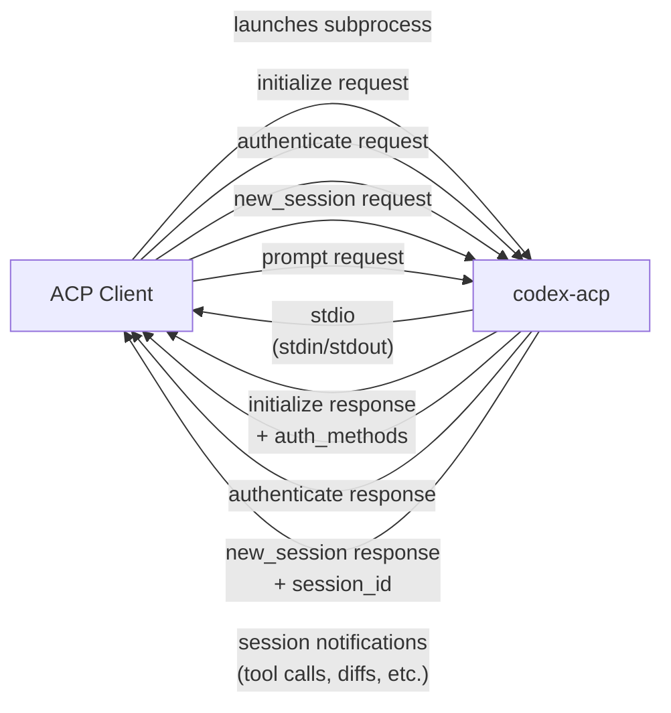

Get **codex-acp** running in under five minutes. This guide walks you through the three things you need: installation, authentication, and connecting to an ACP client. By the end, you'll have Codex answering prompts inside your editor.

## What You'll Need

| Prerequisite | Why | Notes |
|---|---|---|
| An OpenAI account with API access or ChatGPT subscription | Codex requires an OpenAI-backed identity | API key methods work everywhere; ChatGPT login requires a browser and does **not** work in remote/SSH projects |
| An ACP-compatible client | codex-acp speaks the Agent Client Protocol over stdio | [Zed](https://zed.dev) has built-in support; any [ACP client](https://agentclientprotocol.com/overview/clients) works |
| Node.js ≥ 18 **or** a pre-built binary | For the `npx` install path or direct binary download | Node is only needed if you choose the npm install route |

Sources: [codex_agent.rs](src/codex_agent.rs#L240-L248), [README.md](README.md#L22-L26)

## Installation

There are two installation paths — pick the one that matches your workflow.

### Option A: npm (Recommended)

The fastest path. The `@zed-industries/codex-acp` npm package ships a thin Node.js wrapper that auto-detects your platform and delegates to the correct pre-compiled Rust binary. No Rust toolchain required.

```bash
# Run directly without installing
npx @zed-industries/codex-acp

# Or install globally
npm install -g @zed-industries/codex-acp
codex-acp
```

Under the hood, `codex-acp.js` maps `process.platform` × `process.arch` to one of six platform-specific optional dependencies (`@zed-industries/codex-acp-<os>-<arch>`), resolves the native binary, and spawns it with `stdio: "inherit"`. If the correct platform package is missing, you'll see a clear error message.

Sources: [codex-acp.js](npm/bin/codex-acp.js#L1-L85), [package.json](npm/package.json#L24-L37)

### Option B: Pre-built Binary from GitHub Releases

Download the archive for your OS and architecture from the [releases page](https://github.com/zed-industries/codex-acp/releases), extract it, and place the binary on your `PATH`.

| Platform | Architecture | Target Triple | Archive Format |
|---|---|---|---|
| macOS | Apple Silicon | `aarch64-apple-darwin` | `.tar.gz` |
| macOS | Intel | `x86_64-apple-darwin` | `.tar.gz` |
| Linux | ARM64 (glibc) | `aarch64-unknown-linux-gnu` | `.tar.gz` |
| Linux | ARM64 (musl) | `aarch64-unknown-linux-musl` | `.tar.gz` |
| Linux | x64 (glibc) | `x86_64-unknown-linux-gnu` | `.tar.gz` |
| Linux | x64 (musl) | `x86_64-unknown-linux-musl` | `.tar.gz` |
| Windows | ARM64 | `aarch64-pc-windows-msvc` | `.zip` |
| Windows | x64 | `x86_64-pc-windows-msvc` | `.zip` |

```bash
# Example: macOS Apple Silicon
curl -LO https://github.com/zed-industries/codex-acp/releases/latest/download/codex-acp-0.11.1-aarch64-apple-darwin.tar.gz
tar xzf codex-acp-0.11.1-aarch64-apple-darwin.tar.gz
chmod +x codex-acp
sudo mv codex-acp /usr/local/bin/
```

> **Tip:** Use the `musl` variants for static-linked Alpine Linux / Docker environments; the `gnu` variants cover standard Ubuntu/Debian systems.

Sources: [release.yml](.github/workflows/release.yml#L44-L68), [release.yml](.github/workflows/release.yml#L250-L269)

## Authentication

codex-acp supports three authentication methods. The method you choose determines which environment variable to set or whether the client initiates an interactive login flow.

| Method | How It Works | Environment Variable | Remote/SSH? |
|---|---|---|---|
| **ChatGPT subscription** | Browser-based OAuth login via Codex CLI | None (interactive) | ❌ No |
| **CODEX_API_KEY** | API key from OpenAI's Codex platform | `CODEX_API_KEY` | ✅ Yes |
| **OPENAI_API_KEY** | Standard OpenAI platform API key | `OPENAI_API_KEY` | ✅ Yes |

When running codex-acp manually (outside a client-managed flow), set the relevant environment variable before launching:

```bash
# Using an OpenAI API key
OPENAI_API_KEY=sk-... codex-acp

# Using a Codex API key
CODEX_API_KEY=... codex-acp
```

ACP clients like Zed handle authentication interactively — they present the available methods and let you pick one. The ChatGPT subscription option is automatically hidden when the `NO_BROWSER` environment variable is set (typical in remote/SSH scenarios).

Sources: [codex_agent.rs](src/codex_agent.rs#L240-L248), [codex_agent.rs](src/codex_agent.rs#L276-L318), [codex_agent.rs](src/codex_agent.rs#L610-L639)

## Connecting to an ACP Client

### With Zed (Built-in Support)

The latest version of Zed ships with codex-acp support. No manual installation or configuration is needed.

1. Open Zed's **Agent Panel** (default shortcut: `cmd-'` on macOS / `ctrl-'` on Linux/Windows).
2. Click the **`+`** button in the top-right corner of the panel.
3. Select **"New Codex Thread"** from the dropdown.
4. Choose your authentication method when prompted.
5. Start typing your prompt.

Read more in Zed's [External Agent documentation](https://zed.dev/docs/ai/external-agents).

Sources: [README.md](README.md#L32-L36)

### With Any Other ACP Client

codex-acp communicates over **stdio** using the Agent Client Protocol. Any ACP-compatible client can launch it as a subprocess and exchange JSON-RPC messages over stdin/stdout.

The minimal launch sequence:



The client sends an `initialize` request; codex-acp responds with its capabilities (prompt support, embedded context, images, MCP, session management) and available auth methods. After authentication, the client opens a `new_session` with a working directory and starts sending prompts.

Sources: [lib.rs](src/lib.rs#L28-L87), [codex_agent.rs](src/codex_agent.rs#L218-L254)

## Verifying Your Setup

Run this quick smoke test to confirm the binary is correctly installed and can authenticate:

```bash
# The binary should print ACP protocol output to stdout
# and any diagnostic/logging output to stderr
OPENAI_API_KEY=sk-... codex-acp
```

You should see no errors on stderr. The process will block waiting for an ACP `initialize` request on stdin — this is expected when running manually. Press `Ctrl+C` to exit.

To enable verbose diagnostic logging, set the `RUST_LOG` environment variable:

```bash
RUST_LOG=debug OPENAI_API_KEY=sk-... codex-acp
```

Sources: [lib.rs](src/lib.rs#L33-L37)

## Platform Support at a Glance

| OS | x64 | ARM64 | Package Suffix |
|---|---|---|---|
| macOS | ✅ | ✅ | `darwin-x64` / `darwin-arm64` |
| Linux (glibc) | ✅ | ✅ | `linux-x64` / `linux-arm64` |
| Linux (musl/Alpine) | ✅ | ✅ | `linux-x64` / `linux-arm64` (musl binary) |
| Windows | ✅ | ✅ | `win32-x64` / `win32-arm64` |

Sources: [package.json](npm/package.json#L30-L37), [release.yml](.github/workflows/release.yml#L44-L68)

## Troubleshooting

| Symptom | Likely Cause | Fix |
|---|---|---|
| `Failed to locate @zed-industries/codex-acp-<platform> binary` | Platform-specific npm optional dependency wasn't installed | Run `npm install` again; check your Node.js platform/arch with `node -e "console.log(process.platform, process.arch)"` |
| `error loading config` | Corrupted or incompatible Codex config file | Delete `~/.codex/config.toml` and retry |
| `auth_required` error | No valid credentials found | Set `OPENAI_API_KEY` or `CODEX_API_KEY`, or use ChatGPT login from an ACP client |
| ChatGPT login not offered in remote SSH | Browser-based auth unavailable in headless environments | Use an API key method instead; the `NO_BROWSER` flag automatically hides the ChatGPT option |

Sources: [codex-acp.js](npm/bin/codex-acp.js#L60-L66), [codex_agent.rs](src/codex_agent.rs#L111-L116), [codex_agent.rs](src/codex_agent.rs#L246-L248)

## Next Steps

You're up and running — here's where to go deeper:

- **[Authentication Methods](3-authentication-methods)** — detailed walkthrough of each auth flow, token storage, and the `/logout` command.
- **[Using with Zed and Other ACP Clients](4-using-with-zed-and-other-acp-clients)** — client-specific configuration, MCP server propagation, and remote project setup.
- **[Architecture: Bridging ACP and Codex](5-architecture-bridging-acp-and-codex)** — understand how the stdio bridge, event loop, and notification gateway work under the hood.