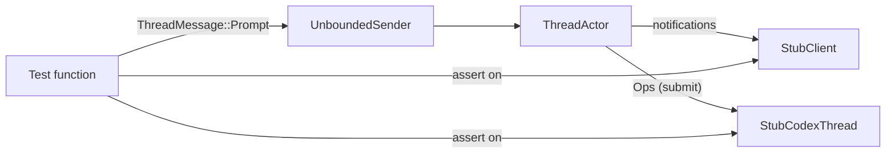
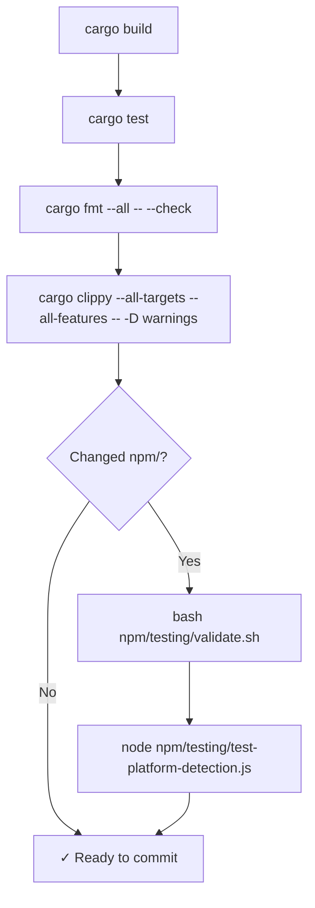

This page walks you through everything you need to build the `codex-acp` binary from source, run its test suites, and validate the npm package infrastructure — all on your own machine. Whether you're contributing a patch or just exploring the codebase, these are the commands and prerequisites that matter.

## Prerequisites

codex-acp is a **Rust** project using the **2024 edition**, so the first requirement is a working Rust toolchain. The project pins its toolchain through [rust-toolchain.toml](rust-toolchain.toml#L1-L4), which specifies the `stable` channel along with the `clippy`, `rustfmt`, and `rust-src` components. If you use [rustup](https://rustup.rs/), the correct toolchain is selected automatically when you run any `cargo` command inside the repository.

On **Linux**, you also need a few system libraries. The CI pipeline installs `pkg-config` and `libcap-dev` via apt, and these are required for the `codex-exec-server` crate's sandboxing support. On macOS and Windows, no extra system packages are needed beyond the standard C/C++ build toolchain.

Sources: [rust-toolchain.toml](rust-toolchain.toml#L1-L4), [.github/workflows/ci.yml](.github/workflows/ci.yml#L80-L87)

### Prerequisite Summary

| Platform | Rust Toolchain | System Packages | Notes |
|----------|---------------|-----------------|-------|
| **macOS** (ARM64 / x86_64) | stable (auto via rustup) | Xcode Command Line Tools | No extra packages |
| **Linux** (glibc) | stable (auto via rustup) | `pkg-config`, `libcap-dev` | `sudo apt-get install -y pkg-config libcap-dev` |
| **Linux** (musl) | stable + `musl-tools` | `pkg-config`, `libcap-dev`, `musl-tools`, Zig 0.14.0 | Cross-compilation only; see [Release Workflow](22-release-workflow-cross-compilation-and-code-signing) |
| **Windows** (MSVC) | stable (auto via rustup) | Visual Studio Build Tools | No extra packages |

Sources: [.github/workflows/ci.yml](.github/workflows/ci.yml#L19-L35), [.github/workflows/ci.yml](.github/workflows/ci.yml#L80-L87)

## Building the Binary

A standard `cargo build` produces a debug binary at `target/debug/codex-acp`. For a release-optimized build (what CI uses and what ships to users), add the `--release` flag:

```bash
# Debug build (fast compile, slower runtime, larger binary)
cargo build

# Release build (slower compile, faster runtime, smaller binary)
cargo build --release
```

The binary entry point is minimal — [main.rs](src/main.rs#L1-L12) delegates to `codex_acp::run_main`, which sets up the ACP stdio bridge, initializes tracing, and loads configuration. The resulting binary at `target/release/codex-acp` is a self-contained executable that communicates over stdin/stdout using the ACP protocol.

The project defines **two Cargo targets**: a binary (`codex-acp`, path `src/main.rs`) and a library (`codex_acp`, path `src/lib.rs`). The library has doctests explicitly disabled (`doctest = false`) since the public API is designed for the binary entry point rather than library consumers.

Sources: [Cargo.toml](Cargo.toml#L11-L18), [src/main.rs](src/main.rs#L1-L12), [src/lib.rs](src/lib.rs#L1-L18)

### Build Artifact Location

| Build Type | Binary Path |
|-----------|-------------|
| Debug | `target/debug/codex-acp` |
| Release | `target/release/codex-acp` |

Both the `target/` directory and `node_modules/` are listed in [.gitignore](.gitignore#L1-L6), so build artifacts and local npm installs won't pollute version control.

Sources: [.gitignore](.gitignore#L1-L6)

## Running Rust Tests

The project has **two test modules** containing a total of **22 tests**, split across the core source files:

### Test Inventory

| Source File | Test Type | Test Count | Key Areas |
|-------------|-----------|------------|-----------|
| [src/prompt_args.rs](src/prompt_args.rs#L222-L315) | `#[test]` (synchronous) | 6 | Argument expansion, escaping, validation |
| [src/thread.rs](src/thread.rs#L4047-L5493) | `#[tokio::test]` (async) | 16 | Slash commands, exec/MCP approval, shutdown, notification routing |

Sources: [src/prompt_args.rs](src/prompt_args.rs#L222-L315), [src/thread.rs](src/thread.rs#L4064-L5493)

### Running All Tests

```bash
# Run all tests (debug mode — default)
cargo test

# Run all tests in release mode (what CI uses)
cargo test --release
```

The CI pipeline runs tests in release mode with an explicit target triple: `cargo test --release --target <triple>`. For local development, omitting `--target` builds and tests for your native host, which is the simplest approach.

Sources: [.github/workflows/ci.yml](.github/workflows/ci.yml#L194-L195)

### Running Specific Tests

You can target individual test functions or modules using Cargo's filter syntax:

```bash
# Run only prompt_args tests
cargo test prompt_args

# Run only thread tests
cargo test thread

# Run a single test by name
cargo test test_compact

# Show test output (println!) even on success
cargo test -- --nocapture
```

### Understanding the Test Architecture

The tests in `thread.rs` use a **stub-based testing pattern**. The `setup()` helper constructs a `ThreadActor` wired to mock implementations — `StubClient` (captures ACP notifications), `StubCodexThread` (records submitted operations), `StubAuth`, and `StubModelsManager`. This allows each test to send `ThreadMessage::Prompt` values through a channel and then assert on both the emitted notifications and the operations recorded by the stub, all without needing a real Codex backend or network connection.



This pattern is important to understand if you're adding new tests: you'll use `setup()` to get the channel sender and stub references, send messages through the sender, and then assert on the recorded state.

Sources: [src/thread.rs](src/thread.rs#L4560-L4598), [src/thread.rs](src/thread.rs#L4600-L4650)

### Thread Test Names and What They Cover

| Test Name | Slash Command / Feature | What It Validates |
|-----------|------------------------|-------------------|
| `test_prompt` | Plain text prompt | Echo notification, `EndTurn` stop reason |
| `test_compact` | `/compact` | Compact op dispatched, completion notification |
| `test_undo` | `/undo` | Undo op, two-phase notification ("in progress" → "completed") |
| `test_init` | `/init` | Init op with `INIT_COMMAND_PROMPT` text |
| `test_review` | `/review` | Review op with `UncommittedChanges` target |
| `test_custom_review` | `/review <instructions>` | Review op with `Custom` target |
| `test_commit_review` | `/review-commit <sha>` | Review op with `Commit` target |
| `test_branch_review` | `/review-branch` | Review op with `Branch` target |
| `test_custom_prompts` | Custom prompt with args | Argument expansion and dispatch |
| `test_delta_deduplication` | Streaming delta | Deduplication of identical consecutive deltas |
| `test_parallel_exec_commands` | Parallel exec approvals | Multiple concurrent exec events handled correctly |
| `test_exec_approval_uses_available_decisions` | Exec permission | Pre-approved decisions skip user prompts |
| `test_mcp_tool_approval_elicitation_routes_to_permission_request` | MCP tool call | Elicitation → ACP permission request routing |
| `test_mcp_elicitation_declines_unsupported_form_requests` | MCP elicitation | Unsupported form types are declined |
| `test_blocked_approval_does_not_block_followup_events` | Blocked approval | Subsequent events flow despite blocked permission |
| `test_thread_shutdown_bypasses_blocked_permission_request` | Shutdown | Thread shutdown cancels pending permission requests |

Sources: [src/thread.rs](src/thread.rs#L4064-L5493)

## Linting and Formatting

The CI pipeline enforces **two linting checks** that you should run locally before pushing:

### Format Check

```bash
# Check formatting (fails if any file needs reformatting)
cargo fmt --all -- --check

# Auto-fix formatting issues
cargo fmt --all
```

Sources: [.github/workflows/ci.yml](.github/workflows/ci.yml#L233-L234)

### Clippy Lint

```bash
# Run clippy with all targets and features (treats warnings as errors, matching CI)
cargo clippy --all-targets --all-features -- -D warnings
```

The project also defines **custom lint levels** in [Cargo.toml](Cargo.toml#L51-L54): `let_underscore = "warn"`, `rust_2018_idioms = "warn"`, and `unused = "warn"`. These are enforced by the compiler itself, not just clippy, so even a plain `cargo build` will surface them.

Sources: [Cargo.toml](Cargo.toml#L51-L54), [.github/workflows/ci.yml](.github/workflows/ci.yml#L236-L237)

## npm Package Validation

The `npm/` directory contains the JavaScript wrapper that resolves and launches the platform-specific native binary. Two validation scripts verify this infrastructure works correctly — and both are run in CI as a separate job.

### validate.sh — Structural Integrity Checks

```bash
bash npm/testing/validate.sh
```

This script performs five checks:

| # | Check | What It Verifies |
|---|-------|-----------------|
| 1 | Wrapper script syntax | `codex-acp.js` parses without errors |
| 2 | Base package.json validity | `npm/package.json` is valid JSON |
| 3 | Template placeholders | `npm/template/package.json` contains `${PACKAGE_NAME}`, `${VERSION}`, `${OS}`, `${ARCH}` |
| 4 | Version consistency | Version in `Cargo.toml` matches version in `npm/package.json` |
| 5 | Platform packages | All six platform packages are listed in `optionalDependencies` |

Sources: [npm/testing/validate.sh](npm/testing/validate.sh#L1-L101)

### test-platform-detection.js — Platform Mapping Tests

```bash
node npm/testing/test-platform-detection.js
```

This script validates that every supported platform/arch combination (darwin-arm64, darwin-x64, linux-arm64, linux-x64, win32-arm64, win32-x64) maps to the correct npm package name. It mocks `process.platform` and `process.arch` to test all six combinations regardless of the host machine.

Sources: [npm/testing/test-platform-detection.js](npm/testing/test-platform-detection.js#L1-L117)

## Recommended Local Workflow

The following flowchart shows the recommended sequence for building, testing, and validating before submitting a change:



### Quick-Reference Command Table

| Step | Command | When to Run |
|------|---------|-------------|
| Build | `cargo build --release` | After any source change |
| Test | `cargo test --release` | After any source change |
| Format check | `cargo fmt --all -- --check` | Before every commit |
| Format fix | `cargo fmt --all` | When format check fails |
| Clippy | `cargo clippy --all-targets --all-features -- -D warnings` | Before every commit |
| npm validate | `bash npm/testing/validate.sh` | After changing `npm/` files |
| npm platform test | `node npm/testing/test-platform-detection.js` | After changing `npm/` files |

## Troubleshooting Common Build Issues

| Problem | Likely Cause | Solution |
|---------|-------------|----------|
| `error: linker 'cc' not found` | No C compiler on Linux | Install `build-essential` (Debian/Ubuntu) or `gcc` |
| `Package libcap was not found in the pkg-config search path` | Missing `libcap-dev` on Linux | `sudo apt-get install pkg-config libcap-dev` |
| `failed to run custom build command for 'v8'` | Missing rusty_v8 prebuilt | Ensure you're building for a supported target; musl builds require special env vars (CI-only) |
| `cargo fmt` reports differences | Code not formatted | Run `cargo fmt --all` to auto-fix |
| Clippy warnings block CI | New code doesn't satisfy lint rules | Fix each warning; they're treated as errors (`-D warnings`) |
| Version mismatch in npm validate | `Cargo.toml` and `npm/package.json` versions out of sync | Update both to the same version number |

Sources: [Cargo.toml](Cargo.toml#L1-L59), [.github/workflows/ci.yml](.github/workflows/ci.yml#L80-L87), [npm/testing/validate.sh](npm/testing/validate.sh#L62-L73)

## Where to Go Next

Now that you can build and test locally, the next pages in the Build, Release, and Distribution section cover what happens in CI and release automation:

- [CI Pipeline: Multi-Platform Testing and Linting](21-ci-pipeline-multi-platform-testing-and-linting) — how the test matrix, caching, and lint jobs work in GitHub Actions
- [Release Workflow: Cross-Compilation and Code Signing](22-release-workflow-cross-compilation-and-code-signing) — building for all 8 platform targets and signing macOS/Windows binaries
- [npm Package Distribution and Platform Detection](23-npm-package-distribution-and-platform-detection) — how platform-specific packages are created, published, and resolved at runtime