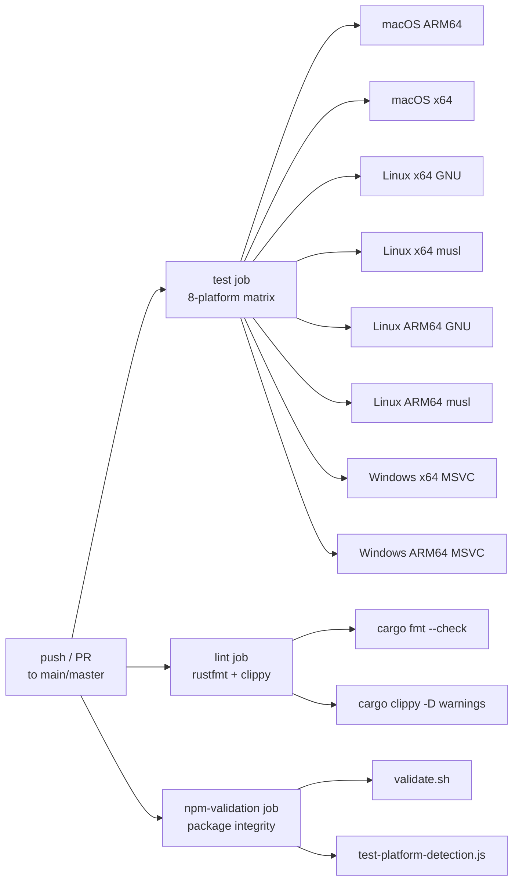
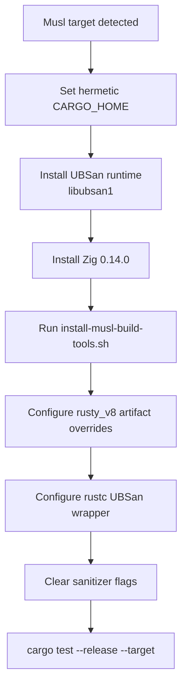

The CI pipeline for codex-acp ensures that every push and pull request targeting the main branch is validated across **eight platform targets**, subjected to **two static analysis passes**, and checked for **npm distribution integrity**. The pipeline is defined entirely in [ci.yml](.github/workflows/ci.yml) and is structured as three parallel jobs — `test`, `lint`, and `npm-validation` — each designed to catch distinct classes of regressions before they reach the main branch. The design philosophy is explicit: `fail-fast: false` on the test matrix guarantees that a failure on one platform never masks failures on others, providing complete visibility into cross-platform health on every run.

Sources: [ci.yml](.github/workflows/ci.yml#L1-L8)

## Pipeline Architecture Overview

The three CI jobs run independently and in parallel. A pull request or push must pass **all three** before it can be merged. This separation means a formatting error won't block you from seeing test results, and vice versa — each job produces its own pass/fail signal.



**Trigger conditions**: The pipeline fires on pushes to `main` or `master`, on pull requests targeting those branches, and via manual `workflow_dispatch` invocations. The `CARGO_TERM_COLOR: always` environment variable ensures colored output in CI logs for readability.

Sources: [ci.yml](.github/workflows/ci.yml#L1-L12)

## The Test Job: Eight-Platform Matrix

The `test` job is the centerpiece of the pipeline. It uses an explicit `include` matrix (not a Cartesian product) to pair each GitHub Actions runner with its precise Rust compilation target. This ensures deterministic, reproducible builds with no ambiguity about which runner hosts which target.

| Runner | Rust Target | OS Family | C Library | Architecture |
|--------|-------------|-----------|-----------|-------------|
| `macos-14` | `aarch64-apple-darwin` | macOS | System | ARM64 |
| `macos-14` | `x86_64-apple-darwin` | macOS | System | x86_64 |
| `ubuntu-22.04` | `x86_64-unknown-linux-gnu` | Linux | glibc | x86_64 |
| `ubuntu-24.04` | `x86_64-unknown-linux-musl` | Linux | musl | x86_64 |
| `ubuntu-22.04-arm` | `aarch64-unknown-linux-gnu` | Linux | glibc | ARM64 |
| `ubuntu-24.04-arm` | `aarch64-unknown-linux-musl` | Linux | musl | ARM64 |
| `windows-latest` | `x86_64-pc-windows-msvc` | Windows | MSVC CRT | x86_64 |
| `windows-11-arm` | `aarch64-pc-windows-msvc` | Windows | MSVC CRT | ARM64 |

The `fail-fast: false` setting is critical: it tells GitHub Actions to continue running all matrix entries even after one fails. In a cross-platform project like codex-acp, a bug that only manifests on musl or ARM64 must be visible alongside any GNU/x86_64 failures, so developers can fix all regressions in a single iteration rather than playing whack-a-mole across CI runs.

Sources: [ci.yml](.github/workflows/ci.yml#L14-L39)

### Common Steps Across All Platforms

Every matrix entry shares a baseline sequence of steps: checkout → Rust toolchain installation → three-level cargo cache → platform-specific dependency installation → test execution. The Rust toolchain is installed via `dtolnay/rust-toolchain@stable` with the `targets` parameter set to the matrix target, ensuring cross-compilation support is available even when the runner's native architecture differs from the target. The project pins itself to the stable channel through [rust-toolchain.toml](rust-toolchain.toml#L1-L4), which also pre-installs the `clippy`, `rustfmt`, and `rust-src` components.

**Caching strategy** uses three independent `actions/cache@v4` layers keyed by `os`, `target`, and a hash of `Cargo.lock`:

| Cache Layer | Path | Key Pattern |
|-------------|------|-------------|
| Cargo registry | `~/.cargo/registry` | `{os}-{target}-cargo-registry-{Cargo.lock hash}` |
| Cargo git | `~/.cargo/git` | `{os}-{target}-cargo-git-{Cargo.lock hash}` |
| Build target | `target/` | `{os}-{target}-cargo-target-{Cargo.lock hash, script hash}` |

Each cache also specifies `restore-keys` with a prefix-only match, so a new `Cargo.lock` still benefits from a partially-valid cache. The target directory cache additionally includes the hash of [install-musl-build-tools.sh](.github/scripts/install-musl-build-tools.sh) in its key, ensuring that changes to the musl toolchain setup invalidate the build cache.

Sources: [ci.yml](.github/workflows/ci.yml#L39-L86), [rust-toolchain.toml](rust-toolchain.toml#L1-L4)

### Linux Dependency Installation

On all Linux runners, the job installs `pkg-config` and `libcap-dev` via apt. The `libcap` library is required because codex-acp depends on the `codex-core` crate chain, which uses Linux capabilities for sandboxing. The `DEBIAN_FRONTEND=noninteractive` flag and `--no-install-recommends` keep the installation lean and non-blocking.

Sources: [ci.yml](.github/workflows/ci.yml#L80-L86)

### Musl Cross-Compilation: The Deep Path

The two musl targets (`x86_64-unknown-linux-musl` and `aarch64-unknown-linux-musl`) require an extensive setup sequence that accounts for roughly half of the CI file's complexity. This is because musl static linking introduces a fundamentally different compilation model from glibc, and several upstream crates (notably `rusty_v8` and `aws-lc-sys`) do not publish musl-compatible prebuilt artifacts.



**Hermetic Cargo home**: The first musl-specific step relocates `CARGO_HOME` into the workspace at `${GITHUB_WORKSPACE}/.cargo-home`. This prevents interference from any runner-level Cargo configuration that might inject glibc-specific linker flags or registry entries into the musl build.

Sources: [ci.yml](.github/workflows/ci.yml#L47-L56)

**Zig as a cross-compiler**: The pipeline installs Zig 0.14.0 via `mlugg/setup-zig@v2`. Zig is not used as a language here — it is used as a **drop-in C/C++ cross-compiler**. Zig bundles musl sysroots for all architectures, eliminating the need to install separate cross-compilation toolchains. The [install-musl-build-tools.sh](.github/scripts/install-musl-build-tools.sh) script generates `zigcc` and `zigcxx` wrapper scripts that translate GCC-style arguments (which Cargo and build scripts emit) into Zig-compatible invocations while stripping `--target` flags that use Rust triples (Zig expects its own target syntax like `x86_64-linux-musl` instead of `x86_64-unknown-linux-musl`).

The wrappers also solve a subtle header priority problem: glibc headers at `/usr/include` must not shadow the musl sysroot headers. The wrappers intercept `-I /usr/include` paths and demote them to `-idirafter`, ensuring musl headers are always found first. They also translate `-Wp,-U_FORTIFY_SOURCE` (a GCC preprocessor forwarding form emitted by `aws-lc-sys`) into the direct `-U_FORTIFY_SOURCE` flag that Zig expects.

Sources: [ci.yml](.github/workflows/ci.yml#L98-L108), [install-musl-build-tools.sh](.github/scripts/install-musl-build-tools.sh#L92-L211)

**Static libcap compilation**: Because musl systems typically lack a prebuilt `libcap` package, the script downloads libcap 2.75 source, verifies its SHA-256 checksum, and compiles it statically against the musl toolchain. The resulting `libcap.a`, headers, and a generated `.pc` file are placed under `${RUNNER_TEMP}/codex-musl-tools-${TARGET}/libcap-2.75/prefix/`. The `PKG_CONFIG_PATH` is then configured to point to this directory so that `cargo` can find `libcap` during the build.

Sources: [install-musl-build-tools.sh](.github/scripts/install-musl-build-tools.sh#L35-L90)

**rusty_v8 artifact overrides**: The `denoland/rusty_v8` crate does not publish musl prebuilt V8 static libraries. The CI works around this by extracting the `v8` version from `Cargo.lock` using a Python script, then downloading the matching artifact from the `openai/codex` GitHub releases under the tag `rusty-v8-v${version}`. Two environment variables are set:

| Variable | Purpose |
|----------|---------|
| `RUSTY_V8_ARCHIVE` | URL to the `.a.gz` static library for the target |
| `RUSTY_V8_SRC_BINDING_PATH` | Local path to the Rust source binding file |

This tells the `rusty_v8` build script to skip compilation and use the prebuilt artifacts instead.

Sources: [ci.yml](.github/workflows/ci.yml#L110-L134)

**UBSan wrapper and flag sanitization**: Some GitHub runners inject Undefined Behavior Sanitizer flags at the system level. These flags cause musl builds to fail because the UBSan runtime is not linked into static musl binaries by default. The CI handles this with a two-pronged approach: first, it installs `libubsan1` and creates a `rustc` wrapper that preloads the UBSan shared library via `LD_PRELOAD`; second, it clears **all** sanitizer-related environment variables (`RUSTFLAGS`, `CARGO_ENCODED_RUSTFLAGS`, `RUSTDOCFLAGS`, `CFLAGS`, `CXXFLAGS`, and per-target overrides) and explicitly strips `-fsanitize=undefined` from C/CXX flags. It also sets `AWS_LC_SYS_NO_JITTER_ENTROPY=1` to disable the jitterentropy module in `aws-lc-sys`, which has its own UBSan incompatibilities.

Sources: [ci.yml](.github/workflows/ci.yml#L88-L193)

### Test Execution

After all platform-specific setup, the actual test command is remarkably simple:

```bash
cargo test --release --target ${{ matrix.target }}
```

The `--release` flag is used because the project depends on `rusty_v8`, which requires release-mode linking for its V8 static library. The `--target` flag ensures the correct cross-compilation target is used, even on runners where the host architecture matches the target.

Sources: [ci.yml](.github/workflows/ci.yml#L194-L195)

## The Lint Job: Formatting and Clippy

The `lint` job runs on `ubuntu-latest` and enforces two static analysis gates: **formatting** via `cargo fmt` and **semantic linting** via `cargo clippy`. It installs the Rust toolchain with explicit `rustfmt` and `clippy` components, uses the same three-layer caching strategy as the test job (though with `lint`-specific cache keys to avoid cross-contamination), and installs the same `libcap-dev` Linux dependency.

**Formatting check**:

```bash
cargo fmt --all -- --check
```

The `--all` flag ensures every crate in the workspace is checked, and `--check` causes the command to exit with a non-zero status if any file needs formatting — without modifying files.

**Clippy check**:

```bash
cargo clippy --all-targets --all-features -- -D warnings
```

The `-D warnings` flag promotes all Clippy warnings to errors, enforcing a zero-warning policy. The `--all-targets` flag includes tests and benchmarks in the analysis, and `--all-features` ensures linting covers every conditional compilation path.

Sources: [ci.yml](.github/workflows/ci.yml#L197-L237)

### Additional Crate-Level Lints

Beyond what the CI job enforces, the project declares additional lints in [Cargo.toml](Cargo.toml#L51-L54) and at the crate root in [lib.rs](src/lib.rs#L2-L2):

| Source | Lint | Level | Purpose |
|--------|------|-------|---------|
| `Cargo.toml` | `let-underscore` | warn | Catches `_ = expr` that silently discards `Result` or `Option` |
| `Cargo.toml` | `rust-2018-idioms` | warn | Enforces modern idioms (e.g., explicit lifetime elision) |
| `Cargo.toml` | `unused` | warn | Flags dead code, unused imports, unused variables |
| `lib.rs` | `clippy::print_stdout` | deny | Prevents accidental `println!` in library code |
| `lib.rs` | `clippy::print_stderr` | deny | Prevents accidental `eprintln!` in library code |

The `deny` level on the print lints means they cannot be overridden with `#[allow]` without changing the source — they are hard gates that enforce proper use of the `tracing` framework instead of raw prints.

Sources: [Cargo.toml](Cargo.toml#L51-L54), [lib.rs](src/lib.rs#L2-L2)

## The NPM Validation Job

The `npm-validation` job runs on `ubuntu-latest` and validates the npm distribution package structure. It uses Node.js LTS and executes two validation scripts:

### validate.sh — Structural Integrity

The [validate.sh](npm/testing/validate.sh) script performs five checks:

| # | Check | What It Verifies |
|---|-------|-----------------|
| 1 | Wrapper script syntax | `node -c npm/bin/codex-acp.js` parses without errors |
| 2 | Base package.json validity | `npm/package.json` is valid JSON |
| 3 | Template placeholders | `npm/template/package.json` contains `${PACKAGE_NAME}`, `${VERSION}`, `${OS}`, `${ARCH}` |
| 4 | Version consistency | `Cargo.toml` version matches `npm/package.json` version |
| 5 | Platform package list | All six platform-specific packages are listed in `optionalDependencies` |

The version consistency check is particularly important: because codex-acp is a Rust binary distributed through npm, the Rust package version and the npm package version must stay synchronized. A mismatch would cause `npm install` to download platform binaries that don't correspond to the wrapper's expected version.

Sources: [validate.sh](npm/testing/validate.sh#L1-L101)

### test-platform-detection.js — Platform Mapping Correctness

The [test-platform-detection.js](npm/testing/test-platform-detection.js) script tests the platform-to-package mapping logic by mocking `process.platform` and `process.arch` for all six supported combinations:

| Platform | Architecture | Resolved Package |
|----------|-------------|-----------------|
| `darwin` | `arm64` | `codex-acp-darwin-arm64` |
| `darwin` | `x64` | `codex-acp-darwin-x64` |
| `linux` | `arm64` | `codex-acp-linux-arm64` |
| `linux` | `x64` | `codex-acp-linux-x64` |
| `win32` | `arm64` | `codex-acp-win32-arm64` |
| `win32` | `x64` | `codex-acp-win32-x64` |

The test uses `Object.defineProperty` to temporarily override `process.platform` and `process.arch`, runs the detection function, and verifies the returned package name matches expectations. After the exhaustive test, it also reports the current runner's platform detection result.

Sources: [test-platform-detection.js](npm/testing/test-platform-detection.js#L1-L118)

## Caching and Performance Considerations

The three-layer caching strategy is essential for keeping CI times manageable. Without caching, each CI run would need to download and compile the full dependency tree (including the heavyweight `rusty_v8` and `aws-lc-sys` crates, which involve C++ compilation). The cache keys incorporate both the `Cargo.lock` hash and the platform matrix variables, ensuring that:

- **Cache isolation**: Different platforms never share caches (different `os` + `target` keys).
- **Automatic invalidation**: When `Cargo.lock` changes (a dependency is added or upgraded), the cache key changes and a fresh build occurs — but the `restore-keys` prefix match still allows partial cache reuse.
- **Toolchain sensitivity**: The target directory cache includes the hash of the musl build tools script, so changes to the cross-compilation setup invalidate only the affected caches.

The `CARGO_TERM_COLOR: always` top-level environment variable ensures that even when cargo output is piped through GitHub Actions log capture, color codes are preserved for readability.

Sources: [ci.yml](.github/workflows/ci.yml#L10-L11), [ci.yml](.github/workflows/ci.yml#L58-L79)

## What This Pipeline Does Not Cover

It is worth noting the explicit boundaries of the CI pipeline. It does **not** build release binaries (that is the domain of the [Release Workflow: Cross-Compilation and Code Signing](22-release-workflow-cross-compilation-and-code-signing) pipeline). It does **not** publish npm packages (covered in [npm Package Distribution and Platform Detection](23-npm-package-distribution-and-platform-detection)). And it does **not** run integration tests against a live ACP client — the `cargo test` scope is limited to unit and integration tests that can run without external services.

Sources: [ci.yml](.github/workflows/ci.yml#L1-L8)

## Reading Path

For local development before pushing, see [Building and Testing Locally](20-building-and-testing-locally). To understand how the tested binaries become distributable releases, continue to [Release Workflow: Cross-Compilation and Code Signing](22-release-workflow-cross-compilation-and-code-signing). For the downstream consumer experience, see [npm Package Distribution and Platform Detection](23-npm-package-distribution-and-platform-detection).