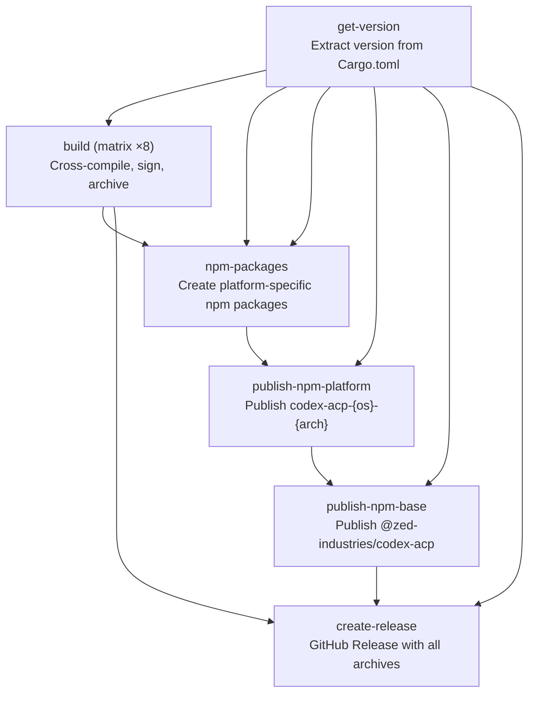

The release workflow is the pipeline that transforms source code on the `main` branch into signed, platform-native binaries distributed through GitHub Releases and npm. Unlike the [CI Pipeline](21-ci-pipeline-multi-platform-testing-and-linting) which validates every pull request, the release workflow is **manually triggered** and orchestrates a multi-stage process: version extraction, cross-compilation across eight target triples, platform-specific code signing, npm packaging, and GitHub Release publication. Understanding this workflow is essential for anyone cutting a release, debugging a failed build, or adding a new target platform.

Sources: [release.yml](.github/workflows/release.yml#L1-L16)

## Workflow Trigger and Version Resolution

The release workflow fires exclusively through `workflow_dispatch`, meaning a maintainer must manually initiate it from the GitHub Actions UI. An optional `tag_name` input allows overriding the automatically derived version tag. The **get-version** job extracts the version string from `Cargo.toml` using a `grep`/`sed` pipeline, then outputs both the bare version (e.g., `0.11.1`) and the tag name (prefixed with `v` if no override is provided). These outputs propagate to every downstream job via GitHub Actions' `needs` dependency chain, ensuring a single source of truth for the version across all build targets.

Sources: [release.yml](.github/workflows/release.yml#L18-L37), [Cargo.toml](Cargo.toml#L1-L9)

## Build Matrix: Eight Targets Across Five OS Images

The **build** job uses a `fail-fast: false` matrix strategy, meaning all targets continue building even if one fails — critical for identifying platform-specific regressions without re-running the entire workflow. The matrix maps each target triple to a specific GitHub Actions runner image:

| Runner Image | Target Triple | Binary Extension | Notes |
|---|---|---|---|
| `macos-14` | `aarch64-apple-darwin` | *(none)* | Apple Silicon (M1+) |
| `macos-14` | `x86_64-apple-darwin` | *(none)* | Intel Mac |
| `ubuntu-22.04` | `x86_64-unknown-linux-gnu` | *(none)* | glibc-linked x64 |
| `ubuntu-24.04` | `x86_64-unknown-linux-musl` | *(none)* | Statically-linked x64 |
| `ubuntu-22.04-arm` | `aarch64-unknown-linux-gnu` | *(none)* | glibc-linked ARM64 |
| `ubuntu-24.04-arm` | `aarch64-unknown-linux-musl` | *(none)* | Statically-linked ARM64 |
| `windows-latest` | `x86_64-pc-windows-msvc` | `.exe` | MSVC-linked x64 |
| `windows-11-arm` | `aarch64-pc-windows-msvc` | `.exe` | MSVC-linked ARM64 |

The dual Linux targets per architecture (gnu vs musl) serve different deployment scenarios: the `gnu` variants link against the host's glibc for maximum compatibility with standard Linux distributions, while the `musl` variants produce fully static binaries that run on any Linux system regardless of the installed C library — essential for Alpine Linux containers and minimal Docker images.

Sources: [release.yml](.github/workflows/release.yml#L39-L69)

## The musl Cross-Compilation Pipeline

Building musl targets is the most architecturally complex part of the release workflow, involving six conditional steps that are absent from all other builds. The core challenge is that the `denoland/rusty_v8` crate does not publish musl prebuilts, and several native dependencies (libcap, BoringSSL via aws-lc-sys) require careful cross-compilation orchestration.

### Hermetic Cargo Home

The pipeline begins by redirecting `CARGO_HOME` to a workspace-local directory. This isolation prevents the musl toolchain from polluting the shared cargo registry that other build steps might rely on, and ensures that the custom `config.toml` overrides don't leak into subsequent builds.

Sources: [release.yml](.github/workflows/release.yml#L80-L89)

### Zig as Cross-Compiler with Custom Wrappers

The musl builds use **Zig** (v0.14.0) as a drop-in C/C++ cross-compiler. Zig provides a hermetic sysroot for each target triple, eliminating the need to install separate cross-compilation toolchains. The [install-musl-build-tools.sh](.github/scripts/install-musl-build-tools.sh) script generates two shell wrapper scripts — `zigcc` and `zigcxx` — that sit between Cargo's build system and the Zig compiler. These wrappers perform critical argument rewriting:

- **Target flag normalization**: Rust emits `--target=x86_64-unknown-linux-musl`, but Zig expects `-target x86_64-linux-musl`. The wrappers strip Rust-style target flags and re-inject them in Zig's format.
- **Header search path management**: `-I/usr/include` flags from the host system are demoted to `-idirafter` ordering, preventing glibc headers from shadowing musl's own headers in the Zig sysroot.
- **Preprocessor forwarding fixes**: The `-Wp,-U_FORTIFY_SOURCE` form emitted by `aws-lc-sys` in debug builds is rewritten to the direct `-U_FORTIFY_SOURCE` flag that Zig expects.

When Zig is unavailable, the wrappers fall back to the system's `musl-gcc` toolchain, maintaining a degraded-but-functional path.

Sources: [install-musl-build-tools.sh](.github/scripts/install-musl-build-tools.sh#L92-L211)

### libcap Static Cross-Compilation

The codex-acp binary depends on Linux capabilities (`libcap`), which must be statically linked for musl targets. The script downloads libcap v2.75 (with SHA-256 verification), cross-compiles it using the musl linker, and installs the resulting `libcap.a` into a dedicated prefix directory. A generated `libcap.pc` pkg-config file allows the Rust build system to locate the static library through standard `PKG_CONFIG_PATH` resolution.

Sources: [install-musl-build-tools.sh](.github/scripts/install-musl-build-tools.sh#L35-L90)

### rusty_v8 Artifact Override

Since `denoland/rusty_v8` does not publish musl prebuilts, the pipeline resolves the v8 version from `Cargo.lock` using a Python script, then downloads the corresponding static library and Rust source binding from the `openai/codex` GitHub releases. Two environment variables — `RUSTY_V8_ARCHIVE` and `RUSTY_V8_SRC_BINDING_PATH` — redirect the v8 build script to these custom artifacts, completely bypassing the default download mechanism.

Sources: [release.yml](.github/workflows/release.yml#L137-L161)

### UBSan Runtime and Flag Sanitization

GitHub's runner images inject Undefined Behavior Sanitizer flags that conflict with musl cross-compilation. The pipeline addresses this with a two-pronged approach: a **rustc wrapper script** that preloads `libubsan.so.1` via `LD_PRELOAD` for the host compiler, and a **flag sanitization step** that strips `-fsanitize=undefined` and related flags from `CFLAGS`, `CXXFLAGS`, and all `RUSTFLAGS` variants. The `AWS_LC_SYS_NO_JITTER_ENTROPY=1` environment variable disables BoringSSL's jitter entropy collector, which is particularly susceptible to UBSan flag leakage through CMake.

Sources: [release.yml](.github/workflows/release.yml#L115-L219)

## Code Signing: macOS and Windows

Code signing is a hard requirement for distribution on both macOS and Windows. Without it, macOS Gatekeeper blocks execution and Windows SmartScreen displays warnings. The release workflow applies platform-specific signing immediately after the `cargo build` step, before archive creation.

### macOS: Codesign + Notarization

The [sign-mac](script/sign-mac) script implements Apple's required two-step process:

1. **Signing**: The binary is signed using `/usr/bin/codesign` with the `--options runtime` flag, which enables Apple's Hardened Runtime — a prerequisite for notarization. The certificate is imported into a temporary keychain created specifically for the CI run, and the keychain is deleted on exit via a `trap cleanup EXIT` handler.

2. **Notarization**: The signed binary is zipped and submitted to Apple's notarization service via `notarytool submit --wait`. Apple verifies the binary against malware signatures and returns a notarization ticket. The `--wait` flag blocks until the process completes, failing the build if notarization is rejected.

Five secrets are required: `MACOS_CERTIFICATE` (base64-encoded .p12), `MACOS_CERTIFICATE_PASSWORD`, `APPLE_NOTARIZATION_KEY` (API key), `APPLE_NOTARIZATION_KEY_ID`, and `APPLE_NOTARIZATION_ISSUER_ID`.

Sources: [sign-mac](script/sign-mac#L1-L75), [release.yml](.github/workflows/release.yml#L224-L233)

### Windows: Azure Trusted Signing

The [sign-windows.ps1](script/sign-windows.ps1) script uses Microsoft's **Azure Trusted Signing** service. It authenticates via an Azure Service Principal, then calls `Invoke-TrustedSigning` with the configured certificate profile and timestamp server. The script is designed to be self-contained: it auto-installs the `Az.CodeSigning` and `TrustedSigning` PowerShell modules if they're not already available.

The signing configuration uses SHA-256 for both file and timestamp digests, with Microsoft's `timestamp.acs.microsoft.com` as the RFC 3161 timestamp authority. Three secrets (`AZURE_SIGNING_TENANT_ID`, `AZURE_SIGNING_CLIENT_ID`, `AZURE_SIGNING_CLIENT_SECRET`) and two repository variables (`AZURE_SIGNING_ACCOUNT_NAME`, `AZURE_SIGNING_CERT_PROFILE_NAME`, `AZURE_SIGNING_ENDPOINT`) are required.

Sources: [sign-windows.ps1](script/sign-windows.ps1#L1-L119), [release.yml](.github/workflows/release.yml#L235-L248)

## Archive Creation and Artifact Upload

After building and signing, each binary is packaged into a platform-appropriate archive. Windows targets produce `.zip` archives via 7-Zip, while all other targets produce `.tar.gz` archives. The naming convention follows the pattern `codex-acp-{version}-{target}`, for example `codex-acp-0.11.1-aarch64-apple-darwin.tar.gz`. Each archive is uploaded as a GitHub Actions artifact with a 1-day retention period — just long enough for the downstream `npm-packages` job to consume them.

Sources: [release.yml](.github/workflows/release.yml#L250-L276)

## End-to-End Release Pipeline

The following diagram shows the complete job dependency chain from version resolution through GitHub Release creation:

Note the deliberate ordering: platform-specific npm packages must be published **before** the base package so that `optionalDependencies` can resolve at install time. The `publish-npm-base` job includes a 30-second sleep to allow npm registry propagation before the base package goes live.

Sources: [release.yml](.github/workflows/release.yml#L278-L424)

## The Two-Phase npm Publishing Strategy

The release workflow separates npm publishing into two distinct phases to handle the `optionalDependencies` contract. The base package (`@zed-industries/codex-acp`) declares six platform-specific packages as optional dependencies. When a user installs the base package, npm automatically selects the correct platform variant based on `os` and `cpu` fields in each variant's `package.json`.

| Phase | Package Pattern | What It Contains |
|---|---|---|
| Platform | `@zed-industries/codex-acp-{os}-{arch}` | Native binary only |
| Base | `@zed-industries/codex-acp` | JavaScript launcher + optional deps |

The [create-platform-packages.sh](npm/publish/create-platform-packages.sh) script maps Rust target triples to npm platform identifiers (e.g., `aarch64-apple-darwin` → `darwin` + `arm64`), extracts the binary from each archive, and generates a `package.json` from the [template](npm/template/package.json) using `envsubst`. Notably, **musl targets are excluded** from npm packaging — only the gnu variants ship through npm, reflecting the expectation that npm consumers typically run on glibc-based systems. The [update-base-package.sh](npm/publish/update-base-package.sh) script synchronizes the version and all `optionalDependencies` references in the base `package.json`.

Sources: [create-platform-packages.sh](npm/publish/create-platform-packages.sh#L1-L92), [update-base-package.sh](npm/publish/update-base-package.sh#L1-L38), [package.json](npm/package.json#L1-L39)

## GitHub Release Creation

The final **create-release** job downloads all build artifacts and creates a GitHub Release using the `softprops/action-gh-release` action. The release is tagged with the version (e.g., `v0.11.1`), titled "Release {version}", and includes auto-generated release notes. All `.tar.gz` and `.zip` archives are attached as release assets. The release is published immediately — it is not created as a draft.

Sources: [release.yml](.github/workflows/release.yml#L394-L424)

## Key Configuration Reference

The following table summarizes the secrets and variables required for a successful release:

| Type | Name | Used By | Purpose |
|---|---|---|---|
| Secret | `MACOS_CERTIFICATE` | sign-mac | Base64-encoded Apple .p12 certificate |
| Secret | `MACOS_CERTIFICATE_PASSWORD` | sign-mac | Certificate import password |
| Secret | `APPLE_NOTARIZATION_KEY` | sign-mac | Apple notarization API key |
| Secret | `APPLE_NOTARIZATION_KEY_ID` | sign-mac | Apple notarization key identifier |
| Secret | `APPLE_NOTARIZATION_ISSUER_ID` | sign-mac | Apple notarization issuer identifier |
| Secret | `AZURE_SIGNING_TENANT_ID` | sign-windows.ps1 | Azure AD tenant for Trusted Signing |
| Secret | `AZURE_SIGNING_CLIENT_ID` | sign-windows.ps1 | Azure service principal app ID |
| Secret | `AZURE_SIGNING_CLIENT_SECRET` | sign-windows.ps1 | Azure service principal secret |
| Variable | `AZURE_SIGNING_ACCOUNT_NAME` | sign-windows.ps1 | Azure Code Signing account |
| Variable | `AZURE_SIGNING_CERT_PROFILE_NAME` | sign-windows.ps1 | Certificate profile within account |
| Variable | `AZURE_SIGNING_ENDPOINT` | sign-windows.ps1 | Regional endpoint URL |
| Secret | `GITHUB_TOKEN` | create-release | Auto-provided; write access for releases |
| Secret | `NPM_TOKEN` | publish steps | npm registry authentication |

Sources: [release.yml](.github/workflows/release.yml#L224-L248), [sign-mac](script/sign-mac#L21-L28), [sign-windows.ps1](script/sign-windows.ps1#L29-L39)

## Continuing the Journey

The release workflow produces binaries that are consumed by the npm distribution layer. For details on how platform detection works at install time and how the JavaScript launcher selects the correct native binary, see [npm Package Distribution and Platform Detection](23-npm-package-distribution-and-platform-detection). For the validation pipeline that runs before a release is cut, see [CI Pipeline: Multi-Platform Testing and Linting](21-ci-pipeline-multi-platform-testing-and-linting).