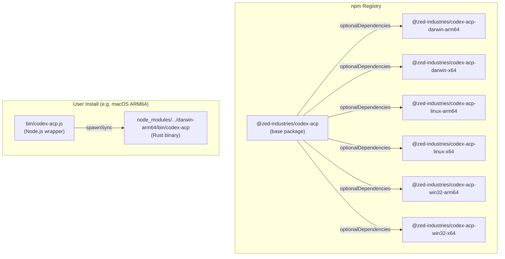
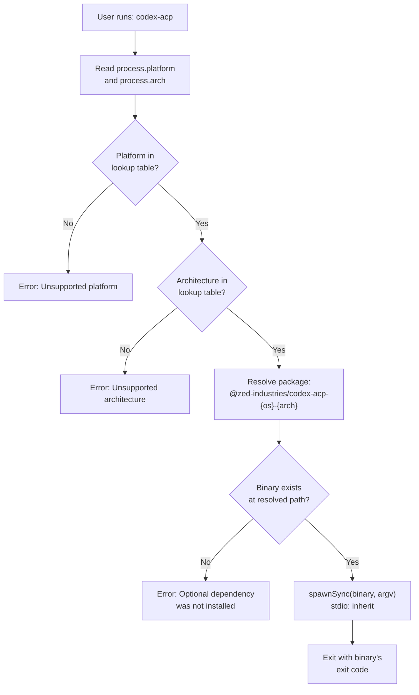
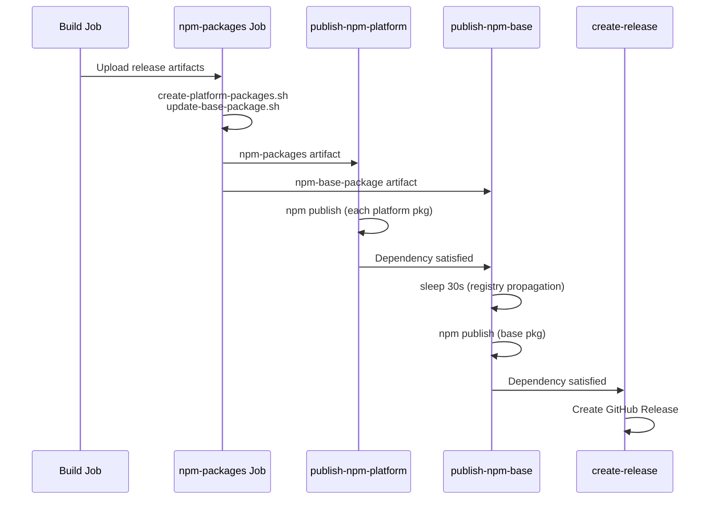

The `codex-acp` project distributes its Rust binary through npm using a **platform-package pattern**: a lightweight base package declares all platform-specific packages as optional dependencies, and a thin Node.js wrapper detects the host platform at runtime, resolves the correct binary, and transparently spawns it. This approach lets users install the agent with a single `npm install @zed-industries/codex-acp` or `npx @zed-industries/codex-acp` command, while npm's dependency resolver automatically pulls in only the platform package matching the current OS and CPU architecture.

Sources: [package.json](npm/package.json#L1-L39), [codex-acp.js](npm/bin/codex-acp.js#L1-L86)

## Architecture: Base Package and Platform Packages

The distribution consists of **seven** npm packages — one base package and six platform-specific packages. The base package `@zed-industries/codex-acp` ships only the JavaScript wrapper script under `bin/`; it contains no native code. Each platform package is named `@zed-industries/codex-acp-{os}-{arch}` and contains exactly one file: the compiled Rust binary under its own `bin/` directory. This separation keeps the base package tiny and lets npm's `optionalDependencies` mechanism resolve only the relevant platform package for the user's machine.

The base package's `package.json` lists all six platform packages in `optionalDependencies` with pinned versions matching its own. Because npm installs optional dependencies on a best-effort basis — skipping those that fail — the platform packages use the `os` and `cpu` fields to restrict installation to matching environments. On an incompatible system, npm simply skips that package rather than failing the entire install.

Sources: [package.json](npm/package.json#L30-L37), [template/package.json](npm/template/package.json#L1-L24)

## Supported Platform Matrix

The six platform packages map directly to the Rust cross-compilation targets built in the release pipeline. Note that while the CI and release workflows build both GNU and musl variants for Linux, the npm packaging step only distributes the GNU variants (`x86_64-unknown-linux-gnu` and `aarch64-unknown-linux-gnu`). This is a deliberate choice in [create-platform-packages.sh](npm/publish/create-platform-packages.sh#L23-L30) where the platform mapping explicitly selects GNU targets.

| Package Name | Rust Target | OS | Architecture | Binary Extension |
|---|---|---|---|---|
| `codex-acp-darwin-arm64` | `aarch64-apple-darwin` | macOS | ARM64 | *(none)* |
| `codex-acp-darwin-x64` | `x86_64-apple-darwin` | macOS | x86_64 | *(none)* |
| `codex-acp-linux-arm64` | `aarch64-unknown-linux-gnu` | Linux | ARM64 | *(none)* |
| `codex-acp-linux-x64` | `x86_64-unknown-linux-gnu` | Linux | x86_64 | *(none)* |
| `codex-acp-win32-arm64` | `aarch64-pc-windows-msvc` | Windows | ARM64 | `.exe` |
| `codex-acp-win32-x64` | `x86_64-pc-windows-msvc` | Windows | x86_64 | `.exe` |

Sources: [create-platform-packages.sh](npm/publish/create-platform-packages.sh#L23-L30)

## Runtime Platform Detection

When a user runs `codex-acp` (or `npx @zed-industries/codex-acp`), the entry point is [bin/codex-acp.js](npm/bin/codex-acp.js#L1-L86) — a small ESM Node.js script that performs three operations in sequence:

1. **Platform resolution** — reads `process.platform` and `process.arch` and maps them through a hardcoded lookup table to determine which platform-specific package name to use. If the platform or architecture is not in the table, the script exits with an error.

2. **Binary location** — uses `import.meta.resolve()` to locate the binary within the resolved platform package's `bin/` directory. For Windows, the binary name includes the `.exe` extension. If the resolved path does not exist on disk (indicating the optional dependency was not installed), the script prints a diagnostic message and exits.

3. **Binary execution** — spawns the located binary as a child process via `spawnSync`, forwarding all command-line arguments (`process.argv.slice(2)`) and connecting stdio in inherit mode so the Rust process runs as if it were invoked directly.

The platform lookup table embedded in the wrapper script mirrors exactly the six supported combinations:

| `process.platform` | `process.arch` | Resolved Package |
|---|---|---|
| `darwin` | `arm64` | `@zed-industries/codex-acp-darwin-arm64` |
| `darwin` | `x64` | `@zed-industries/codex-acp-darwin-x64` |
| `linux` | `arm64` | `@zed-industries/codex-acp-linux-arm64` |
| `linux` | `x64` | `@zed-industries/codex-acp-linux-x64` |
| `win32` | `arm64` | `@zed-industries/codex-acp-win32-arm64` |
| `win32` | `x64` | `@zed-industries/codex-acp-win32-x64` |

Sources: [codex-acp.js](npm/bin/codex-acp.js#L7-L40)

## Platform Package Generation

Platform packages are generated during the release workflow by [create-platform-packages.sh](npm/publish/create-platform-packages.sh#L1-L92). The script accepts three arguments — the artifacts directory containing the release archives, an output directory, and the version string — and proceeds as follows:

For each entry in its platform mapping, the script locates the corresponding release archive (`.tar.gz` for Unix, `.zip` for Windows), extracts the `codex-acp` binary into a `bin/` subdirectory, marks it executable on Unix, and generates a `package.json` from the template using `envsubst`. The template at [npm/template/package.json](npm/template/package.json#L1-L24) uses four environment variable placeholders — `${PACKAGE_NAME}`, `${VERSION}`, `${OS}`, and `${ARCH}` — that are populated at generation time. The `os` and `cpu` fields in the generated package.json enforce npm's platform compatibility check, preventing installation on mismatched systems.

For Windows packages, an additional `sed` step patches the `bin` field in `package.json` to reference `codex-acp.exe` instead of `codex-acp`, ensuring the npm bin link resolves correctly on Windows.

Sources: [create-platform-packages.sh](npm/publish/create-platform-packages.sh#L1-L92), [template/package.json](npm/template/package.json#L1-L24)

## Version Synchronization

A single source of truth controls the version across all packages: the `version` field in [Cargo.toml](Cargo.toml#L3). The release workflow reads this version in its `get-version` job and passes it downstream to both the platform package creation script and the base package update script.

The [update-base-package.sh](npm/publish/update-base-package.sh#L1-L38) script uses `sed` to update the base `package.json`'s `version` field and all six `optionalDependencies` version strings in a single pass. This ensures that the base package and all platform packages share the same version number, which is critical because the base package pins platform dependencies to an exact version rather than a range.

The CI pipeline's `npm-validation` job verifies this synchronization on every push and pull request by extracting the version from both `Cargo.toml` and `npm/package.json` and asserting they match.

Sources: [update-base-package.sh](npm/publish/update-base-package.sh#L1-L38), [validate.sh](npm/testing/validate.sh#L62-L74), [Cargo.toml](Cargo.toml#L3)

## CI Validation Pipeline

The [npm-validation](npm/testing/validate.sh#L1-L101) CI job runs on every push and pull request, performing five checks without requiring a Rust toolchain:

| # | Check | What It Verifies |
|---|---|---|
| 1 | Wrapper script syntax | `node -c` confirms `codex-acp.js` parses without errors |
| 2 | Base package.json validity | `JSON.parse` confirms the base package.json is well-formed |
| 3 | Template placeholders | Ensures `${PACKAGE_NAME}`, `${VERSION}`, `${OS}`, `${ARCH}` all exist in the template |
| 4 | Version consistency | Asserts `Cargo.toml` version equals `npm/package.json` version |
| 5 | Platform packages listed | Confirms all six `@zed-industries/codex-acp-*` packages appear in `optionalDependencies` |

Additionally, [test-platform-detection.js](npm/testing/test-platform-detection.js#L1-L118) exercises the platform detection logic by mocking `process.platform` and `process.arch` via `Object.defineProperty` for all six known combinations, asserting each resolves to the expected package name. It also prints the current host's detection result as a diagnostic.

Sources: [validate.sh](npm/testing/validate.sh#L1-L101), [test-platform-detection.js](npm/testing/test-platform-detection.js#L1-L118), [ci.yml](.github/workflows/ci.yml#L239-L256)

## Release Publishing Order

The release workflow publishes npm packages in a carefully sequenced two-phase process to prevent a race condition: if a user installs the base package before its referenced platform packages are available on the npm registry, the optional dependency resolution would fail silently and the binary would be missing.

**Phase 1** — The `publish-npm-platform` job iterates over all generated platform package directories and publishes each one with `npm publish`. This job has no dependency on the base package.

**Phase 2** — The `publish-npm-base` job depends on `publish-npm-platform` completing successfully. Before publishing, it waits an additional 30 seconds ("Waiting 30 seconds for platform packages to be available on npm...") to allow npm's registry replication to propagate the platform packages globally. Only then does it publish the base package.

This ordering guarantees that by the time any user could install the base package, all six platform packages are already resolvable on the registry.

Sources: [release.yml](.github/workflows/release.yml#L278-L393)

## The optionalDependencies Design Choice

The use of `optionalDependencies` rather than a post-install download script is a deliberate architectural decision with specific tradeoffs. With `optionalDependencies`, npm handles platform filtering natively through the `os` and `cpu` fields in each platform package — no custom install script is needed, and the installation is deterministic and offline-capable once the registry resolves. The downside is that all six platform packages appear in the lockfile, though only one is actually downloaded. This is the same pattern used by projects like `esbuild` and `@swc/core`, and it is well-understood by the Node.js ecosystem.

If the optional dependency fails to install (for example, on an unsupported platform like FreeBSD), npm silently continues and the base package installs successfully. The wrapper script then handles the missing binary gracefully at runtime with a clear error message explaining that the platform-specific dependency was not installed.

Sources: [package.json](npm/package.json#L30-L37), [codex-acp.js](npm/bin/codex-acp.js#L57-L67)

## Key Files Reference

| File | Role |
|---|---|
| [npm/package.json](npm/package.json) | Base package manifest with optionalDependencies |
| [npm/bin/codex-acp.js](npm/bin/codex-acp.js) | Runtime wrapper: platform detection + binary spawn |
| [npm/template/package.json](npm/template/package.json) | Template for platform-specific package manifests |
| [npm/publish/create-platform-packages.sh](npm/publish/create-platform-packages.sh) | Generates platform packages from release archives |
| [npm/publish/update-base-package.sh](npm/publish/update-base-package.sh) | Synchronizes base package version with Cargo.toml |
| [npm/testing/validate.sh](npm/testing/validate.sh) | CI validation: syntax, structure, version consistency |
| [npm/testing/test-platform-detection.js](npm/testing/test-platform-detection.js) | Unit tests for platform detection mapping |

The preceding page [Release Workflow: Cross-Compilation and Code Signing](22-release-workflow-cross-compilation-and-code-signing) covers how the binary archives are built and signed before they reach the npm packaging step described here.