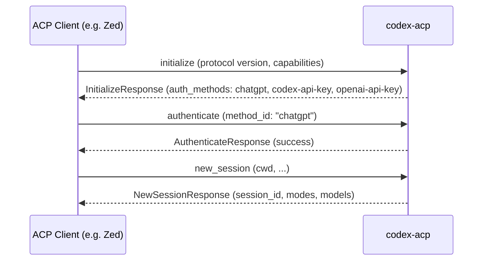
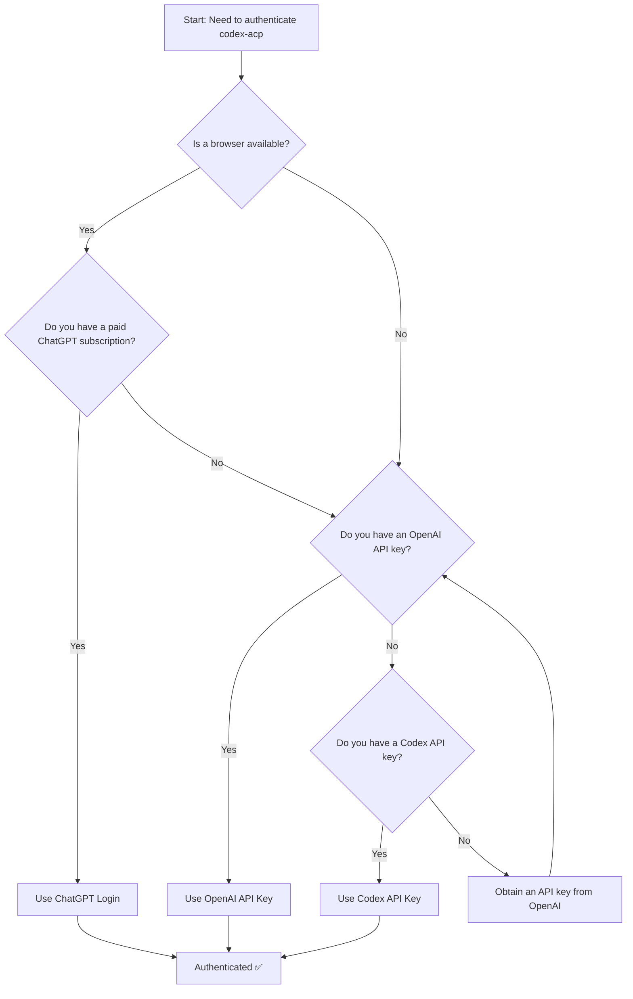

Codex ACP supports **three authentication methods** to connect to the OpenAI backend, each designed for a different workflow. The method you choose determines how codex-acp obtains and refreshes credentials — but once authenticated, all methods grant the same capabilities. This page explains each method, when to use it, and how the authentication lifecycle works within the ACP protocol.

## Authentication at a Glance

| Method | ACP ID | Type | Credential Source | Best For |
|---|---|---|---|---|
| **ChatGPT Login** | `chatgpt` | Agent (browser/device flow) | Browser-based OAuth | Users with a paid ChatGPT subscription |
| **Codex API Key** | `codex-api-key` | Environment variable | `CODEX_API_KEY` | CI/CD pipelines, headless servers |
| **OpenAI API Key** | `openai-api-key` | Environment variable | `OPENAI_API_KEY` | Users with an OpenAI platform API key |

Sources: [codex_agent.rs](src/codex_agent.rs#L593-L638)

## How Authentication Fits into ACP

When an ACP client (like Zed) starts codex-acp, the first exchange is the `initialize` handshake. During this handshake, codex-acp advertises its **authentication capabilities** and the list of supported auth methods. The client then selects a method and sends an `authenticate` request. Only after successful authentication can the agent create sessions, send prompts, or list sessions.



The `initialize` response includes an `AgentAuthCapabilities` object that signals logout support, and each auth method carries metadata (display name, description, required environment variables) so the client can render an appropriate UI.

Sources: [codex_agent.rs](src/codex_agent.rs#L218-L254)

## Method 1: ChatGPT Login (`chatgpt`)

The **ChatGPT login** method uses a browser-based device-code OAuth flow powered by `codex_login`. When the client requests this method, codex-acp starts a local login server, opens (or prompts the user to visit) a URL in the browser, and waits for the user to complete authentication. Once the browser flow succeeds, the credential is stored locally and the `authenticate` call returns success.

**Key details:**

- **Requires a paid ChatGPT subscription** — the description explicitly states: *"Use your ChatGPT login with Codex CLI (requires a paid ChatGPT subscription)"*
- **Not available in remote/headless environments** — when the `NO_BROWSER` environment variable is set, codex-acp removes this method from the advertised list entirely. This prevents offering a browser flow that the user cannot complete on a remote SSH session
- **ACP method type**: `Agent` — meaning the agent itself orchestrates the login flow; the client simply waits for completion

**When to use it:** This is the default and most user-friendly method for desktop usage where a browser is available. It leverages an existing ChatGPT subscription without requiring separate API key management.

Sources: [codex_agent.rs](src/codex_agent.rs#L277-L295), [codex_agent.rs](src/codex_agent.rs#L246-L248), [codex_agent.rs](src/codex_agent.rs#L613-L617)

## Method 2: Codex API Key (`codex-api-key`)

The **Codex API Key** method reads the `CODEX_API_KEY` environment variable and uses it to authenticate. If the variable is not set, the `authenticate` call returns an error with the message *"CODEX_API_KEY is not set"*.

**Key details:**

- **ACP method type**: `EnvVar` — the client is informed that this method requires a specific environment variable (`CODEX_API_KEY`)
- **No interactive step** — authentication succeeds or fails immediately based on whether the env var is present and valid
- **Stored via `codex_login::login_with_api_key`** — the key is persisted to the codex credentials store using the same mechanism as ChatGPT login

**When to use it:** Ideal for automated environments, CI/CD pipelines, or any scenario where you have a Codex-specific API key and no browser available.

```bash
# Set the environment variable before launching codex-acp
export CODEX_API_KEY="your-codex-api-key"
codex-acp
```

Sources: [codex_agent.rs](src/codex_agent.rs#L296-L306), [codex_agent.rs](src/codex_agent.rs#L618-L627)

## Method 3: OpenAI API Key (`openai-api-key`)

The **OpenAI API Key** method works identically to the Codex API Key method, but reads from the `OPENAI_API_KEY` environment variable instead. If the variable is not set, the `authenticate` call returns an error with the message *"OPENAI_API_KEY is not set"*.

**Key details:**

- **ACP method type**: `EnvVar` — the client is informed that this method requires the `OPENAI_API_KEY` environment variable
- **No interactive step** — same immediate success/failure behavior as the Codex API Key method
- **Also stored via `codex_login::login_with_api_key`** — credentials are persisted the same way

**When to use it:** If you already have an OpenAI platform API key (e.g., from using the OpenAI API directly), this method avoids the need to obtain a separate Codex API key.

```bash
# Set the environment variable before launching codex-acp
export OPENAI_API_KEY="sk-..."
codex-acp
```

Sources: [codex_agent.rs](src/codex_agent.rs#L307-L318), [codex_agent.rs](src/codex_agent.rs#L628-L638)

## Authentication Lifecycle

### Already-Authenticated Optimization

When a client sends an `authenticate` request, codex-acp first checks whether the user is **already authenticated** with the requested method. If the existing credential type matches the requested method, the call returns success immediately without re-running the login flow. The matching logic works as follows:

| Existing Credential | Requested Method | Short-Circuited? |
|---|---|---|
| `CodexAuth::ApiKey` | `codex-api-key` or `openai-api-key` | ✅ Yes |
| `CodexAuth::Chatgpt` | `chatgpt` | ✅ Yes |
| `CodexAuth::ApiKey` | `chatgpt` | ❌ No |
| `CodexAuth::Chatgpt` | `codex-api-key` or `openai-api-key` | ❌ No |

This means switching from one method to another always triggers a fresh authentication, while re-authenticating with the same method is a no-op.

Sources: [codex_agent.rs](src/codex_agent.rs#L262-L274)

### Auth Guard on Sensitive Operations

Every operation that communicates with the OpenAI backend runs through `check_auth()` first. This guard verifies that the `model_provider_id` is `"openai"` and that a credential is currently loaded in the `AuthManager`. If no credential is found, the operation returns an `auth_required` error, which the client can use to prompt the user to authenticate.

The following operations are auth-guarded:

| Operation | ACP Method |
|---|---|
| Create a new session | `new_session` |
| Load an existing session | `load_session` |
| List sessions | `list_sessions` |
| Send a prompt | `prompt` |

Sources: [codex_agent.rs](src/codex_agent.rs#L111-L116), [codex_agent.rs](src/codex_agent.rs#L333-L335), [codex_agent.rs](src/codex_agent.rs#L385-L386), [codex_agent.rs](src/codex_agent.rs#L455), [codex_agent.rs](src/codex_agent.rs#L534-L535)

### Logout

Logging out is supported both as an ACP protocol method and as a slash command:

- **ACP `logout` method**: The client calls the `logout` endpoint, which delegates to `AuthManager::logout()`. This clears the stored credentials.
- **`/logout` slash command**: When a user types `/logout` in a session, the command calls the same `AuthManager::logout()` method and then returns an `auth_required` error, forcing the client to re-authenticate before continuing.

Sources: [codex_agent.rs](src/codex_agent.rs#L325-L330), [thread.rs](src/thread.rs#L3208-L3211)

## Choosing the Right Method: A Decision Flowchart



## Under the Hood: AuthManager and Credential Storage

The `CodexAgent` struct holds a shared `Arc<AuthManager>` instance, created during initialization with the codex home directory and the configured credentials store mode. This `AuthManager` is passed down to every `Thread` and `ThreadActor` so that auth state is consistent across the entire agent lifecycle. After any login operation (ChatGPT browser flow or API key ingestion), `auth_manager.reload()` is called to refresh the in-memory credential from the persistent store.

Sources: [codex_agent.rs](src/codex_agent.rs#L51-L52), [codex_agent.rs](src/codex_agent.rs#L70-L74), [codex_agent.rs](src/codex_agent.rs#L294), [codex_agent.rs](src/codex_agent.rs#L320)

## Next Steps

- Learn how to connect with ACP clients in [Using with Zed and Other ACP Clients](4-using-with-zed-and-other-acp-clients)
- Understand the full architecture in [Architecture: Bridging ACP and Codex](5-architecture-bridging-acp-and-codex)
- Explore the `/logout` command details in [Built-in Slash Commands](9-built-in-slash-commands-review-init-compact-undo-logout)