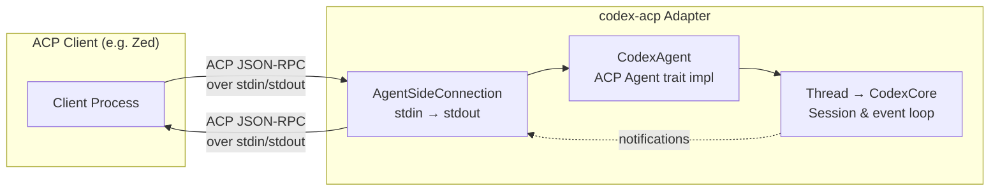
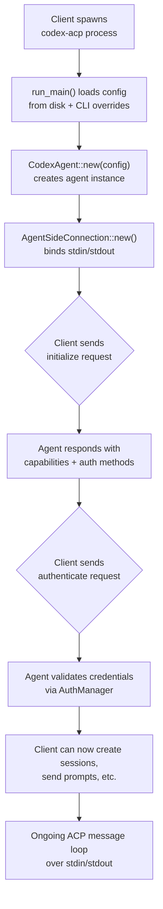

**codex-acp** is a bridge that exposes [OpenAI Codex](https://github.com/openai/codex) through the [Agent Client Protocol (ACP)](https://agentclientprotocol.com/), enabling any ACP-compatible client to use Codex as a coding agent. This page covers how to install, configure, and run codex-acp with Zed and other ACP clients, along with the capabilities the adapter exposes to those clients.

Sources: [README.md](README.md#L1-L4), [Cargo.toml](Cargo.toml#L7-L8)

## The Communication Model: stdio-Based ACP

codex-acp communicates with its host client exclusively over **stdin and stdout** using the ACP protocol. When launched, the adapter reads ACP JSON-RPC messages from stdin, processes them through its `CodexAgent` implementation, and writes responses back to stdout. Diagnostic and tracing output is deliberately redirected to stderr so it never interferes with the protocol stream. This stdio transport makes codex-acp universally compatible with any client that can spawn a child process and pipe its I/O — no HTTP server, WebSocket, or socket file required.



The adapter uses the `agent_client_protocol` crate's `AgentSideConnection` to handle protocol framing and I/O, while the `CodexAgent` struct implements the `Agent` trait to handle all business logic — session management, authentication, prompt processing, and capability negotiation. The `LocalSet` runtime ensures all ACP tasks execute on the same thread, avoiding the need for `Send` bounds on the agent.

Sources: [lib.rs](src/lib.rs#L62-L84), [codex_agent.rs](src/codex_agent.rs#L45-L62)

## Using with Zed

Zed is the primary ACP client for codex-acp and ships with built-in support. The latest version of Zed can discover and launch the adapter automatically — no manual installation or configuration required.

To start a Codex session in Zed, open the **Agent Panel** and click **"New Codex Thread"** from the `+` button menu in the top-right corner. Zed handles spawning the `codex-acp` binary, authenticating through the ACP protocol, and presenting the chat interface. For more details, consult Zed's [External Agent documentation](https://zed.dev/docs/ai/external-agents).

Sources: [README.md](README.md#L31-L37)

## Using with Other ACP Clients

Any client that implements the ACP protocol can communicate with codex-acp. The [ACP client registry](https://agentclientprotocol.com/overview/clients) lists known compatible clients. To integrate codex-acp, the client must be able to:

1. **Spawn a child process** with `codex-acp` as the command.
2. **Pipe stdin/stdout** for bidirectional ACP JSON-RPC communication.
3. **Handle ACP capabilities** such as embedded context, image attachments, tool-call permission requests, and session lifecycle events.

Sources: [README.md](README.md#L39-L41)

### Installation Methods

There are two ways to install codex-acp for use with non-Zed clients:

| Method | Command | Best For |
|--------|---------|----------|
| **GitHub Release binary** | Download from [releases page](https://github.com/zed-industries/codex-acp/releases) | Direct binary usage, CI, constrained environments |
| **npm package** | `npx @zed-industries/codex-acp` | Node.js projects, cross-platform convenience |

#### Method 1: Binary from GitHub Releases

Download the pre-built binary for your platform from the [releases page](https://github.com/zed-industries/codex-acp/releases). Archives are named using the Rust target triple convention:

```
codex-acp-<version>-<target>.tar.gz   (macOS / Linux)
codex-acp-<version>-<target>.zip      (Windows)
```

Extract the binary and ensure it is on your `PATH`. Then run:

```bash
OPENAI_API_KEY=sk-... codex-acp
```

Sources: [README.md](README.md#L43-L51), [release.yml](.github/workflows/release.yml#L250-L269)

#### Method 2: npm Package

The `@zed-industries/codex-acp` npm package uses **optional platform-specific dependencies** to install the correct native binary for your OS and architecture. The entry point `bin/codex-acp.js` is a thin Node.js wrapper that detects the current platform, resolves the correct `@zed-industries/codex-acp-<platform>-<arch>` sub-package, and spawns the native binary with `stdio: "inherit"`.

```bash
# Run directly without installing
npx @zed-industries/codex-acp

# Or install globally
npm install -g @zed-industries/codex-acp
codex-acp
```

The wrapper script maps Node.js `process.platform` and `process.arch` to the correct platform package at runtime. If the optional dependency for your platform was not installed (common with `--ignore-optional` or `--no-optional` flags), the wrapper exits with a diagnostic error message.

Sources: [npm/package.json](npm/package.json#L24-L37), [npm/bin/codex-acp.js](npm/bin/codex-acp.js#L8-L67)

### Supported Platforms

codex-acp ships pre-built binaries for the following platforms:

| Platform | Architecture | npm Sub-package | Target Triple |
|----------|-------------|-----------------|---------------|
| macOS | Apple Silicon (ARM64) | `@zed-industries/codex-acp-darwin-arm64` | `aarch64-apple-darwin` |
| macOS | Intel (x64) | `@zed-industries/codex-acp-darwin-x64` | `x86_64-apple-darwin` |
| Linux | ARM64 | `@zed-industries/codex-acp-linux-arm64` | `aarch64-unknown-linux-gnu` |
| Linux | x64 | `@zed-industries/codex-acp-linux-x64` | `x86_64-unknown-linux-gnu` |
| Windows | ARM64 | `@zed-industries/codex-acp-win32-arm64` | `aarch64-pc-windows-msvc` |
| Windows | x64 | `@zed-industries/codex-acp-win32-x64` | `x86_64-pc-windows-msvc` |

Note that the npm distribution uses the **GNU** Linux variants (not musl), while the GitHub releases additionally provide musl-linked static binaries for Alpine and other musl-based distributions.

Sources: [npm/package.json](npm/package.json#L30-L36), [create-platform-packages.sh](npm/publish/create-platform-packages.sh#L23-L29), [release.yml](.github/workflows/release.yml#L44-L68)

## Capabilities Exposed to ACP Clients

When a client sends an `initialize` request, codex-acp responds with a structured `AgentCapabilities` object that declares what the agent supports. These capabilities determine which features the client can use and which protocol messages it should expect.

| Capability | Description | ACP Field |
|-----------|-------------|-----------|
| **Embedded context** | Supports `@`-mentions for files, symbols, and other resources | `prompt_capabilities.embedded_context` |
| **Images** | Accepts image attachments in prompts | `prompt_capabilities.image` |
| **MCP (HTTP)** | Accepts client-provided MCP servers over HTTP transport | `mcp_capabilities.http` |
| **Session load** | Can resume previous sessions from history | `load_session` |
| **Session close** | Supports explicit session shutdown | `session_capabilities.close` |
| **Session list** | Can enumerate past sessions, filtered by working directory | `session_capabilities.list` |
| **Logout** | Supports authentication logout through the ACP protocol | `auth.logout` |

Sources: [codex_agent.rs](src/codex_agent.rs#L230-L253)

## Authentication Setup

codex-acp declares three authentication methods during the `initialize` handshake. The client presents these to the user, who selects one. Each method maps to a different credential source:

| Method | ACP Method ID | How It Works | Environment Variable |
|--------|---------------|--------------|---------------------|
| **ChatGPT subscription** | `chatgpt` | Browser-based device-code login via `codex-login` | None (interactive) |
| **Codex API key** | `codex-api-key` | Reads key from environment | `CODEX_API_KEY` |
| **OpenAI API key** | `openai-api-key` | Reads key from environment | `OPENAI_API_KEY` |

The ChatGPT subscription method is **not available** when the `NO_BROWSER` environment variable is set, because the device-code flow requires opening a browser. This also means ChatGPT authentication does not work in remote SSH projects where no browser is accessible.

For non-interactive environments (CI, headless servers), use one of the API key methods by setting the relevant environment variable before launching `codex-acp`:

```bash
# Using an OpenAI API key
OPENAI_API_KEY=sk-... codex-acp

# Using a Codex API key
CODEX_API_KEY=... codex-acp
```

Sources: [codex_agent.rs](src/codex_agent.rs#L240-L318), [README.md](README.md#L22-L26)

## Running as a Standalone ACP Agent

Once installed and authenticated, codex-acp is invoked as a simple process that listens on stdin and writes to stdout. The following flowchart illustrates the startup sequence:



When using the npm package, the native binary is automatically selected and spawned by the Node.js wrapper — the ACP client only needs to invoke the `codex-acp` command and communicate over the process's stdio streams.

Sources: [lib.rs](src/lib.rs#L28-L87), [npm/bin/codex-acp.js](npm/bin/codex-acp.js#L70-L83)

## Troubleshooting

| Symptom | Likely Cause | Resolution |
|---------|-------------|------------|
| `codex-acp` exits immediately with no output | Missing authentication credentials | Set `OPENAI_API_KEY` or `CODEX_API_KEY` environment variable, or use a client that handles the ChatGPT auth flow |
| npm install fails with platform error | Optional dependency not installed for your platform | Ensure you are on a supported platform/arch combination; avoid `--no-optional` flags |
| `NO_BROWSER` is set and ChatGPT login not offered | Expected behavior — ChatGPT device-code flow requires a browser | Use an API key method instead |
| `RUST_LOG` noise in client output | Tracing output leaking into protocol stream | codex-acp writes tracing to stderr, but some clients may merge stderr — set `RUST_LOG=off` to suppress |
| Binary not found after npm install | Platform-specific optional dependency was pruned | Reinstall without `--ignore-optional` or download the binary from GitHub releases directly |

Sources: [lib.rs](src/lib.rs#L32-L37), [codex_agent.rs](src/codex_agent.rs#L246-L248), [npm/bin/codex-acp.js](npm/bin/codex-acp.js#L57-L66)

## What's Next

Now that you have codex-acp running with your ACP client, explore the internal architecture and advanced features:

- **[Architecture: Bridging ACP and Codex](5-architecture-bridging-acp-and-codex)** — understand how the adapter bridges two distinct protocol worlds
- **[CodexAgent: The ACP Agent Trait Implementation](6-codexagent-the-acp-agent-trait-implementation)** — dive into the `Agent` trait methods and capability negotiation
- **[Session Lifecycle: New, Load, Close, and List](8-session-lifecycle-new-load-close-and-list)** — learn how sessions are created, resumed, and managed
- **[Authentication Methods](3-authentication-methods)** — deeper coverage of each authentication flow
- **[Session Configuration: Modes, Models, and Reasoning Effort](16-session-configuration-modes-models-and-reasoning-effort)** — configure per-session behavior from the client