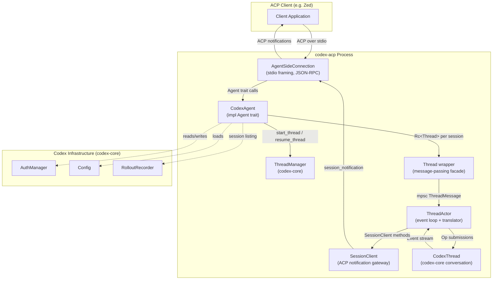
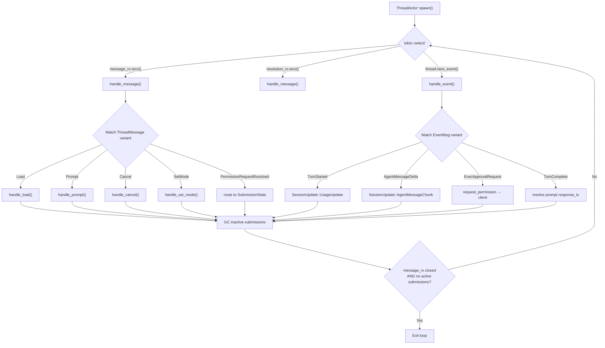
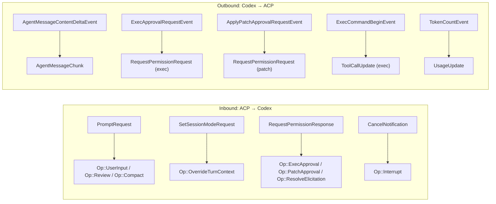

**codex-acp** is a protocol adapter that makes OpenAI's Codex available as an **Agent Client Protocol (ACP)** agent. It receives structured ACP requests over stdio from a client (such as Zed), translates them into Codex-native operations, streams Codex events back as ACP notifications, and surfaces Codex's approval/permission flows as ACP permission requests. This page provides the architectural blueprint — the layers, the data flow, and the key abstractions that make the bridge work.

Sources: [lib.rs](src/lib.rs#L1-L94), [README.md](README.md#L1-L62)

## The Three-Layer Architecture

The system is organized into three distinct layers, each with a clear responsibility boundary. The outermost layer handles ACP protocol framing; the middle layer maps ACP lifecycle operations to Codex sessions; the inner layer drives the Codex event loop and translates its events back into ACP notifications.

| Layer | Core Type | Responsibility | Source Module |
|-------|-----------|----------------|---------------|
| **Protocol I/O** | `AgentSideConnection` | Framing, serialization, stdio transport | `agent-client-protocol` crate |
| **Agent / Session Manager** | `CodexAgent` | ACP `Agent` trait, session CRUD, auth | [codex_agent.rs](src/codex_agent.rs) |
| **Event Loop / Translator** | `ThreadActor` + `SessionClient` | Codex event consumption → ACP notification emission | [thread.rs](src/thread.rs) |

The following diagram shows how these layers nest and communicate:



The `AgentSideConnection` is provided by the `agent-client-protocol` crate and handles all low-level framing — reading JSON-RPC messages from stdin, dispatching them to the `Agent` trait methods, and writing responses/notifications back to stdout. The `CodexAgent` implements that trait and is the single entry point for all ACP requests. Each ACP session maps to a `Thread` wrapper, which internally spawns a `ThreadActor` task that drives the Codex conversation and translates its events.

Sources: [lib.rs](src/lib.rs#L62-L84), [codex_agent.rs](src/codex_agent.rs#L49-L62), [thread.rs](src/thread.rs#L171-L178)

## Startup and Connection Bootstrap

The entry point is `run_main`, which performs four sequential steps:

1. **Initialize tracing** — writes to stderr so it never interferes with the stdio ACP channel.
2. **Load configuration** — merges CLI overrides (`-c key=value`) with the Codex config file and harness defaults.
3. **Instantiate `CodexAgent`** — creates the `AuthManager`, `ThreadManager`, and empty session maps.
4. **Establish the ACP connection** — wraps stdin/stdout with Tokio async adapters, creates an `AgentSideConnection` bound to the agent, and stores the resulting `Client` handle in a global `ACP_CLIENT` singleton for later notification dispatch.

A critical design choice: the connection runs on a `LocalSet` with `spawn_local`, ensuring all tasks execute on the same thread. This is required because `CodexAgent` uses `Rc<RefCell<…>>` for its session map — a non-`Send` type that cannot cross thread boundaries. The entire bridge is single-threaded in the Tokio sense, using cooperative async to achieve concurrency.

Sources: [lib.rs](src/lib.rs#L28-L87), [codex_agent.rs](src/codex_agent.rs#L67-L96)

## The Agent Trait: ACP's Front Door

`CodexAgent` implements the `Agent` trait from the `agent-client-protocol` crate. Every ACP request — `initialize`, `authenticate`, `new_session`, `prompt`, `cancel`, and so on — arrives as a method call on this trait. The agent's job is to validate the request, delegate to the appropriate internal component, and return a structured response.

### Agent State

| Field | Type | Purpose |
|-------|------|---------|
| `auth_manager` | `Arc<AuthManager>` | Shared authentication state (ChatGPT login, API keys) |
| `client_capabilities` | `Arc<Mutex<ClientCapabilities>>` | Client feature flags, set during `initialize` |
| `config` | `Config` | Base Codex configuration, cloned per session |
| `thread_manager` | `ThreadManager` | Codex-core thread lifecycle (start, resume, remove) |
| `sessions` | `Rc<RefCell<HashMap<SessionId, Rc<Thread>>>>` | Active session → Thread mapping |
| `session_roots` | `Arc<Mutex<HashMap<SessionId, PathBuf>>>` | Session working directories for sandboxing |

The `sessions` map is the central routing table: when an ACP request targets a specific `session_id`, the agent looks up the corresponding `Thread` and delegates the operation to it. Because `Thread` wraps a `ThreadActor` running inside the same `LocalSet`, the agent simply sends a message and awaits the response — no locks on the hot path.

Sources: [codex_agent.rs](src/codex_agent.rs#L49-L62), [codex_agent.rs](src/codex_agent.rs#L67-L96)

### ACP ↔ Codex Operation Mapping

The following table shows how each ACP `Agent` trait method maps to underlying Codex operations:

| ACP Method | Codex Operation | Notes |
|------------|----------------|-------|
| `initialize` | Stores client capabilities, returns agent capabilities + auth methods | Negotiates protocol version V1 |
| `authenticate` | `AuthManager` login flow (ChatGPT browser, API key env vars) | Three auth methods: ChatGPT, `CODEX_API_KEY`, `OPENAI_API_KEY` |
| `new_session` | `ThreadManager::start_thread` → `Thread::new` → `Thread::load` | Creates CodexThread + ThreadActor |
| `load_session` | `ThreadManager::resume_thread_from_rollout` → replay history | Restores from persisted rollout file |
| `prompt` | `Thread.prompt(request)` → `ThreadMessage::Prompt` | Delegates to ThreadActor event loop |
| `cancel` | `Thread.cancel()` → `Op::Interrupt` | Aborts in-flight prompt processing |
| `close_session` | `Thread.shutdown()` → `ThreadManager::remove_thread` | Clean session teardown |
| `list_sessions` | `RolloutRecorder::list_threads` | Paginated, filtered by cwd and source |
| `set_session_mode` | `Thread.set_mode()` → `Op::OverrideTurnContext` | Changes approval/sandbox policy |
| `set_session_model` | `Thread.set_model()` → `Op::OverrideTurnContext` | Changes model and reasoning effort |
| `set_session_config_option` | Routes to mode/model/effort handlers | Unified config option dispatch |
| `logout` | `AuthManager::logout` | Clears stored credentials |

Sources: [codex_agent.rs](src/codex_agent.rs#L216-L591)

## Thread: The Message-Passing Facade

`Thread` is the bridge between the synchronous `Agent` trait interface and the asynchronous `ThreadActor` event loop. It holds three things:

- **`thread`**: An `Arc<dyn CodexThreadImpl>` — the handle to the underlying Codex conversation for out-of-band shutdown.
- **`message_tx`**: An unbounded MPSC sender for `ThreadMessage` variants.
- **`_handle`**: The `JoinHandle` that keeps the `ThreadActor` task alive.

Each public method on `Thread` follows the same pattern: create a oneshot channel, send a `ThreadMessage` variant through `message_tx`, and await the oneshot receiver. This gives the `CodexAgent` a clean async interface while allowing the `ThreadActor` to process messages sequentially in its own loop.

```mermaid
sequenceDiagram
    participant Agent as CodexAgent
    participant Thread as Thread wrapper
    participant Channel as mpsc channel
    participant Actor as ThreadActor
    participant Codex as CodexThread

    Agent->>Thread: prompt(request)
    Thread->>Channel: ThreadMessage::Prompt { request, response_tx }
    Channel->>Actor: recv() → Prompt message
    Actor->>Codex: submit(Op::UserInput { items })
    Codex-->>Actor: submission_id
    Actor->>Actor: Insert SubmissionState::Prompt
    Actor-->>Channel: oneshot sends Ok(response_rx)
    Channel-->>Thread: response_rx
    Thread-->>Agent: Ok(response_rx)
    Note over Agent: Agent awaits response_rx later
```

Sources: [thread.rs](src/thread.rs#L171-L209), [thread.rs](src/thread.rs#L233-L247)

## ThreadActor: The Event Loop Core

The `ThreadActor` is the heart of the translation layer. It runs a `tokio::select!` loop with three concurrent branches:

| Branch | Channel | Purpose |
|--------|---------|---------|
| **Message receiver** | `message_rx` | Incoming ACP requests (prompt, cancel, set_mode, etc.) |
| **Resolution receiver** | `resolution_rx` | Results from spawned permission interactions |
| **Codex event stream** | `thread.next_event()` | Events from the Codex conversation |



The actor maintains a `submissions` map keyed by submission ID, where each entry is a `SubmissionState` — either `CustomPrompts` (waiting for prompt list response) or `Prompt` (actively processing a user prompt and its event stream). When a `TurnComplete` or `TurnAborted` event arrives, the `PromptState` resolves its oneshot sender, signaling back through the `Thread` wrapper to the `CodexAgent` and ultimately to the ACP client.

Sources: [thread.rs](src/thread.rs#L2560-L2640), [thread.rs](src/thread.rs#L2642-L2754)

## SessionClient: The Outbound Gateway

While `ThreadActor` consumes Codex events and decides *what* to tell the ACP client, the `SessionClient` handles *how* to deliver those messages. It wraps the globally-stored `ACP_CLIENT` handle and provides typed helper methods:

| Method | ACP Notification | Trigger |
|--------|-----------------|---------|
| `send_notification(update)` | `SessionNotification` (generic) | Base method for all outbound updates |
| `send_user_message(text)` | `SessionUpdate::UserMessageChunk` | Echo user input back to client |
| `send_agent_text(text)` | `SessionUpdate::AgentMessageChunk` | Agent's text response streaming |
| `send_agent_thought(text)` | `SessionUpdate::AgentThoughtChunk` | Reasoning/thinking output |
| `send_tool_call(call)` | `SessionUpdate::ToolCall` | New tool call started |
| `send_tool_call_update(update)` | `SessionUpdate::ToolCallUpdate` | Tool call status/content change |
| `request_permission(tool_call, options)` | `RequestPermissionRequest` | Ask client to approve/deny an operation |
| `update_plan(items)` | `SessionUpdate::Plan` | Plan/task list updates |

The `SessionClient` also checks `client_capabilities` to conditionally enable features — for example, terminal output streaming is only sent if the client signals support via the `terminal_output` metadata flag.

Sources: [thread.rs](src/thread.rs#L2412-L2558), [thread.rs](src/thread.rs#L2440-L2452)

## The Bidirectional Translation Pattern

The fundamental challenge of this bridge is that Codex and ACP speak different languages. Codex emits a rich, granular event stream (`EventMsg` variants like `ExecCommandBegin`, `ApplyPatchApprovalRequest`, `McpToolCallBegin`, etc.), while ACP expects a smaller set of session updates (`SessionUpdate` variants) and permission requests. The translation is bidirectional:



The inbound path (left) converts ACP requests into `Op` variants that the `CodexThread::submit` method understands. The outbound path (right) converts `EventMsg` variants into `SessionUpdate` or `RequestPermissionRequest` objects that the ACP client can render. The `ThreadActor`'s `handle_event` method is where all outbound translation occurs — it pattern-matches each `EventMsg` and calls the appropriate `SessionClient` method.

Sources: [thread.rs](src/thread.rs#L946-L996), [thread.rs](src/thread.rs#L3706-L3712), [codex_agent.rs](src/codex_agent.rs#L532-L548)

## Key Design Decisions

### Single-Threaded Async with Rc

The entire process runs on a single Tokio thread via `LocalSet`. This enables the use of `Rc<RefCell<…>>` for the session map and `RefCell` for custom prompts — avoiding the overhead and complexity of `Arc<Mutex<…>>` on every access. Because ACP communication is inherently sequential per session (one prompt at a time), there is no throughput penalty.

### Submission-Based Event Routing

Codex events carry an `id` field (the submission ID from `thread.submit(op)`). The `ThreadActor` routes each event to the `SubmissionState` matching that ID. This ensures that if multiple prompts were somehow in flight, their events would not cross-contaminate — though in practice, ACP prompts are processed one at a time per session.

### Permission Interaction as Spawned Tasks

When the `ThreadActor` encounters an approval event (exec, patch, MCP elicitation), it does **not** block the event loop waiting for the client's response. Instead, it calls `spawn_permission_request`, which sends the `RequestPermissionRequest` to the client via `SessionClient` and spawns a local task to await the response. When the response arrives, it's forwarded through the `resolution_rx` channel back into the actor's select loop as a `ThreadMessage::PermissionRequestResolved`. This keeps the event loop responsive — other events (like streaming text deltas) continue to flow while permission dialogs are pending.

Sources: [lib.rs](src/lib.rs#L69-L74), [thread.rs](src/thread.rs#L3706-L3712), [thread.rs](src/thread.rs#L782-L814)

## Dependency Landscape

The bridge depends on a constellation of Codex crates, each providing a specific slice of functionality. Understanding what each crate contributes clarifies the boundaries of the adapter:

| Crate | Role in codex-acp |
|-------|-------------------|
| `agent-client-protocol` | ACP protocol types (`Agent` trait, `AgentSideConnection`, all request/response/notification types) |
| `codex-core` | `Config`, `ThreadManager`, `CodexThread`, `AuthManager`, `RolloutRecorder` |
| `codex-protocol` | `Op` enum, `Event`/`EventMsg` types, `ThreadId`, custom prompts, approval types |
| `codex-login` | Authentication flows (ChatGPT browser login, API key login, env var reading) |
| `codex-mcp-server` | MCP tool call parameter types (re-exported for compatibility) |
| `codex-exec-server` | `EnvironmentManager` for sandbox process management |
| `codex-apply-patch` | Patch parsing for diff display |
| `codex-shell-command` | Shell command parsing |
| `codex-utils-approval-presets` | Built-in approval/sandbox mode presets |
| `codex-utils-cli` | CLI config override parsing |
| `codex-arg0` | Binary arg0 dispatch (platform binary resolution) |

The adapter itself contributes only four source modules — `lib.rs`, `codex_agent.rs`, `thread.rs`, and `prompt_args.rs` — sitting as a thin but critical translation layer between the ACP world and the Codex world.

Sources: [Cargo.toml](Cargo.toml#L20-L48), [lib.rs](src/lib.rs#L14-L16)

## Where to Go Next

This page covered the structural skeleton. The following pages dive into each component in depth:

- **[CodexAgent: The ACP Agent Trait Implementation](6-codexagent-the-acp-agent-trait-implementation)** — detailed walk-through of every `Agent` trait method, auth flows, and session CRUD logic.
- **[Thread and ThreadActor: Event Loop and Codex-to-ACP Translation](7-thread-and-threadactor-event-loop-and-codex-to-acp-translation)** — the event loop mechanics, submission state machine, and per-event translation logic.
- **[Session Lifecycle: New, Load, Close, and List](8-session-lifecycle-new-load-close-and-list)** — how sessions are created, restored from rollouts, and cleaned up.
- **[SessionClient: The ACP Notification Gateway](18-sessionclient-the-acp-notification-gateway)** — every notification type and how capability gating works.