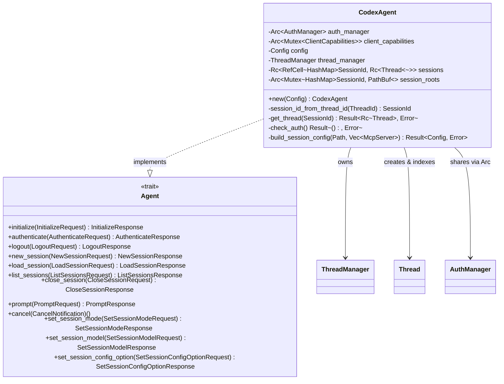
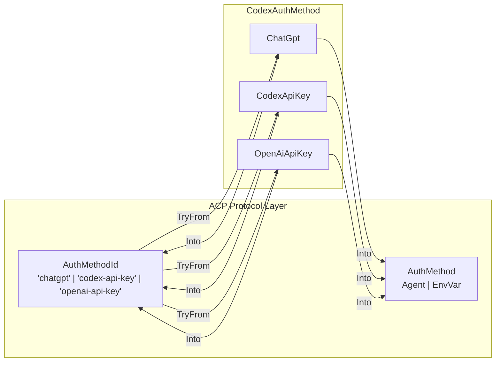
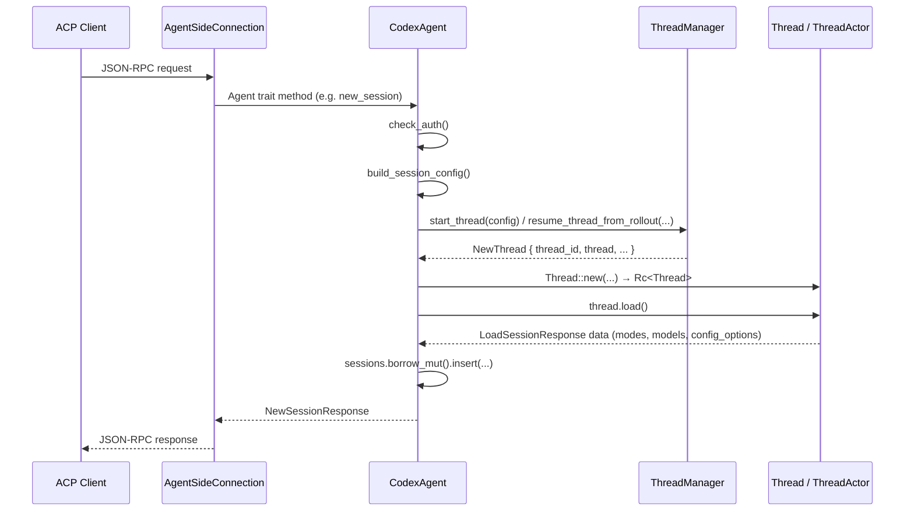

`CodexAgent` is the central bridge between the **Agent Client Protocol (ACP)** specification and the **Codex** runtime. It implements the `Agent` trait defined by the `agent-client-protocol` crate, translating every ACP request — initialize, authenticate, session lifecycle, prompt, cancel, and configuration — into concrete operations against the Codex infrastructure. If you think of the ACP protocol as a contract that any compliant agent must fulfill, `CodexAgent` is the Codex-specific fulfillment of that contract: it owns the authentication state, the session map, the thread manager, and the client capability registry, and it orchestrates them all through a single cohesive struct.

Sources: [codex_agent.rs](src/codex_agent.rs#L45-L62), [lib.rs](src/lib.rs#L63-L64)

## Structural Anatomy: Fields and Ownership Model

The `CodexAgent` struct holds five fields, each chosen to satisfy a distinct responsibility boundary within the ACP-to-Codex translation layer:

| Field | Type | Responsibility |
|---|---|---|
| `auth_manager` | `Arc<AuthManager>` | Shared authentication state — reloaded after login flows, consulted before every session-creating operation |
| `client_capabilities` | `Arc<Mutex<ClientCapabilities>>` | Capabilities declared by the connected client during the `initialize` handshake; read by `Thread`/`ThreadActor` at notification time |
| `config` | `Config` | The base Codex configuration (model provider, codex home, sandbox policy, MCP servers) — cloned and specialized per-session via `build_session_config` |
| `thread_manager` | `ThreadManager` | The Codex lifecycle manager — creates new threads, resumes from rollouts, removes threads on close |
| `sessions` | `Rc<RefCell<HashMap<SessionId, Rc<Thread>>>>` | The active session index — maps ACP session IDs to `Thread` wrappers; interior mutability via `RefCell` supports the `?Send` async trait bound |
| `session_roots` | `Arc<Mutex<HashMap<SessionId, PathBuf>>>` | Working directory per session — used for filesystem sandboxing and MCP server `cwd` resolution |

The ownership model is deliberate: `Arc<Mutex<…>>` wraps fields that must be shared across the `CodexAgent` itself and the `Thread`/`ThreadActor` instances it creates (like `client_capabilities` and `session_roots`), while `Rc<RefCell<…>` wraps the session map because the entire `Agent` trait is `?Send` — it runs on a single-threaded `LocalSet` and never crosses async task boundaries. The `Thread` values themselves are `Rc<Thread>` rather than `Arc<Thread>` for the same reason.

Sources: [codex_agent.rs](src/codex_agent.rs#L49-L62)

### Construction: `CodexAgent::new`

The constructor takes a `Config` and bootstraps all interior state from it. The `AuthManager` is initialized as a shared singleton keyed on `codex_home`. The `ThreadManager` is constructed with the config, a clone of the auth manager, a `SessionSource::Unknown` tag (since the ACP entry point is distinct from CLI or VS Code), a `CollaborationModesConfig` with `default_mode_request_user_input: false`, and an `EnvironmentManager` sourced from the process environment. The `client_capabilities` and `session_roots` maps start empty — they are populated during `initialize` and `new_session`/`load_session` respectively.

Sources: [codex_agent.rs](src/codex_agent.rs#L67-L96)

## The Agent Trait: Method-by-Method

The `#[async_trait(?Send)]` annotation on the `impl Agent for CodexAgent` block is critical — it signals that the trait methods are async but **not** `Send`. This is a requirement of the ACP framework's `AgentSideConnection`, which runs on a single-threaded `LocalSet` spawned via `tokio::task::spawn_local`. Every method in this impl block operates within that single-threaded context.

Sources: [codex_agent.rs](src/codex_agent.rs#L216-L217), [lib.rs](src/lib.rs#L69-L74)

### `initialize`: The Capability Handshake

The `initialize` method is the first call the ACP client makes. It receives the client's protocol version and capabilities, stores the client capabilities in the shared `Mutex`, and responds with:

- **Protocol version**: Hardcoded to `V1`
- **Agent capabilities**: Prompt capabilities (embedded context + image support), MCP capabilities (HTTP transport), session capabilities (close + list), load session support, and logout support
- **Agent info**: Name `"codex-acp"`, version from `CARGO_PKG_VERSION`, title `"Codex"`
- **Auth methods**: Three methods derived from the `CodexAuthMethod` enum (ChatGPT, Codex API Key, OpenAI API Key) — with the ChatGPT method removed when `NO_BROWSER` is set, since browser-based device code auth cannot work in headless/SSH environments

Sources: [codex_agent.rs](src/codex_agent.rs#L218-L254)

### `authenticate` and `logout`: Credential Lifecycle

The `authenticate` method dispatches on the `CodexAuthMethod` parsed from the request's `method_id`. Before initiating any login flow, it checks whether the `AuthManager` already holds valid credentials of the matching type — if so, it returns immediately with a success response, avoiding redundant login attempts.

| Method | Flow | Key Detail |
|---|---|---|
| `ChatGpt` | Launches `codex_login::run_login_server` (browser device code flow), then blocks until completion | Requires interactive browser; skipped when `NO_BROWSER` is set |
| `CodexApiKey` | Reads `CODEX_API_KEY` from environment, calls `codex_login::login_with_api_key` | Fails if env var is unset |
| `OpenAiApiKey` | Reads `OPENAI_API_KEY` from environment, calls `codex_login::login_with_api_key` | Fails if env var is unset |

After every successful authentication, `auth_manager.reload()` is called to refresh the in-memory credential cache. The `logout` method simply delegates to `auth_manager.logout()`.

Sources: [codex_agent.rs](src/codex_agent.rs#L256-L330)

### `new_session` and `load_session`: Session Creation Paths

Both session creation methods share a common pattern: **authenticate → build config → create/resume thread → wrap in `Thread` → register in session map**. The divergence is in how the underlying Codex thread is obtained:

- **`new_session`**: Calls `thread_manager.start_thread(config)` to create a fresh thread. The returned `thread_id` becomes the ACP `SessionId`. The session root (working directory) is recorded for sandboxing.

- **`load_session`**: Looks up the rollout file via `find_thread_path_by_id_str`, reads the rollout history, then calls `thread_manager.resume_thread_from_rollout(config, rollout_path, auth_manager, None)` to resume. After thread creation, `thread.replay_history(rollout_items)` replays prior conversation events so the ThreadActor's internal state matches the historical context.

Both methods return the `modes`, `models`, and `config_options` obtained from `thread.load()`, which triggers the ThreadActor to query the models manager and assemble the session configuration metadata.

Sources: [codex_agent.rs](src/codex_agent.rs#L332-L449)

### `list_sessions`: Paginated Session Discovery

The `list_sessions` method queries `RolloutRecorder::list_threads` with a page size of 25 and sorts by `UpdatedAt`. It filters results by the optional `cwd` parameter — only sessions whose working directory matches the filter are included. Session titles are derived from the first user message, truncated to 120 grapheme clusters (with an ellipsis suffix). Cursor-based pagination is supported: the `next_cursor` from the rollout page is serialized to a JSON string and returned for the client to use in subsequent requests.

Sources: [codex_agent.rs](src/codex_agent.rs#L451-L511), [codex_agent.rs](src/codex_agent.rs#L64-L65)

### `close_session`: Teardown

Closing a session is a three-step teardown: (1) call `thread.shutdown()` to gracefully terminate the ThreadActor event loop, (2) call `thread_manager.remove_thread()` to clean up the Codex thread infrastructure, and (3) remove the session from both the `sessions` map and the `session_roots` map. This ensures no lingering state leaks across session boundaries.

Sources: [codex_agent.rs](src/codex_agent.rs#L513-L530)

### `prompt`, `cancel`, and Configuration Mutations

The `prompt` method delegates entirely to `thread.prompt(request)`, which submits the user's prompt to the ThreadActor and returns a `StopReason` indicating why the model stopped (end of turn, tool call requiring approval, etc.). The `cancel` method calls `thread.cancel()` to interrupt an in-progress turn.

The three configuration mutation methods — `set_session_mode`, `set_session_model`, and `set_session_config_option` — all follow the same pattern: look up the `Thread` by session ID, delegate to the corresponding `Thread` method, and return the result. The `set_session_config_option` method additionally re-queries `thread.config_options()` after applying the change, returning the full updated option set so the client can reconcile its UI state.

Sources: [codex_agent.rs](src/codex_agent.rs#L532-L590)

## `build_session_config`: Per-Session Configuration Assembly

The private `build_session_config` method is the linchpin between the base `Config` stored on `CodexAgent` and the per-session config that each `Thread` operates on. It performs three key transformations:

1. **Clones the base config** — each session gets an independent copy
2. **Enables `include_apply_patch_tool`** — ACP clients expect patch-based file editing rather than shell-based file manipulation
3. **Sets the working directory** — the `cwd` from the ACP request becomes the session's sandbox root
4. **Propagates client-provided MCP servers** — iterates over the `mcp_servers` from the ACP request, converting each into a `McpServerConfig`:

| ACP `McpServer` Variant | Codex `McpServerTransportConfig` | Notes |
|---|---|---|
| `McpServer::Http` | `StreamableHttp` | Headers mapped; bearer token and env headers set to `None` |
| `McpServer::Stdio` | `Stdio` | Command, args, env mapped; `cwd` set to session working directory |
| `McpServer::Sse` | *(skipped)* | Not supported by Codex |
| Other | *(skipped)* | Unknown variants ignored |

A notable detail: **whitespace in MCP server names is replaced with underscores**, because Codex's internal naming convention does not allow spaces. The `required` field is hardcoded to `false`, and `enabled` to `true`, for all client-provided servers.

Sources: [codex_agent.rs](src/codex_agent.rs#L118-L213)

## `CodexAuthMethod`: The Authentication Method Registry

`CodexAuthMethod` is a private enum that bridges ACP's `AuthMethodId` string identifiers with Codex's concrete authentication flows. It implements a bidirectional mapping:

The `From<CodexAuthMethod> for AuthMethod` conversion produces the rich ACP-level description that clients display in their authentication UI:

- **ChatGpt** → `AuthMethod::Agent` with title "Login with ChatGPT" and description referencing the paid subscription requirement
- **CodexApiKey** → `AuthMethod::EnvVar` referencing `CODEX_API_KEY`
- **OpenAiApiKey** → `AuthMethod::EnvVar` referencing `OPENAI_API_KEY`

The `TryFrom<AuthMethodId> for CodexAuthMethod` conversion performs the reverse, with an error for any unrecognized method ID.

Sources: [codex_agent.rs](src/codex_agent.rs#L593-L653)

## Private Helpers: Session Titles and Grapheme Truncation

Two free functions support the `list_sessions` implementation:

- **`format_session_title`**: Normalizes a first-user-message string by replacing newlines with spaces and trimming whitespace. Returns `None` for empty strings, ensuring untitled sessions display gracefully.

- **`truncate_graphemes`**: Truncates a string to a maximum number of grapheme clusters (Unicode-aware), appending `"..."` when truncation occurs. The ellipsis replaces the last 3 grapheme positions to avoid mid-cluster breaks. This is used with `SESSION_TITLE_MAX_GRAPHEMES = 120` to produce readable session titles without risking buffer overflows in client UIs.

Sources: [codex_agent.rs](src/codex_agent.rs#L655-L684), [codex_agent.rs](src/codex_agent.rs#L64-L65)

## Request Flow Summary

The following diagram shows how an ACP request flows from the client through `CodexAgent` to the underlying Codex infrastructure:

## Where to Go Next

`CodexAgent` is the **entry point** — it receives ACP requests and delegates them. The substantive processing happens downstream:

- To understand how `Thread` and `ThreadActor` manage the event loop and translate Codex events into ACP notifications, see [Thread and ThreadActor: Event Loop and Codex-to-ACP Translation](7-thread-and-threadactor-event-loop-and-codex-to-acp-translation).
- For the full session lifecycle (new, load, close, list) with rollout replay details, see [Session Lifecycle: New, Load, Close, and List](8-session-lifecycle-new-load-close-and-list).
- For how `build_session_config`'s MCP server propagation integrates with the broader MCP pipeline, see [Client MCP Server Propagation](19-client-mcp-server-propagation).
- For the authentication methods in context of the full client setup, see [Authentication Methods](3-authentication-methods).