The `Thread` and `ThreadActor` form the **runtime bridge** between the ACP protocol and Codex's internal event stream. While [CodexAgent](6-codexagent-the-acp-agent-trait-implementation) handles the top-level ACP agent trait — fielding requests like `new_session`, `prompt`, and `cancel` — it delegates every session-scoped operation into a `Thread` wrapper, which in turn owns a `ThreadActor` running an asynchronous event loop on a `tokio::LocalSet`. This page dissects the architecture of that loop, the internal message protocol that drives it, and the state machine that translates Codex's `EventMsg` variants into ACP `SessionUpdate` notifications.

Sources: [thread.rs](src/thread.rs#L1-L98), [codex_agent.rs](src/codex_agent.rs#L43-L62)

## Architecture Overview

The relationship between `CodexAgent`, `Thread`, and `ThreadActor` follows a **command-query separation** pattern. `CodexAgent` acts as the public facade, mapping ACP RPC calls into `ThreadMessage` values. `Thread` is a thin async handle that serializes those calls through an unbounded MPSC channel. `ThreadActor` is the single-task executor that processes those messages, polls Codex for events, and orchestrates permission request flows — all on one `!Send` local task.

```mermaid
flowchart TB
    subgraph ACP_Layer["ACP Layer"]
        CA["CodexAgent<br/>(Agent trait impl)"]
    end

    subgraph Bridge_Layer["Bridge Layer"]
        T["Thread<br/>(public handle)"]
        TM["ThreadMessage<br/>(unbounded mpsc)"]
    end

    subgraph Event_Loop["ThreadActor Event Loop"]
        TA["ThreadActor<br/>(tokio::spawn_local)"]
        PS["SubmissionState<br/>(PromptState | CustomPromptsState)"]
        SC["SessionClient<br/>(ACP notification gateway)"]
    end

    subgraph Codex_Layer["Codex Core"]
        CT["CodexThreadImpl<br/>(submit + next_event)"]
    end

    subgraph Resolution_Channel["Permission Resolution"]
        RR["resolution_rx<br/>(PermissionRequestResolved)"]
    end

    CA -->|"load, prompt, cancel..."| T
    T -->|"send(ThreadMessage)"| TM
    TM -->|"recv()"| TA
    TA -->|"submit(Op)"| CT
    CT -->|"next_event()"| TA
    TA -->|"handle_event()"| PS
    PS -->|"send_notification / request_permission"| SC
    TA -->|"handle_message()"| RR
    RR -->|"PermissionRequestResolved"| TA

    style ACP_Layer fill:#1a1b26,stroke:#7aa2f7
    style Bridge_Layer fill:#1a1b26,stroke:#9ece6a
    style Event_Loop fill:#1a1b26,stroke:#bb9af7
    style Codex_Layer fill:#1a1b26,stroke:#f7768e
    style Resolution_Channel fill:#1a1b26,stroke:#e0af68
```

The `ThreadActor::spawn()` method runs a **biased `tokio::select!`** loop with three branches, ordered by priority: (1) external API messages from `message_rx`, (2) permission resolution responses from `resolution_rx`, and (3) Codex events from `thread.next_event()`. After each iteration, the actor performs **litter collection** — removing `SubmissionState` entries whose response channels have closed — and exits only when both the message channel is closed and no active submissions remain.

Sources: [thread.rs](src/thread.rs#L171-L178), [thread.rs](src/thread.rs#L2612-L2640)

## Thread: The Public Async Handle

`Thread` is the `Rc<Thread>` that `CodexAgent` stores per session in its `sessions` map. It owns three fields:

| Field | Type | Purpose |
|-------|------|---------|
| `thread` | `Arc<dyn CodexThreadImpl>` | Direct handle to the Codex thread for out-of-band shutdown |
| `message_tx` | `mpsc::UnboundedSender<ThreadMessage>` | Channel for sending commands to the actor |
| `_handle` | `JoinHandle<()>` | Keeps the actor task alive for the lifetime of the wrapper |

Every public method on `Thread` follows the **request-response via oneshot** pattern: create a `oneshot::channel`, package a `ThreadMessage` with the `response_tx` sender, send it through `message_tx`, then `.await` the `response_rx` receiver. This ensures the actor processes commands serially, eliminating the need for internal synchronization beyond the channel itself.

The `prompt` method is notable for its **double-indirection** return: `oneshot::Receiver<Result<StopReason, Error>>`. The outer oneshot resolves once the `Op` has been submitted and a `PromptState` has been registered; the inner `Result<StopReason, Error>` resolves when the turn completes, is aborted, or encounters an error. This allows the caller to know immediately whether the submission succeeded (getting a handle to await the final outcome) versus failing at the submission stage.

The `shutdown` method has a **fallback path**: if the message channel is already closed (actor gone), it bypasses the actor and calls `self.thread.submit(Op::Shutdown)` directly on the underlying `CodexThreadImpl`, ensuring shutdown always reaches Codex even in degenerate states.

Sources: [thread.rs](src/thread.rs#L171-L333)

## ThreadMessage: The Internal Protocol

The `ThreadMessage` enum defines every operation the actor can receive. Each variant carries a `oneshot::Sender` for the response, enabling synchronous request-response semantics over the asynchronous channel.

| Variant | Response Type | Purpose |
|---------|--------------|---------|
| `Load` | `Result<LoadSessionResponse, Error>` | Initialize session, fetch models/modes/config |
| `GetConfigOptions` | `Result<Vec<SessionConfigOption>, Error>` | Retrieve current configuration options |
| `Prompt` | `Result<oneshot::Receiver<Result<StopReason, Error>>, Error>` | Submit user prompt, return completion handle |
| `SetMode` | `Result<(), Error>` | Change approval/sandbox preset |
| `SetModel` | `Result<(), Error>` | Override the active model |
| `SetConfigOption` | `Result<(), Error>` | Set a named config option (mode/model/effort) |
| `Cancel` | `Result<(), Error>` | Interrupt the current turn |
| `Shutdown` | `Result<(), Error>` | Graceful shutdown |
| `ReplayHistory` | `Result<(), Error>` | Replay session history to client |
| `PermissionRequestResolved` | *(no response)* | Route permission decision back to Codex |

The `PermissionRequestResolved` variant is special — it originates not from `CodexAgent` but from spawned local tasks within the actor. These tasks call `SessionClient::request_permission()`, wait for the client's response, then send the result back through the `resolution_tx` channel. This ensures permission decisions are processed on the actor's single-threaded loop, maintaining consistency without locks.

Sources: [thread.rs](src/thread.rs#L130-L169), [thread.rs](src/thread.rs#L2733-L2752)

## ThreadActor: The Event Loop

### Construction and State

`ThreadActor<A>` is generic over an `Auth` trait, enabling test injection. Its fields fall into three categories:

**Communication channels**: `message_rx` (inbound API messages), `resolution_rx` (permission resolution results), `resolution_tx` (clone passed to `PromptState` for spawning permission requests).

**Codex interaction**: `thread: Arc<dyn CodexThreadImpl>` for submitting `Op` values and polling `next_event()`, `config: Config` for tracking mode/model/effort state, `models_manager: Arc<dyn ModelsManagerImpl>` for model lookups.

**Session state**: `client: SessionClient` for emitting ACP notifications, `custom_prompts: Rc<RefCell<Vec<CustomPrompt>>>` for slash command expansion, `submissions: HashMap<String, SubmissionState>` for tracking active and recently-completed `Op` submissions, `last_sent_config_options` for deduplication.

Sources: [thread.rs](src/thread.rs#L2560-L2610)

### The Select Loop

```mermaid
flowchart TD
    START["spawn()"] --> SELECT{"tokio::select!<br/>(biased)"}
    
    SELECT -->|"message_rx.recv()"| MSG["handle_message()"]
    SELECT -->|"resolution_rx.recv()"| RES["handle_message()<br/>(PermissionRequestResolved)"]
    SELECT -->|"thread.next_event()"| EVT["handle_event()"]
    
    MSG --> CLEANUP
    RES --> CLEANUP
    EVT --> CLEANUP
    
    CLEANUP{"Litter collection:<br/>retain active submissions"}
    CLEANUP --> CHECK{"message_rx closed<br/>AND submissions empty?"}
    CHECK -->|Yes| EXIT["break"]
    CHECK -->|No| SELECT
    
    style SELECT fill:#1a1b26,stroke:#7aa2f7
    style CHECK fill:#1a1b26,stroke:#9ece6a
    style EXIT fill:#1a1b26,stroke:#f7768e
```

The **biased** selection prioritizes API messages and permission resolutions over new Codex events. This is critical: when a user sends a cancel or shutdown, it should be processed before any pending events. After each iteration, `submissions.retain(|_, s| s.is_active())` cleans up entries whose response channels have closed, preventing memory leaks from abandoned sessions.

The loop terminates only when `message_rx` is closed (all `Thread` handles dropped) **and** no submissions remain active, ensuring in-flight turns receive their terminal events before the actor exits.

Sources: [thread.rs](src/thread.rs#L2612-L2640)

## SubmissionState: Tracking In-Flight Operations

The `SubmissionState` enum models the two kinds of `Op` submissions the actor tracks:

| State | When Created | When Resolved |
|-------|-------------|---------------|
| `CustomPrompts` | During `handle_load`, via `Op::ListCustomPrompts` | When `ListCustomPromptsResponse` event arrives |
| `Prompt` | During `handle_prompt`, via `Op::UserInput` / `Op::Review` / etc. | When `TurnComplete`, `TurnAborted`, `ShutdownComplete`, or `Error` event arrives |

Both states track **activity** by checking whether their `response_tx` oneshot sender is still open (i.e., the receiver hasn't been dropped or consumed). The `is_active()` method is what the litter collector uses.

Sources: [thread.rs](src/thread.rs#L639-L690)

## PromptState: The Codex-to-ACP Translation Engine

`PromptState` is the most complex component in the bridge. It manages the full lifecycle of a single prompt submission, from `Op` submission through to terminal event. Its fields capture all transient state needed during a turn:

| Field | Type | Purpose |
|-------|------|---------|
| `submission_id` | `String` | Correlates events from `next_event()` back to this submission |
| `active_commands` | `HashMap<String, ActiveCommand>` | Tracks in-flight exec commands by `call_id` |
| `active_web_search` | `Option<String>` | The `call_id` of the current web search, if any |
| `active_guardian_assessments` | `HashSet<String>` | IDs of in-progress guardian assessments |
| `thread` | `Arc<dyn CodexThreadImpl>` | For submitting approval `Op` responses |
| `resolution_tx` | `mpsc::UnboundedSender<ThreadMessage>` | For routing permission decisions back to the actor |
| `pending_permission_interactions` | `HashMap<String, PendingPermissionInteraction>` | Active permission request tasks by request key |
| `response_tx` | `Option<oneshot::Sender<Result<StopReason, Error>>>` | The final response channel |
| `seen_message_deltas` / `seen_reasoning_deltas` | `bool` | Deduplication flags for delta vs. non-delta events |

### Event Translation Pattern

`PromptState::handle_event()` is the central switch — a large `match` on `EventMsg` variants that translates each Codex event into the appropriate ACP `SessionUpdate` notification. The translation patterns fall into several categories:

**Streaming text** — `AgentMessageContentDelta` and `ReasoningContentDelta` events are forwarded as `AgentMessageChunk` and `AgentThoughtChunk` respectively. Non-delta counterparts (`AgentMessage`, `AgentReasoning`) are suppressed when deltas were seen (the `seen_message_deltas` / `seen_reasoning_deltas` flags), preventing duplication.

**Tool call lifecycle** — Commands, patches, MCP calls, dynamic tool calls, and web searches each follow a begin → update → end lifecycle, mapped to ACP `ToolCall` and `ToolCallUpdate` notifications with appropriate `ToolCallStatus` transitions (`Pending → InProgress → Completed/Failed`).

**Permission requests** — Exec approvals, patch approvals, permission profiles, and MCP elicitation requests all follow the **spawn-permission-request** pattern: create a `ToolCallUpdate` with `Pending` status and `PermissionOption` list, send it to the client via `request_permission()`, and spawn a local task that awaits the response and sends it through `resolution_tx`. The actor then processes `PermissionRequestResolved`, maps the user's choice to a Codex `ReviewDecision`, and submits the appropriate `Op` back to the Codex thread.

**Terminal events** — `TurnComplete` resolves the prompt with `StopReason::EndTurn`, `TurnAborted` and `ShutdownComplete` resolve with `StopReason::Cancelled`, and `Error` resolves with the error. All three abort any pending permission interactions before resolving.

Sources: [thread.rs](src/thread.rs#L733-L745), [thread.rs](src/thread.rs#L946-L1375)

## PendingPermissionRequest: The Approval Routing Subsystem

The `PendingPermissionRequest` enum captures the four kinds of approval flows that require client interaction:

| Variant | Codex Event | Resolution Op |
|---------|------------|---------------|
| `Exec` | `ExecApprovalRequest` | `Op::ExecApproval` |
| `Patch` | `ApplyPatchApprovalRequest` | `Op::PatchApproval` |
| `RequestPermissions` | `RequestPermissions` | `Op::RequestPermissionsResponse` |
| `McpElicitation` | `ElicitationRequest` | `Op::ResolveElicitation` |

Each variant stores an `option_map: HashMap<String, DecisionType>` that maps ACP `PermissionOption` IDs back to their Codex-side equivalents. When the client selects an option, `handle_permission_request_resolved()` looks up the option ID in the map and submits the corresponding `Op` to the Codex thread. If the option ID is unrecognized or the request was cancelled, the code falls back to the most conservative decision (`ReviewDecision::Abort` or `ResolvedMcpElicitation::cancel()`).

The permission flow is inherently **concurrent**: the spawned task awaits the client's response asynchronously, while the actor continues processing other events. This is why `resolution_rx` is a separate channel — it allows permission responses to be interleaved with Codex events without blocking the main loop.

Sources: [thread.rs](src/thread.rs#L335-L366), [thread.rs](src/thread.rs#L816-L944)

## SessionClient: The Notification Gateway

`SessionClient` is the **outbound interface** from the actor to the ACP client. It wraps three concerns:

1. **Session identity** — stores the `SessionId` for all notifications.
2. **Client reference** — holds an `Arc<dyn Client>` (sourced from the global `ACP_CLIENT`) for making RPC calls.
3. **Capability detection** — reads `ClientCapabilities` (via `Arc<Mutex<ClientCapabilities>>`) to determine whether the client supports terminal output streaming.

Its methods form a clean API surface for the translation layer:

| Method | ACP Notification | Used For |
|--------|-----------------|----------|
| `send_user_message` | `UserMessageChunk` | Echoing user input during replay |
| `send_agent_text` | `AgentMessageChunk` | Agent text responses, warnings |
| `send_agent_thought` | `AgentThoughtChunk` | Reasoning/thinking content |
| `send_tool_call` | `ToolCall` | New tool call begin |
| `send_tool_call_update` | `ToolCallUpdate` | Status changes, output, terminal data |
| `update_plan` | `Plan` | Plan item updates |
| `request_permission` | `RequestPermissionRequest` | Approval/permission solicitations |

The `supports_terminal_output()` method checks whether the client's capabilities meta includes `"terminal_output": true`, and if the active command was classified as needing terminal output (i.e., `ParsedCommand::Unknown`). When supported, command output is streamed as `meta.terminal_output` chunks with incremental data; when not, output is accumulated and formatted as fenced code blocks.

Sources: [thread.rs](src/thread.rs#L2411-L2558)

## Prompt Submission: From Slash Command to Codex Op

The `handle_prompt` method on `ThreadActor` implements the **slash command router**. When a `PromptRequest` arrives, the actor extracts the first content block, checks for a leading `/`, and dispatches to the appropriate `Op`:

| Slash Command | Codex `Op` | Notes |
|---------------|-----------|-------|
| `/compact` | `Op::Compact` | Summarize conversation |
| `/undo` | `Op::Undo` | Revert last turn |
| `/init` | `Op::UserInput` with `INIT_COMMAND_PROMPT` | Hardcoded prompt from embedded markdown |
| `/review` | `Op::Review` with `ReviewTarget::UncommittedChanges` | Or custom instructions |
| `/review-branch` | `Op::Review` with `ReviewTarget::BaseBranch` | Requires branch name |
| `/review-commit` | `Op::Review` with `ReviewTarget::Commit` | Requires commit SHA |
| `/logout` | `auth.logout()` + `Error::auth_required()` | Terminates the prompt with auth error |
| Custom prompt | `Op::UserInput` with expanded template | Via `expand_custom_prompt` |
| (none) | `Op::UserInput` with original items | Pass-through |

After submitting the `Op` and receiving a `submission_id`, the actor creates a `PromptState` and inserts it into `submissions`. All subsequent events with that `submission_id` are routed to this state's `handle_event()` method, which performs the Codex-to-ACP translation described above.

Sources: [thread.rs](src/thread.rs#L3147-L3258)

## Session Configuration Changes

Mode, model, and reasoning effort changes all follow the same pattern: submit an `Op::OverrideTurnContext` to the Codex thread with the appropriate fields set, then update the local `config` mirror. The actor also calls `maybe_emit_config_options_update()` after mode or model changes, which recomputes the full configuration option list, compares it against `last_sent_config_options`, and sends a `ConfigOptionUpdate` notification only if the options have actually changed (deduplication).

Mode changes (`handle_set_mode`) have an additional side effect: if the new mode uses a permissive sandbox policy (`DangerFullAccess`, `WorkspaceWrite`, or `ExternalSandbox`), the actor calls `set_project_trust_level(Trusted)`, persisting the trust decision so future sessions for the same project won't require re-approval.

Sources: [thread.rs](src/thread.rs#L3260-L3313), [thread.rs](src/thread.rs#L2971-L2989)

## History Replay

When a session is loaded, `CodexAgent` calls `thread.replay_history(rollout_items)`, which sends a `ReplayHistory` message to the actor. The actor iterates over `RolloutItem` values, dispatching `EventMsg` items to `replay_event_msg()` and `ResponseItem` items to `replay_response_item()`. The replay path is simpler than the live event path — no permission requests, no delta streaming — just direct emission of completed messages and tool calls. For tool calls, the replay handler re-parses command arguments (shell commands) and patch content (apply_patch calls) to reconstruct the same rich `ToolCall` notifications that the live path produces.

Sources: [thread.rs](src/thread.rs#L3380-L3399), [thread.rs](src/thread.rs#L3404-L3704)

## Key Design Invariants

Several design choices are worth noting as they constrain the system's behavior:

**Single-threaded actor** — `ThreadActor` runs on `tokio::task::spawn_local`, meaning all state mutations happen on one thread. This eliminates the need for `Mutex` on internal state, at the cost of requiring `!Send` types. The `Rc<RefCell<Vec<CustomPrompt>>>` for custom prompts is safe precisely because only one task accesses it.

**Biased select** — The `tokio::select! { biased; ... }` ensures API messages and permission resolutions are processed before new Codex events. This guarantees that a cancel request arriving mid-event-stream is handled promptly, and that permission decisions feed back into Codex before the next event is polled.

**Litter collection** — The `submissions.retain()` call after each loop iteration prevents memory leaks from sessions whose `Thread` handle has been dropped but whose prompt is still nominally active. The `is_active()` check (response channel still open) serves as the reaper criterion.

**Fallback shutdown** — `Thread::shutdown()` first tries the message channel; if it's closed, it falls through to direct `Op::Shutdown` submission, ensuring the Codex thread always receives the shutdown signal.

Sources: [thread.rs](src/thread.rs#L2612-L2640), [thread.rs](src/thread.rs#L315-L333)

## What Comes Next

With the event loop and translation layer understood, the following pages dive into specific translation paths in detail: [Translating Codex Events to ACP Notifications](11-translating-codex-events-to-acp-notifications) covers the event-to-notification mapping table, [Exec Command Approval and Terminal Output](12-exec-command-approval-and-terminal-output) details the exec approval flow and terminal streaming, and [Patch Approval and File Diff Representation](13-patch-approval-and-file-diff-representation) explains how file changes become ACP `Diff` content blocks. For the lifecycle of sessions that use these threads, see [Session Lifecycle: New, Load, Close, and List](8-session-lifecycle-new-load-close-and-list).