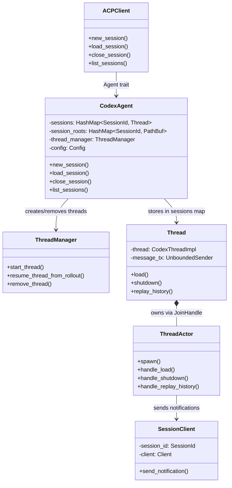
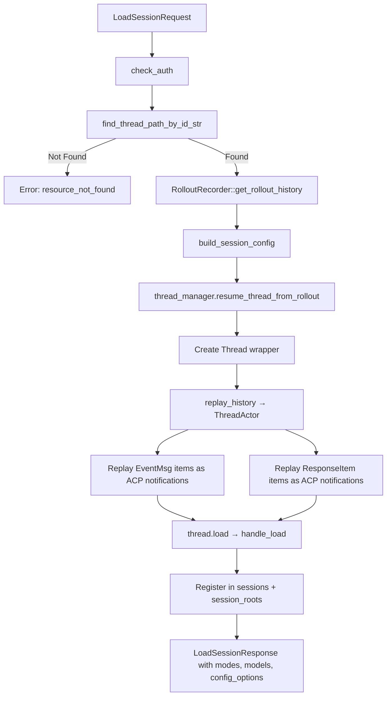
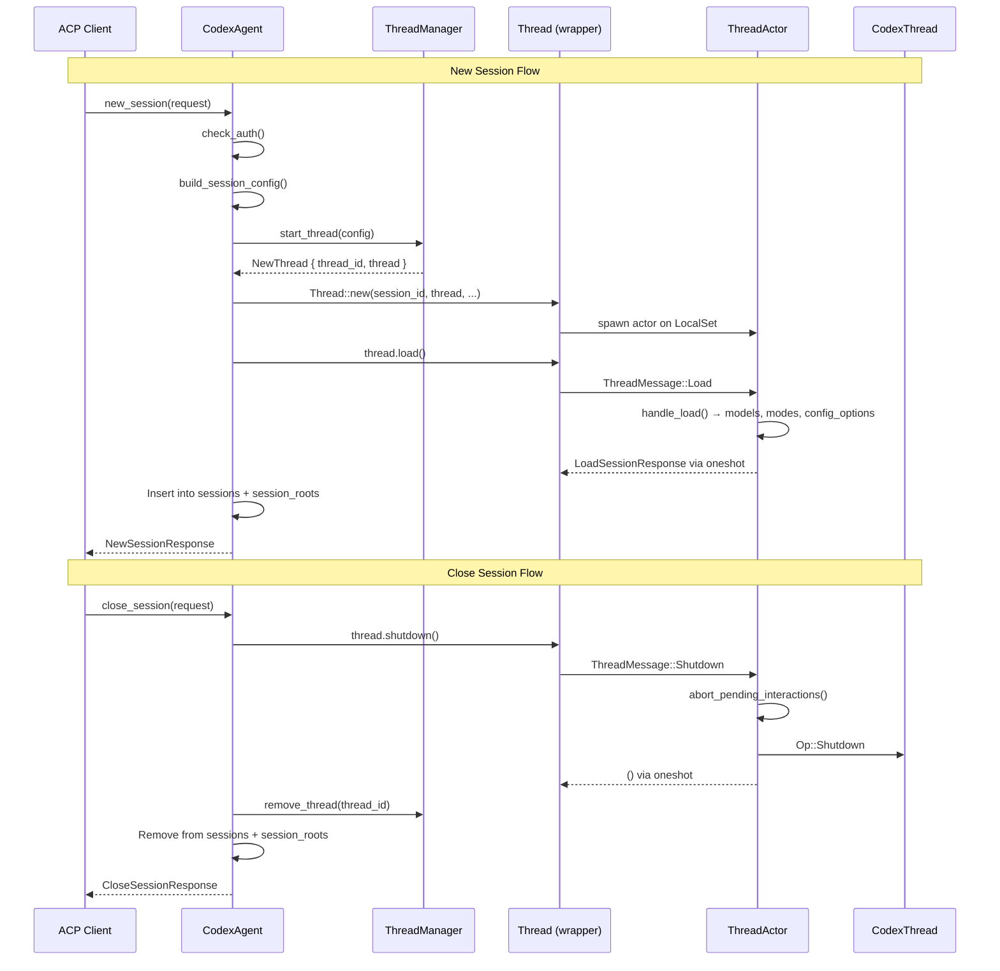

Sessions are the fundamental unit of interaction between an ACP client and Codex. Every conversation — whether freshly started or resumed from a previous run — is managed through four lifecycle operations exposed by the `Agent` trait: **new**, **load**, **close**, and **list**. This page examines how each operation flows through the `CodexAgent` struct, delegates to the `ThreadManager` and `ThreadActor`, and ultimately produces ACP-compliant responses back to the client.

Sources: [codex_agent.rs](src/codex_agent.rs#L1-L11)

## The Session State Model

`CodexAgent` maintains two in-memory maps that track active sessions and their associated filesystem roots. The `sessions` field is an `Rc<RefCell<HashMap<SessionId, Rc<Thread>>>>` that maps each ACP `SessionId` to its live `Thread` wrapper, while `session_roots` is an `Arc<Mutex<HashMap<SessionId, PathBuf>>>` that records each session's working directory for filesystem sandboxing. Both maps are populated during `new_session` and `load_session`, and both are cleaned up during `close_session`. The `ThreadManager` — a codex-rs core construct — owns the underlying `CodexThread` lifecycle and provides the `start_thread`, `resume_thread_from_rollout`, and `remove_thread` methods that power session creation, resumption, and teardown respectively.

Sources: [codex_agent.rs](src/codex_agent.rs#L49-L62)

The following diagram illustrates the relationship between the ACP client, the `CodexAgent`, and the internal session state:

Sources: [codex_agent.rs](src/codex_agent.rs#L49-L62), [thread.rs](src/thread.rs#L171-L178), [thread.rs](src/thread.rs#L2412-L2424)

## New Session: Spawning a Fresh Conversation

When the ACP client sends a `NewSessionRequest`, the `CodexAgent::new_session` method orchestrates a multi-step initialization sequence. First, it checks authentication via `check_auth()`, which verifies that the `AuthManager` holds valid credentials for the configured model provider. Then it builds a session-specific configuration using `build_session_config`, which clones the base `Config`, enables the `include_apply_patch_tool` flag, sets the `cwd` from the request, and propagates any client-provided MCP servers into the codex-rs configuration format.

The core of session creation is the call to `thread_manager.start_thread(config)`, which returns a `NewThread` struct containing a `thread_id` and the underlying `CodexThread`. The `thread_id` is converted into an ACP `SessionId` via `session_id_from_thread_id` — a simple string conversion — and the working directory is recorded in `session_roots`. A `Thread` wrapper is then constructed around the `CodexThread`, which internally spawns a `ThreadActor` on a tokio `LocalSet`. The `Thread::load()` call triggers the actor's `handle_load` method, which assembles the session's available models, modes, and config options. Finally, the thread is stored in the `sessions` map and the `NewSessionResponse` is returned with the session ID, modes, models, and config options.

Sources: [codex_agent.rs](src/codex_agent.rs#L332-L378)

After the `Load` response is sent back through the oneshot channel, the `ThreadActor` also spawns a separate local task to discover custom prompts from the workspace and emit an `AvailableCommandsUpdate` notification. This notification includes both the built-in slash commands (`/review`, `/review-branch`, `/review-commit`, `/init`, `/compact`, `/undo`, `/logout`) and any custom prompt templates found in the project. By deferring this to a spawned task, the session load response is not blocked by filesystem I/O.

Sources: [thread.rs](src/thread.rs#L2644-L2688)

The `handle_load` method itself is concise — it delegates to three helper methods that each query a different aspect of session configuration:

| Helper | Returns | Purpose |
|--------|---------|---------|
| `models()` | `SessionModelState` | Lists available model presets with reasoning effort variants |
| `modes()` | `Option<SessionModeState>` | Lists approval/sandbox presets (read-only, auto-edit, full-access, etc.) |
| `config_options()` | `Vec<SessionConfigOption>` | Combined mode, model, and reasoning effort selectors for the client UI |

Sources: [thread.rs](src/thread.rs#L3140-L3145), [thread.rs](src/thread.rs#L3107-L3138), [thread.rs](src/thread.rs#L2808-L2843), [thread.rs](src/thread.rs#L2876-L2969)

## Load Session: Resuming a Previous Conversation

The `load_session` operation restores a previously created session from its persisted rollout file. The flow diverges from `new_session` in how the underlying `CodexThread` is created — instead of `start_thread`, it uses `thread_manager.resume_thread_from_rollout`, which replays the session's historical events through the Codex event loop.

The session ID from the `LoadSessionRequest` is used to locate the rollout file via `find_thread_path_by_id_str`, which searches the codex home directory for a matching thread. If no rollout file is found, a `resource_not_found` error is returned. Once found, `RolloutRecorder::get_rollout_history` parses the rollout into an `InitialHistory` enum, which has three variants:

| Variant | Meaning | Rollout Items |
|---------|---------|---------------|
| `Resumed` | Session was previously active; history contains full conversation | `resumed.history` |
| `Forked` | Session was forked from another; items are the forked subset | `items` directly |
| `New` | Session had no prior content | Empty `Vec` |

Sources: [codex_agent.rs](src/codex_agent.rs#L380-L449)

After the thread is created and the `Thread` wrapper is constructed, `thread.replay_history(rollout_items)` is called. This sends a `ThreadMessage::ReplayHistory` to the `ThreadActor`, which iterates through each `RolloutItem` and re-emits it as ACP notifications via the `SessionClient`. Two categories of rollout items are processed:

- **`EventMsg`** — User messages, agent messages, and reasoning are replayed as `UserMessageChunk`, `AgentMessageChunk`, and `AgentThoughtChunk` notifications respectively. Transient event types (deltas, turn lifecycle) are skipped during replay.
- **`ResponseItem`** — Tool call results (exec commands, patches, MCP calls) are replayed as `ToolCall` and `ToolCallUpdate` notifications with `Completed` status.

Sources: [thread.rs](src/thread.rs#L3386-L3400), [thread.rs](src/thread.rs#L3404-L3428)

After replay completes, `thread.load()` is called to produce the same `LoadSessionResponse` structure as a new session — models, modes, and config options. The session is then registered in both `sessions` and `session_roots`. Note that `load_session` reuses the same `build_session_config` method as `new_session`, so any MCP servers provided by the client are merged into the session configuration.

Sources: [codex_agent.rs](src/codex_agent.rs#L411-L449)

The following flowchart shows the complete `load_session` sequence:

Sources: [codex_agent.rs](src/codex_agent.rs#L380-L449)

## Close Session: Graceful Teardown

Closing a session is a three-phase cleanup operation that ensures no resources leak. When `close_session` receives a `CloseSessionRequest`, it:

1. **Shuts down the thread actor** — calls `thread.shutdown()`, which sends a `ThreadMessage::Shutdown` to the `ThreadActor`. The actor's `handle_shutdown` method first aborts all pending permission interactions (exec approvals, patch approvals, MCP elications) by calling `abort_pending_interactions`, then submits an `Op::Shutdown` to the underlying `CodexThread`. If the actor's message channel is already closed (indicating the actor has already terminated), the shutdown `Op` is submitted directly to the `CodexThread` as a fallback.

2. **Removes the thread from the ThreadManager** — calls `thread_manager.remove_thread(thread_id)`, which cleans up codex-rs internal state associated with the thread.

3. **Evicts the session from both maps** — removes the entry from `sessions` (the `RefCell<HashMap>`) and `session_roots` (the `Mutex<HashMap>`), releasing the `Rc<Thread>` and its associated `ThreadActor` handle.

Sources: [codex_agent.rs](src/codex_agent.rs#L513-L530), [thread.rs](src/thread.rs#L315-L332), [thread.rs](src/thread.rs#L3365-L3378)

The `shutdown` method on `Thread` is designed for resilience: if the actor's message channel has already been dropped (meaning the actor loop has exited), it falls back to submitting `Op::Shutdown` directly to the `CodexThread`. This ensures the underlying thread terminates even if the actor has already stopped processing messages.

Sources: [thread.rs](src/thread.rs#L315-L332)

## List Sessions: Cursor-Based Pagination

The `list_sessions` operation queries the rollout store for previously created sessions, supporting optional filtering by working directory and cursor-based pagination. The method delegates to `RolloutRecorder::list_threads`, which reads thread metadata from the codex home directory.

The request accepts an optional `cwd` filter and an optional `cursor` string. The cursor is parsed via `parse_cursor` into an opaque pagination token that `list_threads` uses to resume from a specific position. Results are paginated with a fixed page size of **25** items (`SESSION_LIST_PAGE_SIZE`), sorted by `UpdatedAt` in descending order, and filtered to include only sessions from sources `Cli`, `VSCode`, and `Unknown`.

Sources: [codex_agent.rs](src/codex_agent.rs#L451-L510)

Each result item is transformed into a `SessionInfo` with the following fields:

| Field | Source | Notes |
|-------|--------|-------|
| `session_id` | `item.thread_id` | Converted to `SessionId` via string representation; items without a `thread_id` are filtered out |
| `cwd` | `item.cwd` | Items without a `cwd` are filtered out; if the request includes a `cwd` filter, only matching items are retained |
| `title` | `item.first_user_message` | Formatted via `format_session_title`, which normalizes whitespace, trims, and truncates to 120 graphemes with an ellipsis suffix |
| `updated_at` | `item.updated_at` or `item.created_at` | Falls back to `created_at` if `updated_at` is absent |

Sources: [codex_agent.rs](src/codex_agent.rs#L477-L502), [codex_agent.rs](src/codex_agent.rs#L64-L65), [codex_agent.rs](src/codex_agent.rs#L655-L684)

The `format_session_title` function ensures that session titles are human-readable: it replaces newlines with spaces, trims leading/trailing whitespace, and returns `None` for empty strings. The `truncate_graphemes` function respects grapheme boundaries (not byte or codepoint boundaries) when truncating, appending `...` when the title exceeds 120 graphemes.

The response includes a `next_cursor` field if there are additional pages. The cursor value is serialized from the `page.next_cursor` returned by `list_threads`, converted to a JSON string for transport. Clients pass this value back in subsequent `ListSessionsRequest` calls to continue pagination.

Sources: [codex_agent.rs](src/codex_agent.rs#L504-L510)

## The Message-Passing Architecture

All four lifecycle operations interact with the `Thread` wrapper through an **unbounded channel message-passing pattern**. Each public method on `Thread` (`load`, `shutdown`, `replay_history`) creates a `oneshot::Sender`/`oneshot::Receiver` pair, packages the sender into a `ThreadMessage` enum variant, sends it through the `message_tx` channel, and then awaits the receiver. The `ThreadActor` event loop processes these messages sequentially alongside Codex events, ensuring that session lifecycle operations are serialized per thread and never race with event processing.

Sources: [thread.rs](src/thread.rs#L130-L169), [thread.rs](src/thread.rs#L211-L220), [thread.rs](src/thread.rs#L315-L332), [thread.rs](src/thread.rs#L2612-L2640)

## Shared Configuration Builder

Both `new_session` and `load_session` delegate to `build_session_config` to construct a session-specific `Config` from the agent's base configuration, the request's `cwd`, and any client-provided MCP servers. This method performs three key transformations:

1. **Enables the apply-patch tool** — sets `config.include_apply_patch_tool = true`, which is required for the ACP patch approval flow.
2. **Sets the working directory** — converts the request `cwd` into a `Config::cwd`, which determines the filesystem sandbox root.
3. **Propagates MCP servers** — iterates over client-provided `McpServer` entries and converts them into codex-rs `McpServerConfig` entries. Only `Http` and `Stdio` transports are supported; `Sse` and other variants are silently skipped. Whitespace in MCP server names is replaced with underscores to comply with codex-rs naming requirements.

Sources: [codex_agent.rs](src/codex_agent.rs#L120-L213)

## Key Takeaways

| Operation | ThreadManager Method | Thread Method | ACP Response |
|-----------|---------------------|---------------|--------------|
| **New** | `start_thread(config)` | `load()` | `NewSessionResponse { session_id, modes, models, config_options }` |
| **Load** | `resume_thread_from_rollout(config, rollout_path, auth, None)` | `replay_history()` + `load()` | `LoadSessionResponse { modes, models, config_options }` |
| **Close** | `remove_thread(thread_id)` | `shutdown()` | `CloseSessionResponse` |
| **List** | (delegates to `RolloutRecorder::list_threads`) | — | `ListSessionsResponse { sessions, next_cursor }` |

The session lifecycle is the foundation upon which all other ACP features are built. Understanding how sessions are created, restored, enumerated, and destroyed is prerequisite to understanding how prompts flow through the system (see [Thread and ThreadActor: Event Loop and Codex-to-ACP Translation](7-thread-and-threadactor-event-loop-and-codex-to-acp-translation)), how slash commands are dispatched (see [Built-in Slash Commands](9-built-in-slash-commands-review-init-compact-undo-logout)), and how session configuration evolves at runtime (see [Session Configuration: Modes, Models, and Reasoning Effort](16-session-configuration-modes-models-and-reasoning-effort)).