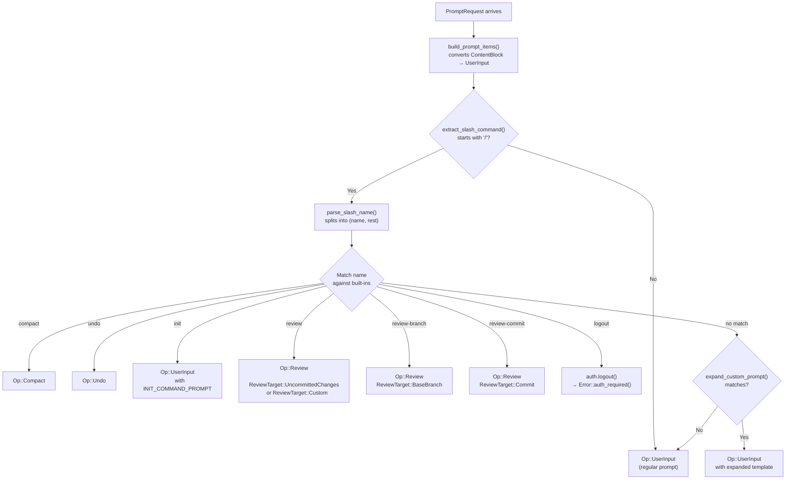

Slash commands are the primary control surface for directing Codex's behavior from within an ACP session. When a user types a prompt that begins with `/`, the `ThreadActor` intercepts it before it reaches the Codex engine, routing it to a specialized `Op` variant or performing a side effect directly. This page documents the five core built-in commands — `/review`, `/init`, `/compact`, `/undo`, and `/logout` — plus the two review variants `/review-branch` and `/review-commit`, explaining how each command is parsed, what operation it produces, and how the resulting Codex events are translated back into ACP notifications.

Sources: [thread.rs](src/thread.rs#L642-L643), [thread.rs](src/thread.rs#L3155-L3231)

## Command Dispatch Architecture

All slash command processing begins in `handle_prompt`, which receives a `PromptRequest` from the ACP client. The prompt's content blocks are first converted into `UserInput` items via `build_prompt_items`. The function `extract_slash_command` then inspects the first text block: if it starts with `/`, `parse_slash_name` splits the line into a command name and the remaining text after the name. The name is matched against built-in commands, and each match maps to a specific `Op` variant submitted to the underlying `CodexThread`. If no built-in command matches, the system falls through to the custom prompt expansion logic (documented in [Custom Prompt Templates and Argument Expansion](10-custom-prompt-templates-and-argument-expansion)).



The key insight is that slash commands are **not** sent to the LLM as user messages — they are intercepted and transformed into protocol-level operations. This means the LLM never sees the literal `/compact` or `/undo` text; instead, it receives the semantically appropriate operation that the Codex engine processes directly.

Sources: [thread.rs](src/thread.rs#L3147-L3257), [prompt_args.rs](src/prompt_args.rs#L57-L75), [thread.rs](src/thread.rs#L4037-L4045)

## Command Registry and Discovery

When a session is loaded (via the `Load` message), the `ThreadActor` assembles the list of available commands by combining built-in commands with any custom prompts discovered in the project. The built-in commands are defined in `ThreadActor::builtin_commands()` and returned as `AvailableCommand` structs that describe each command's name, description, and input schema. This list is then sent to the ACP client as an `AvailableCommandsUpdate` notification, enabling the client UI to present slash command autocompletion.

| Command | Description | Input Type | Input Hint |
|---|---|---|---|
| `/review` | Review my current changes and find issues | Unstructured | "optional custom review instructions" |
| `/review-branch` | Review the code changes against a specific branch | Unstructured | "branch name" |
| `/review-commit` | Review the code changes introduced by a commit | Unstructured | "commit sha" |
| `/init` | Create an AGENTS.md file with instructions for Codex | None | — |
| `/compact` | Summarize conversation to prevent hitting the context limit | None | — |
| `/undo` | Undo Codex's most recent turn | None | — |
| `/logout` | Logout of Codex | None | — |

Custom prompts from the project are appended to this same list after the built-in commands, each with its own `argument_hint` if defined. The merged list ensures the ACP client can offer a unified slash command palette.

Sources: [thread.rs](src/thread.rs#L2756-L2788), [thread.rs](src/thread.rs#L2648-L2687)

## /review — Code Review

The `/review` command triggers Codex's review mode, which analyzes code changes and produces structured findings. It is the most feature-rich of the built-in commands, supporting three distinct review targets through the command itself and its two variants.

**`/review`** (no arguments) reviews uncommitted changes in the working tree. The target is set to `ReviewTarget::UncommittedChanges`.

**`/review <instructions>`** reviews uncommitted changes but with custom review instructions. The text after `/review` becomes `ReviewTarget::Custom { instructions }`, allowing users to direct the review toward specific concerns (e.g., `/review focus on security issues`).

**`/review-branch <branch>`** reviews changes between the current HEAD and the specified base branch, using `ReviewTarget::BaseBranch { branch }`. The branch name is required — if omitted, the command falls through to custom prompt matching.

**`/review-commit <sha>`** reviews changes introduced by a specific commit, using `ReviewTarget::Commit { sha, title: None }`. The commit SHA is required — like `/review-branch`, it falls through if absent.

All review variants produce an `Op::Review` containing a `ReviewRequest` with both the target and a `user_facing_hint` string generated by the `user_facing_hint()` function from `codex_core::review_prompts`. This hint is echoed back to the user as an agent message so they can see what scope is being reviewed.

Sources: [thread.rs](src/thread.rs#L3168-L3207)

### Review Event Lifecycle

When the Codex engine processes an `Op::Review`, it emits a pair of events that the `PromptState` event handler translates into ACP notifications:

1. **`EnteredReviewMode`** — Logged at info level but produces no client-facing notification. It signals that the review has begun.
2. **`ExitedReviewMode`** — Carries a `ReviewOutputEvent` containing `findings`, `overall_explanation`, `overall_correctness`, and `overall_confidence_score`. The handler calls `review_mode_exit`, which formats the findings using `format_review_findings_block` from `codex_core::review_format`. If findings are empty, the overall explanation is sent directly; if findings are present, they are formatted into a structured block and sent as an agent text message.

```mermaid
sequenceDiagram
    participant Client as ACP Client
    participant Actor as ThreadActor
    participant Codex as CodexThread
    participant Engine as Codex Engine

    Client->>Actor: /review focus on security
    Actor->>Actor: parse → ReviewTarget::Custom
    Actor->>Codex: Op::Review { ReviewRequest }
    Codex->>Engine: submit review
    Engine-->>Actor: EnteredReviewMode
    Note over Actor: logged, no notification
    Engine-->>Actor: ExitedReviewMode { ReviewOutputEvent }
    Actor->>Actor: review_mode_exit()
    Actor->>Actor: format_review_findings_block()
    Actor-->>Client: AgentMessage (formatted findings)
```

Sources: [thread.rs](src/thread.rs#L1270-L1280), [thread.rs](src/thread.rs#L1437-L1467)

## /init — Repository Bootstrapping

The `/init` command does not invoke a specialized `Op` variant. Instead, it reuses `Op::UserInput` with a carefully crafted prompt loaded from the embedded Markdown file `prompt_for_init_command.md`. This prompt instructs Codex to generate an `AGENTS.md` file — a contributor guide for the repository — following a structured outline that includes project structure, build commands, coding style, testing guidelines, and commit conventions.

The prompt template is loaded at compile time via `include_str!` into the constant `INIT_COMMAND_PROMPT`. When the user types `/init`, the handler constructs an `Op::UserInput` whose sole text item is this embedded prompt. From Codex's perspective, it receives a normal user message asking it to create an `AGENTS.md` file — the slash command is simply a convenient shortcut that hides the lengthy prompt from the user.

The generated `AGENTS.md` follows specific guidelines: 200–400 words, Markdown headings, concise and actionable explanations, and a professional instructional tone. The recommended sections cover project structure, build/test commands, coding style, testing guidelines, and commit/PR conventions.

Sources: [thread.rs](src/thread.rs#L80), [thread.rs](src/thread.rs#L3159-L3166), [prompt_for_init_command.md](src/prompt_for_init_command.md#L1-L41)

## /compact — Context Window Management

The `/compact` command maps directly to `Op::Compact`, which instructs the Codex engine to summarize the current conversation context to prevent hitting the model's context window limit. This is a session-level operation with no arguments.

When the Codex engine completes compaction, it emits a `ContextCompacted` event. The `PromptState` handler responds by sending a simple agent text message — `"Context compacted\n"` — to notify the user that the operation succeeded. Additionally, the Codex engine may emit a `Warning` event with a post-compact advisory message, which is also forwarded to the client as an agent text message via the general `Warning` event handler.

The compact operation is particularly important for long-running sessions where the accumulated conversation history approaches the model's token limit. By summarizing prior context, `/compact` allows the session to continue without losing the essential thread of the conversation.

Sources: [thread.rs](src/thread.rs#L3157), [thread.rs](src/thread.rs#L1311-L1313), [thread.rs](src/thread.rs#L1281-L1286)

## /undo — Reverting the Last Turn

The `/undo` command maps directly to `Op::Undo`, which instructs the Codex engine to roll back its most recent turn. This is useful when Codex makes an undesired change and the user wants to revert it without manually undoing file modifications.

The undo operation produces a two-phase event sequence:

1. **`UndoStarted`** — Sent immediately when the undo begins. The handler forwards the event's `message` field (defaulting to `"Undo in progress..."`) as an agent text notification, giving the user immediate feedback.
2. **`UndoCompleted`** — Sent when the undo finishes. If `event.success` is true, the message defaults to `"Undo completed."`; if false, it defaults to `"Undo failed."`. The event's `message` field takes precedence if present.

```mermaid
sequenceDiagram
    participant Client as ACP Client
    participant Actor as ThreadActor
    participant Codex as CodexThread

    Client->>Actor: /undo
    Actor->>Codex: Op::Undo
    Codex-->>Actor: UndoStarted { message }
    Actor-->>Client: "Undo in progress..."
    Codex-->>Actor: UndoCompleted { success, message }
    alt success = true
        Actor-->>Client: "Undo completed."
    else success = false
        Actor-->>Client: "Undo failed."
    end
```

Sources: [thread.rs](src/thread.rs#L3158), [thread.rs](src/thread.rs#L1202-L1218)

## /logout — Authentication Reset

The `/logout` command is unique among the built-in commands because it **does not submit an `Op` to the Codex thread**. Instead, it performs a synchronous side effect: calling `self.auth.logout()`, which delegates to `AuthManager::logout()` to clear stored credentials. After logout succeeds, the handler returns `Error::auth_required()`, which signals to the ACP client that the session is no longer authenticated and the user must re-authenticate.

This design is deliberate — logout is not a conversation-level operation but a session-level authentication change. By returning an `auth_required` error, the ACP protocol triggers the client's authentication flow, prompting the user to log in again. The `Auth` trait abstracts over `AuthManager`, making it testable independently of the full authentication infrastructure.

The `CodexAgent` also exposes a separate `logout` method at the ACP agent level (via the `Agent` trait's `logout` handler), which performs the same `AuthManager::logout()` call but returns a successful `LogoutResponse` rather than an error. The slash command variant exists for cases where the user initiates logout from within an active session prompt.

Sources: [thread.rs](src/thread.rs#L3208-L3211), [thread.rs](src/thread.rs#L118-L128), [codex_agent.rs](src/codex_agent.rs#L325-L330)

## Slash Command Parsing: Implementation Detail

The slash command detection mechanism is implemented in two layers:

**`extract_slash_command`** operates on the `Vec<UserInput>` produced by `build_prompt_items`. It looks at only the first content item, and only if it is a `UserInput::Text` variant. This means slash commands must appear as the first text block in a prompt — embedding `/compact` mid-message will not trigger the command.

**`parse_slash_name`** performs the actual string parsing: it strips the leading `/`, then scans for the first whitespace character to separate the command name from the remainder. The remainder is left-trimmed of whitespace. If the name portion is empty (i.e., the input is just `/`), the function returns `None` and the input is treated as a regular prompt.

```
Input: "/review focus on security"
  → name = "review", rest = "focus on security"

Input: "/compact"
  → name = "compact", rest = ""

Input: "/undo"
  → name = "undo", rest = ""

Input: "hello /compact"
  → None (does not start with /)
```

Sources: [thread.rs](src/thread.rs#L4037-L4045), [prompt_args.rs](src/prompt_args.rs#L57-L75)

## Command-to-Operation Mapping Summary

The following table summarizes the complete mapping from each built-in slash command to its `Op` variant, the Codex events it produces, and the ACP notifications sent to the client:

| Command | `Op` Variant | Codex Events | ACP Notifications |
|---|---|---|---|
| `/review` | `Op::Review { UncommittedChanges }` | `EnteredReviewMode` → `ExitedReviewMode` | Agent message with formatted findings |
| `/review <text>` | `Op::Review { Custom }` | `EnteredReviewMode` → `ExitedReviewMode` | Agent message with formatted findings |
| `/review-branch <name>` | `Op::Review { BaseBranch }` | `EnteredReviewMode` → `ExitedReviewMode` | Agent message with formatted findings |
| `/review-commit <sha>` | `Op::Review { Commit }` | `EnteredReviewMode` → `ExitedReviewMode` | Agent message with formatted findings |
| `/init` | `Op::UserInput { INIT_COMMAND_PROMPT }` | Normal turn events | Normal agent response (AGENTS.md content) |
| `/compact` | `Op::Compact` | `ContextCompacted` | `"Context compacted\n"` |
| `/undo` | `Op::Undo` | `UndoStarted` → `UndoCompleted` | `"Undo in progress..."` → `"Undo completed."` |
| `/logout` | *(none — side effect)* | *(none)* | `Error::auth_required()` |

Sources: [thread.rs](src/thread.rs#L3155-L3231), [thread.rs](src/thread.rs#L1202-L1218), [thread.rs](src/thread.rs#L1311-L1313)

## Fallback: Unrecognized Commands

When a slash command name does not match any built-in, the handler attempts to expand it as a **custom prompt** by calling `expand_custom_prompt(name, rest, custom_prompts)`. If a matching custom prompt is found, the template is expanded (with argument substitution) and submitted as `Op::UserInput`. If no custom prompt matches either, the original user input is submitted verbatim as `Op::UserInput` — meaning an unrecognized `/foo` command is sent to the LLM as the literal text `/foo`, where the model may interpret it or ask for clarification.

This fallback chain ensures that the slash command namespace is extensible via project-level custom prompts without requiring code changes, while also gracefully handling typos by passing them through to the model.

Sources: [thread.rs](src/thread.rs#L3212-L3231), [prompt_args.rs](src/prompt_args.rs#L130-L177)

## Next Steps

- Learn how custom prompt templates extend the slash command system with project-specific workflows: [Custom Prompt Templates and Argument Expansion](10-custom-prompt-templates-and-argument-expansion)
- Understand how review-mode permission requests are translated to ACP: [Translating Codex Events to ACP Notifications](11-translating-codex-events-to-acp-notifications)
- See how the `PromptState` manages the full event lifecycle for all command types: [Thread and ThreadActor: Event Loop and Codex-to-ACP Translation](7-thread-and-threadactor-event-loop-and-codex-to-acp-translation)